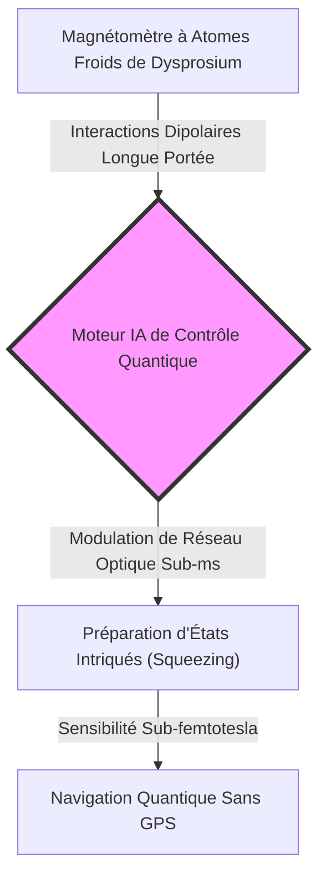
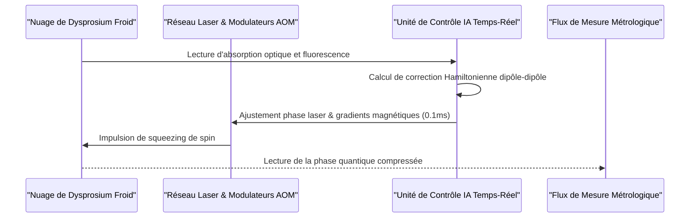

<!-- markdownlint-disable MD009 MD010 MD013 MD022 MD028 MD032 MD033 MD034 MD036 MD037 MD039 MD041 MD060 -->

[🇬🇧 English Version](./README.md)

# Dysprosium Spin Metrology

> **Aperçu exécutif :** Dysprosium Spin Metrology fournit un moteur de contrôle quantique temps-réel pour atomes ultrafroids de dysprosium à spin géant (J=8), permettant une sensibilité magnétique sub-femtotesla et une navigation quantique sans dérive.

---

## 1. Aperçu visuel & Effet Wahou

## 2. La thèse contrariante (Style Peter Thiel)

**Croyance populaire :** La métrologie quantique et les horloges atomiques ont atteint leur maturité avec les métaux alcalins (Rubidium, Césium) dont les niveaux d'énergie à un électron sont bien maîtrisés.
**Vérité cachée :** Les atomes alcalins manquent de moment magnétique pour la métrologie extrême. Le dysprosium, avec son moment magnétique géant (10 magnétons de Bohr) et son spin J=8, permet un squeezing de spin quantique dépassant la limite quantique standard d'un ordre de grandeur—à condition qu'une IA contrôle ses interactions dipolaires en temps réel.

## 3. Le problème & La cible

**Modèle économique :** B2B
**Cible précise :** Fabricants de capteurs quantiques, agences spatiales, industriels de la défense et instituts nationaux de métrologie exigeant une détection magnétique sub-femtotesla ou de la navigation inertielle sans GPS.
**Problème urgent :** Les systèmes de navigation inertielle sans GPS (sous-marins, environnement souterrain, aéronautique militaire) accumulent une dérive de position. Les capteurs atomiques actuels se dégradent en raison du bruit classique et de l'élargissement thermique dipolaire non compensé.

## 4. Architecture technique & Plomberie

## 5. Modèle économique & Viabilité financière

| Métrique                         | Valeur                                                                          |
| :------------------------------- | :------------------------------------------------------------------------------ |
| **Structure de Prix**            | Module Hardware + Licence IA Embarquée (35 000 € matériel + 15 000 €/an SaaS)   |
| **Cible à 12 Mois**              | 3 partenariats stratégiques avec labos de métrologie quantique spatiale/défense |
| **Calcul du Chiffre d'Affaires** | 2 déploiements systèmes @ 50 000 € valeur initiale = **100 000 € ARR**          |
| **Marge Brute Estimée**          | 78 % (firmware FPGA propriétaire à forte marge)                                 |

## 6. Moteur de distribution & Fossé défensif

**Stratégie d'acquisition :** Partenariats de recherche clé avec l'ESA, CNES, DARPA et grands laboratoires de physique atomique (ex. LKB, NIST) pour intégrer l'unité de contrôle dans des gravimètres et magnétomètres de terrain.
**Barrière à l'entrée (Moat) :** Simulation Hamiltonienne exacte des interactions dipolaires à 17 niveaux d'énergie du dysprosium couplée à des boucles de contrôle sous-milliseconde. Les IA généralistes ne savent pas modéliser cette dynamique de spin.

## 7. Grille d'évaluation détaillée

| Critères                            | Score VC (/100) | Score Terrain (/100) |
| :---------------------------------- | :-------------: | :------------------: |
| **Thèse & Monopole / Urgence**      |     22 / 25     |       22 / 25        |
| **Moat / Résistance aux LLMs**      |     24 / 25     |       23 / 25        |
| **Scalabilité / Friction adoption** |     19 / 25     |       20 / 25        |
| **Unit Economics / ROI direct**     |     22 / 25     |       22 / 25        |
| **TOTAL**                           |  **87 / 100**   |     **90 / 100**     |

> **Verdict VC :** Dysprosium Spin Metrology débloque une sensibilité quantique inédite en maîtrisant la dynamique des spins géants. La haute complexité expérimentale limite un passage à l'échelle immédiat, mais les applications défense et spatiales garantissent des contrats à forte valeur.
