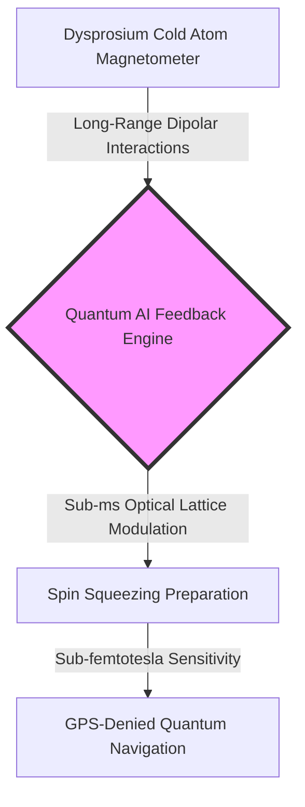
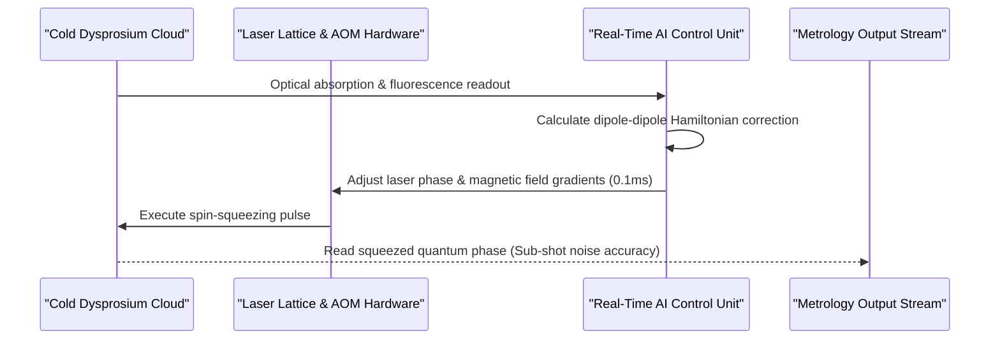

<!-- markdownlint-disable MD009 MD010 MD013 MD022 MD028 MD032 MD033 MD034 MD036 MD037 MD039 MD041 MD060 -->

[🇫🇷 Version Française](./README.fr.md)

# Dysprosium Spin Metrology

> **Executive Summary:** Dysprosium Spin Metrology delivers a real-time quantum control engine for giant-spin (J=8) ultracold dysprosium atoms, enabling sub-femtotesla magnetic sensing and drift-free quantum navigation.

---

## 1. Visual Overview

## 2. Contrarian Thesis (Peter Thiel Style)

**Popular Belief:** Quantum sensing and atomic clocks have peaked using alkali metals like Rubidium or Cesium, which offer well-understood single-electron energy levels.
**Hidden Truth:** Alkali atoms lack the magnetic dipole moment needed for high-precision quantum metrology. Dysprosium, with its massive magnetic dipole moment (10 Bohr magnetons) and giant spin (J=8), allows quantum spin-squeezing that breaks the standard quantum limit by orders of magnitude—provided real-time AI controls its dipolar interactions.

## 3. Problem & Target Market

**Business Model:** B2B
**Precise Target:** Quantum sensor manufacturers, space agencies, defense contractors, and national metrology institutes requiring sub-femtotesla magnetic field detection or driftless inertial navigation.
**Urgent Pain:** Inertial navigation systems in GPS-denied environments (submarines, deep underground, defense aircraft) accumulate positioning errors rapidly over time. Current atomic sensors degrade due to classical noise and uncompensated dipolar thermal broadening.

## 4. Technical Architecture & Infrastructure

## 5. Business Model & Financial Viability

| Metric                                 | Value                                                                              |
| :------------------------------------- | :--------------------------------------------------------------------------------- |
| **Pricing Structure**                  | Control Hardware Unit + Embedded AI License (35,000€ hardware + 15,000€/year SaaS) |
| **12-Month Target**                    | 3 strategic partnerships with defense/space quantum metrology labs                 |
| **Revenue Calculation (100k€ Target)** | 2 system deployments @ 50,000€ initial value = **100,000€ ARR**                    |
| **Estimated Gross Margin**             | 78% (high-margin proprietary embedded FPGA control firmware)                       |

## 6. Distribution Engine & Moat

**Acquisition Strategy:** Key research partnerships with ESA, CNES, DARPA, and premier atomic physics labs (e.g., LKB, NIST) to integrate the control unit into field-deployable gravimeters and magnetometers.
**Moat (Barrier to Entry):** Exact Hamiltonian simulation of 17-level dipolar manifold interactions in dysprosium coupled with sub-millisecond hardware control loops. Generalist AI models cannot compute quantum spin dynamics or interface with laser acousto-optic modulators.

## 7. Detailed Evaluation Grid

| Criteria                             | VC Score (/100) | Market Score (/100) |
| :----------------------------------- | :-------------: | :-----------------: |
| **Thesis & Monopoly / Urgency**      |     22 / 25     |       22 / 25       |
| **Moat / Resistance to Native LLMs** |     24 / 25     |       23 / 25       |
| **Scalability / Adoption Friction**  |     19 / 25     |       20 / 25       |
| **Unit Economics / Direct ROI**      |     22 / 25     |       22 / 25       |
| **TOTAL**                            |  **87 / 100**   |    **90 / 100**     |

> **VC Verdict:** Dysprosium Spin Metrology unlocks unprecedented quantum sensing resolution by tackling complex dipolar spin dynamics. High hardware and experimental complexity limit immediate scale, but deep defense and space applications ensure premium pricing.
