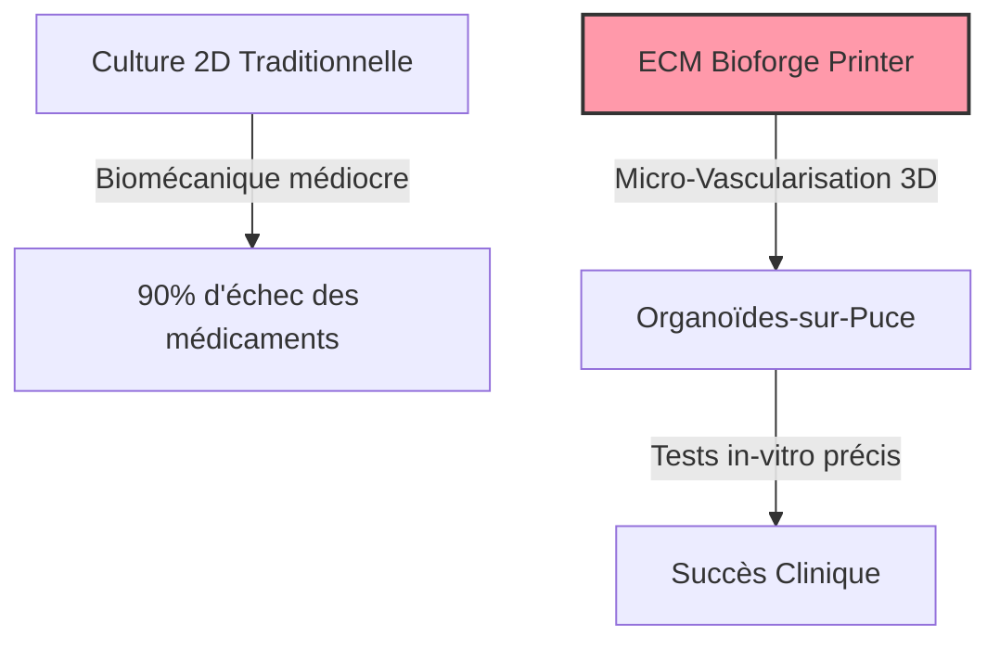
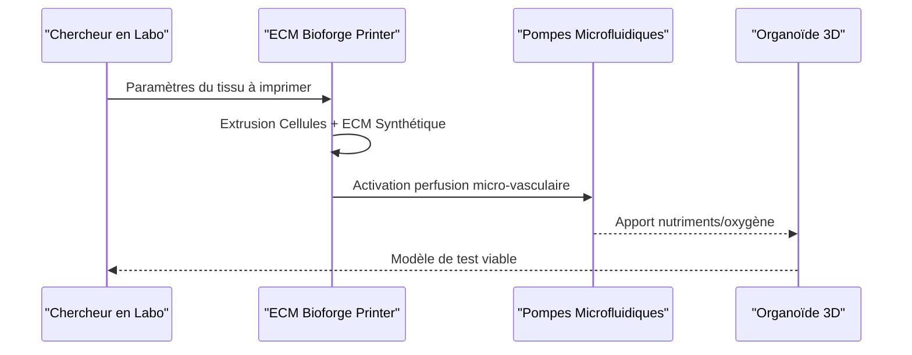

<!-- markdownlint-disable MD009 MD010 MD013 MD022 MD028 MD032 MD033 MD034 MD036 MD037 MD039 MD041 MD058 MD060 -->

[ 🇬🇧 English Version ](./README.md)

# ECM Bioforge Printer

> **Résumé exécutif :** Une imprimante 3D biophysique qui extrude des cellules vivantes et une matrice extracellulaire (ECM) synthétique pour créer des "organoïdes-sur-puce" micro-vascularisés, révolutionnant les tests de médicaments in vitro.

---

## 1. Aperçu visuel & Effet Wahou

## 2. La thèse contrariante (Peter Thiel Style)

**La croyance populaire :** La clé de la découverte de médicaments réside uniquement dans plus de données et de meilleurs algorithmes d'IA entraînés sur des résultats de boîtes de Petri (2D).
**La vérité cachée :** Les cultures 2D altèrent fondamentalement le comportement cellulaire. Sans reproduire la biomécanique 3D et la micro-vascularisation des organes humains, l'IA n'apprendra que de données biologiques biaisées.

## 3. Le problème & La cible

**Modèle économique :** B2B
**Cible précise :** Les laboratoires de recherche pharmaceutique, l'industrie cosmétique, et les centres de médecine régénérative.
**La douleur urgente :** 90% des médicaments échouent lors des essais cliniques humains car les tests in vitro préliminaires sur des surfaces plastiques planes ne reflètent pas la complexité 3D des organes, gaspillant des milliards de dollars.

## 4. Architecture technique & Plomberie

## 5. Modèle économique & Viabilité financière

| Métrique                        | Valeur                                                |
| :------------------------------ | :---------------------------------------------------- |
| **Structure de prix**           | Location matériel + Consommables (encres ECM)         |
| **Objectif 12 mois**            | 2 contrats avec des labos de recherche                |
| **Calcul du CA (Target 100k€)** | 2 contrats \* 50k€ = 100k€ ARR                        |
| **Marge brute estimée**         | 70% (Revenus récurrents sur les encres propriétaires) |

## 6. Moteur de distribution & Fossé défensif (Moat)

**Stratégie d'acquisition :** Ventes B2B directes ciblant les chercheurs principaux et directeurs R&D en Big Pharma, validées par des publications scientifiques revues par les pairs.
**Moat (Barrière à l'entrée) :** Intégration profonde de l'ingénierie tissulaire et de la robotique mécatronique. Un logiciel seul ne peut fabriquer des échafaudages de collagène vascularisés ni gérer les pompes microfluidiques nécessaires à la survie des tissus.

## 7. Grille d'évaluation détaillée

| Critère                               | Score VC (/100) | Score Terrain (/100) |
| :------------------------------------ | :-------------- | :------------------- |
| **Thèse & Monopole / Urgence**        | -- / 25         | 23 / 25              |
| **Moat / Résistance aux LLM natifs**  | -- / 25         | 25 / 25              |
| **Scalabilité / Friction d'adoption** | -- / 25         | 16 / 25              |
| **Unit Economics / ROI direct**       | -- / 25         | 21 / 25              |
| **TOTAL**                             | **-- / 100**    | **85 / 100**         |

> **Verdict VC :** En attente d'évaluation.

> **Verdict Terrain :** ECM Bioforge Printer résout le taux d'échec massif des essais cliniques avec une solution physique convaincante. Sa combinaison matériel-logiciel le protège complètement de la concurrence de l'IA générique. Bien que l'adoption en laboratoire soit intrinsèquement lente, l'impact direct sur le succès des essais cliniques entraîne une forte disposition à payer.
