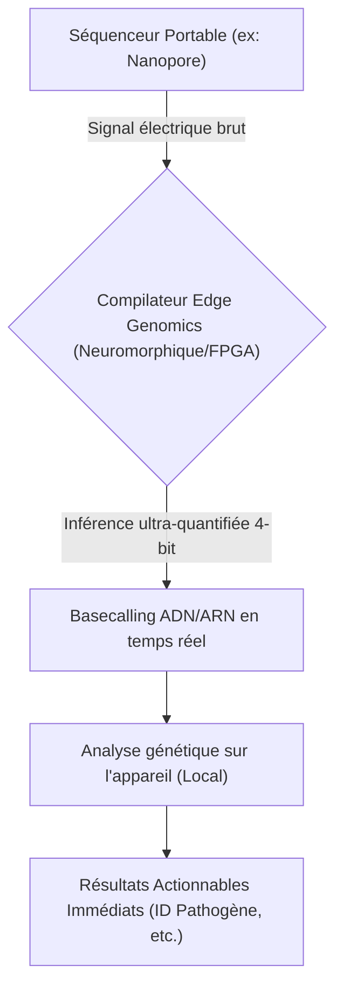
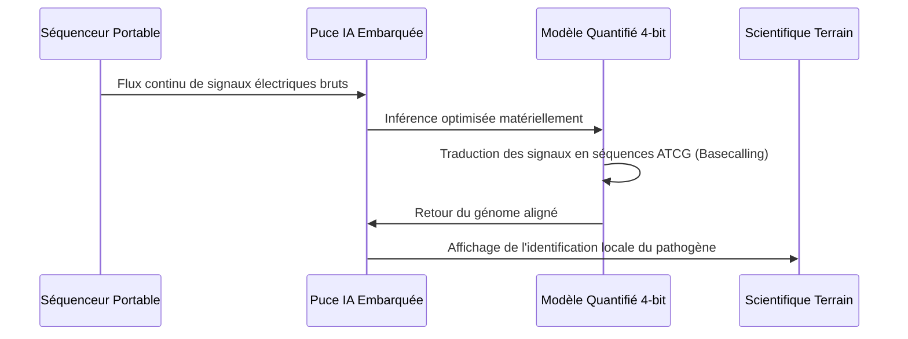

<!-- markdownlint-disable MD009 MD010 MD013 MD022 MD028 MD032 MD033 MD034 MD036 MD037 MD039 MD041 MD058 MD060 -->

[ 🇬🇧 English Version ](./README.md)

# Edge Genomics Compiler

> **Résumé exécutif :** Un moteur d'inférence neuronal ultra-quantifié et un compilateur conçus pour exécuter le "basecalling" d'ADN/ARN en temps réel sur des appareils à basse consommation, éliminant le besoin de connectivité cloud pour le séquençage génomique déporté.

---

## 1. Aperçu visuel & Effet Wahou

## 2. La thèse contrariante (Peter Thiel Style)

**La croyance populaire :** L'analyse génomique à haut débit nécessite intrinsèquement des clusters de calcul cloud x86 massifs ou des GPU haut de gamme très énergivores.
**La vérité cachée :** En quantifiant agressivement les réseaux de neurones et en les compilant directement sur des puces neuromorphiques ou des FPGA à très basse consommation, l'analyse génomique de qualité clinique peut être exécutée entièrement en local, sur batterie, n'importe où sur Terre.

## 3. Le problème & La cible

**Modèle économique :** B2B
**Cible précise :** Hôpitaux de campagne, bases de recherche isolées, agences de défense et équipes de biosurveillance (pandémies, agriculture).
**La douleur urgente :** Le séquençage portable génère des volumes massifs de données brutes. Sans haut débit pour accéder au cloud, ou sans lourds générateurs pour alimenter des GPU locaux, l'identification rapide des pathogènes dans les zones isolées est impossible, coûtant des vies lors d'épidémies.

## 4. Architecture technique & Plomberie

## 5. Modèle économique & Viabilité financière

| Métrique                    | Valeur                                                                                         |
| --------------------------- | ---------------------------------------------------------------------------------------------- |
| Structure de prix           | Licence logicielle entreprise par appareil déployé + mises à jour premium de la BDD pathogènes |
| Objectif 12 mois            | 100 unités de terrain déployées (à 1 000€/unité/an)                                            |
| Calcul du CA (Target 100k€) | 100 \* 1 000€ = 100 000€ de revenus annuels récurrents                                         |
| Marge brute estimée         | 90% (Licence logicielle)                                                                       |

## 6. Moteur de distribution & Fossé défensif (Moat)

**Stratégie d'acquisition :** Partenariats B2B/B2G avec des organisations mondiales de santé (OMS), des départements de défense et des fabricants de matériel portable.
**Moat (Barrière à l'entrée) :** Maintenir une précision clinique (99.9%+) tout en compressant des pipelines bio-informatiques complexes dans une architecture neuromorphique 4-bit nécessite une intersection hautement spécifique d'ingénierie matérielle, d'élagage neuronal et de bioinformatique que les concurrents pure-cloud ne peuvent facilement répliquer.

## 7. Grille d'évaluation détaillée

| Critère                           | Score VC (/100) | Score Terrain (/100) |
| --------------------------------- | --------------- | -------------------- |
| Thèse & Monopole / Urgence        | -- / 25         | -- / 25              |
| Moat / Résistance aux LLM natifs  | -- / 25         | -- / 25              |
| Scalabilité / Friction d'adoption | -- / 25         | -- / 25              |
| Unit Economics / ROI direct       | -- / 25         | -- / 25              |
| **TOTAL**                         | **-- / 100**    | **-- / 100**         |

> **Verdict VC :** En attente d'évaluation.
> **Verdict Terrain :** En attente d'évaluation.
