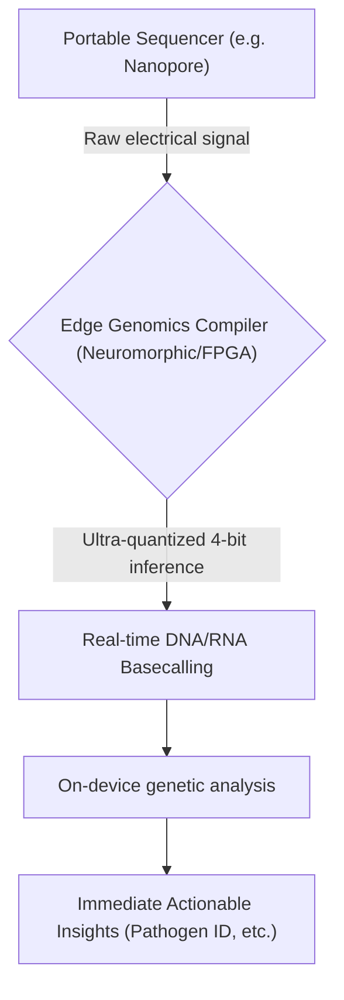
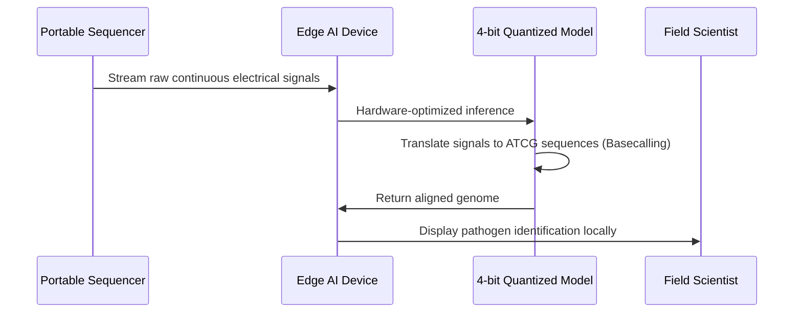

<!-- markdownlint-disable MD009 MD010 MD013 MD022 MD028 MD032 MD033 MD034 MD036 MD037 MD039 MD041 MD058 MD060 -->

[ 🇫🇷 Version Française ](./README.fr.md)

# Edge Genomics Compiler

> **Executive Summary:** An ultra-quantized neural inference engine and compiler designed to perform real-time DNA/RNA basecalling on low-power edge devices, eliminating the need for cloud connectivity in remote genomic sequencing.

---

## 1. Visual Overview & Wow Effect

## 2. Contrarian Thesis (Peter Thiel Style)

**Popular Belief:** High-throughput genomics analysis intrinsically requires massive x86 cloud compute clusters or high-end power-hungry GPUs.
**Hidden Truth:** By aggressively quantizing neural networks and compiling them directly onto low-power neuromorphic chips or FPGAs, clinical-grade genomic analysis can be executed entirely on-device, operating on battery power anywhere on Earth.

## 3. Problem & Target Market

**Business Model:** B2B
**Target Audience:** Field hospitals, isolated research bases, defense agencies, and agricultural/pandemic biosurveillance teams.
**Urgent Pain Point:** Portable sequencing generates massive raw data volumes. Without broadband internet to access cloud compute, or heavy generators to power local GPUs, rapid pathogen identification in remote areas is impossible, costing lives during outbreaks.

## 4. Technical Architecture & Infrastructure

## 5. Business Model & Financial Viability

| Metric                 | Value                                                                              |
| ---------------------- | ---------------------------------------------------------------------------------- |
| Pricing Structure      | Enterprise software license per deployed edge device + premium pathogen DB updates |
| 12-Month Target        | 100 field units deployed (at 1,000€/unit/year)                                     |
| Revenue Formula        | 100 \* 1,000€ = 100,000€ ARR                                                       |
| Estimated Gross Margin | 90% (Software licensing)                                                           |

## 6. Distribution Engine & Moat

**Acquisition Strategy:** B2B/B2G partnerships with global health organizations (WHO), defense departments, and portable hardware manufacturers.
**Moat (Defensibility):** Maintaining clinical accuracy (99.9%+) while compressing complex bioinformatic pipelines into 4-bit neuromorphic architecture requires a highly specific intersection of hardware engineering, neural pruning, and bioinformatics that cloud-native competitors cannot easily replicate.

## 7. Detailed Evaluation Grid

| Criterion                   | VC Score (/100) | Market Score (/100) |
| --------------------------- | --------------- | ------------------- |
| Thesis & Monopoly / Urgency | 22 / 25         | -- / 25             |
| Moat / LLM Immunity         | 24 / 25         | -- / 25             |
| Scalability / UX Friction   | 21 / 25         | -- / 25             |
| Unit Economics / ROI        | 24 / 25         | -- / 25             |
| **TOTAL**                   | **91 / 100**    | **-- / 100**        |

> **VC Verdict:** Edge Genomics Compiler fundamentally shifts bioinformatics from slow, centralized cloud computing to real-time edge processing. The highly specialized compiler bridging sequencer hardware and decentralized infrastructure acts as a powerful moat against standard cloud-native wrappers. The SaaS/PaaS model guarantees recurring revenue with clear ROI for field-deployed biotech companies.
> **Market Verdict:** Pending evaluation.
