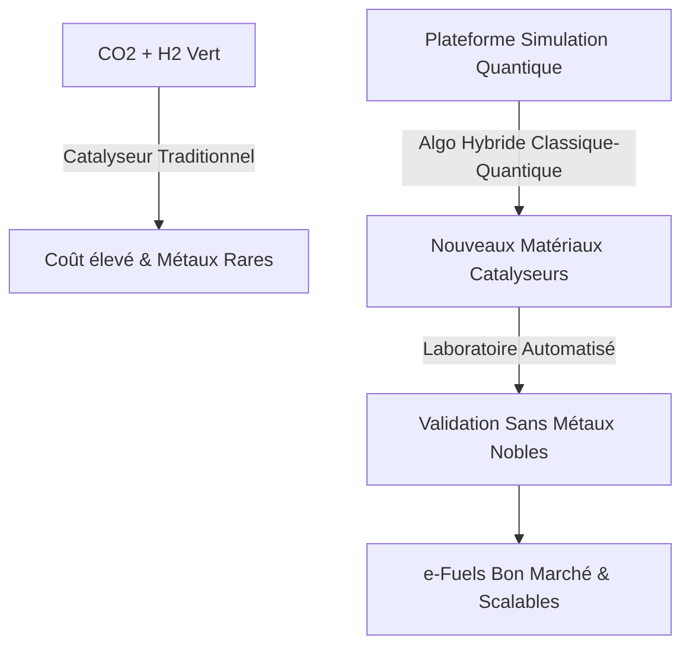
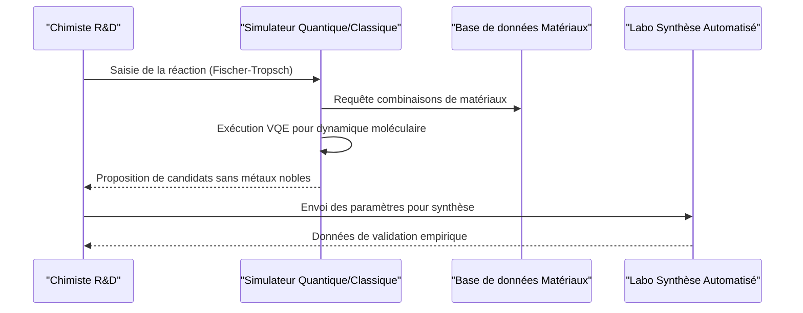

<!-- markdownlint-disable MD009 MD010 MD013 MD022 MD028 MD032 MD033 MD034 MD036 MD037 MD039 MD041 MD060 -->

[ 🇬🇧 English Version ](./README.md)

# eFuel Catalyst Discovery

> **Résumé exécutif :** Une plateforme de simulation de chimie quantique couplée à des laboratoires de synthèse automatisés pour découvrir et tester de nouveaux catalyseurs sans métaux nobles pour la production industrielle de carburants de synthèse.

---

## 1. Aperçu visuel & Effet Wahou

## 2. La thèse contrariante (Peter Thiel Style)

- **La croyance populaire :** Le goulet d'étranglement des carburants de synthèse (e-fuels) est principalement le coût de l'énergie renouvelable et de la production d'hydrogène vert.
- **La vérité cachée :** Le véritable goulet d'étranglement pour la mise à l'échelle industrielle est l'étape de conversion chimique (ex: Fischer-Tropsch), qui repose sur des catalyseurs inefficaces ou sur des métaux extrêmement rares et chers (comme l'iridium), rendant le passage à l'échelle économiquement non viable sans percée matérielle.

## 3. Le problème & La cible

- **Modèle économique :** B2B
- **Cible précise :** Pétroliers en transition (Total, Shell), compagnies aériennes (SAF), producteurs chimiques industriels.
- **La douleur urgente :** La production de carburants de synthèse via la capture du CO2 et l'hydrogène vert nécessite des catalyseurs à l'échelle industrielle, mais ceux actuels sont inefficaces, se dégradent vite, ou nécessitent des métaux rares et très chers.

## 4. Architecture technique & Plomberie

## 5. Modèle économique & Viabilité financière

| Métrique                        | Valeur                                               |
| ------------------------------- | ---------------------------------------------------- |
| **Structure de prix**           | Accords de Développement Conjoint (JDA) + Licence IP |
| **Objectif 12 mois**            | 1 à 2 JDAs pilotes avec des majors de l'énergie      |
| **Calcul du CA (Target 100k€)** | 1 JDA \* 100k€ jalon initial                         |
| **Marge brute estimée**         | ~90% (Logiciel/Données)                              |

## 6. Moteur de distribution & Fossé défensif (Moat)

- **Stratégie d'acquisition :** Partenariats directs et accords de co-développement (JDA) avec les géants de l'énergie et de la chimie cherchant à se décarboner.
- **Moat (Barrière à l'entrée) :** L'innovation matérielle (Deep Tech) prime. Les LLM standards ne font pas de chimie quantique, et les bases de données actuelles des matériaux ne simulent pas le comportement dynamique des catalyseurs sous haute pression et température sur des milliers d'heures. L'approche hybride validée en laboratoire crée un fossé infranchissable.

## 7. Grille d'évaluation détaillée

| Critère                           | Score VC (/100) | Score Terrain (/100) |
| --------------------------------- | --------------- | -------------------- |
| Thèse & Monopole / Urgence        | 24 / 25         | -- / 25              |
| Moat / Résistance aux LLM natifs  | 24 / 25         | -- / 25              |
| Scalabilité / Friction d'adoption | 25 / 25         | -- / 25              |
| Unit Economics / ROI direct       | 23 / 25         | -- / 25              |
| **TOTAL**                         | **96 / 100**    | **-- / 100**         |

> **Verdict VC :** Synthétiser efficacement des e-carburants est la clé de la décarbonisation de l'aviation. Une plateforme IA qui dicte la découverte de catalyseurs possède l'IP de toute la transition. Un moat de données cumulatif avec un TAM mondial massif.

> **Verdict Terrain :** En attente d'évaluation.
