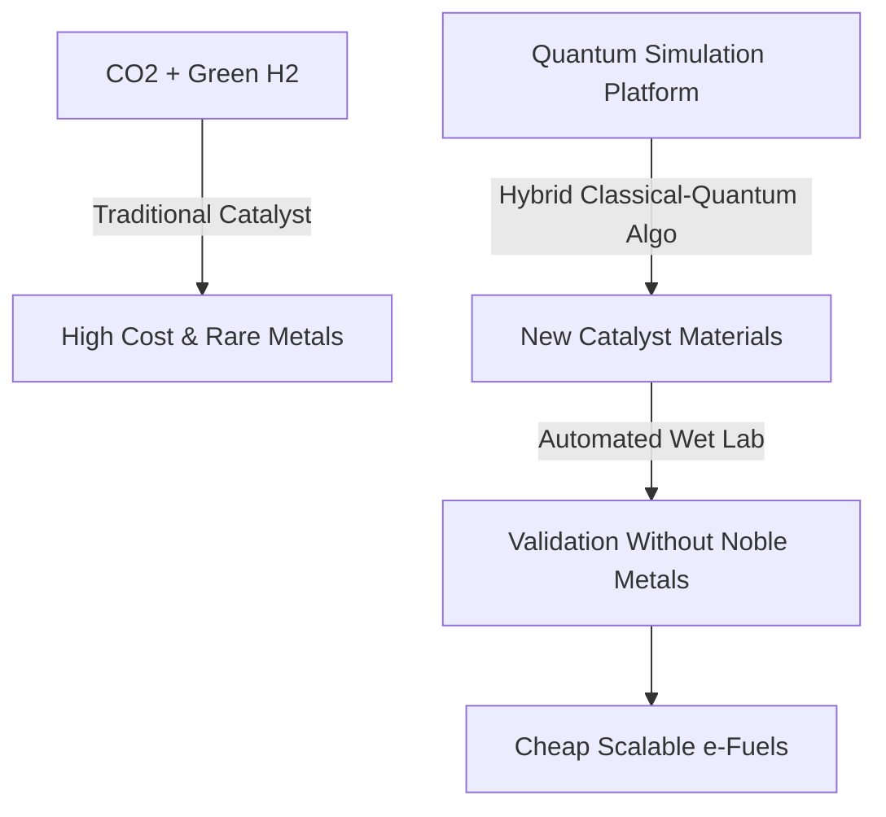
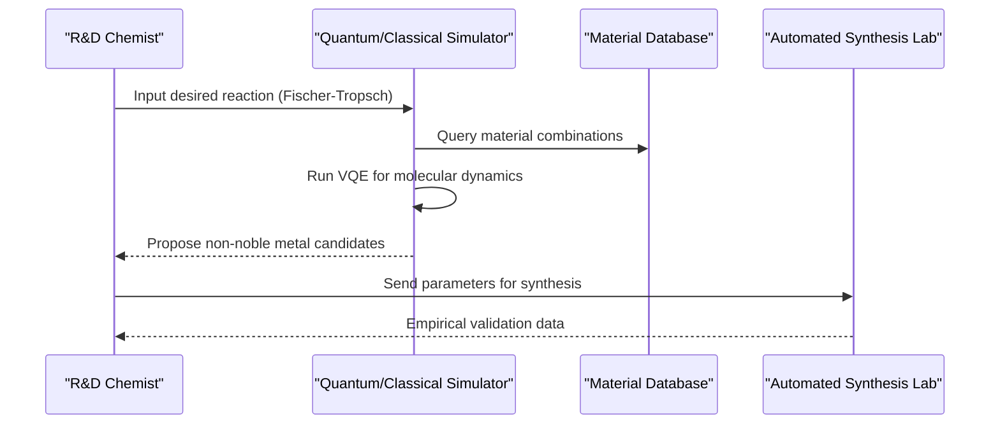

<!-- markdownlint-disable MD009 MD010 MD013 MD022 MD028 MD032 MD033 MD034 MD036 MD037 MD039 MD041 MD060 -->

[ 🇫🇷 Version Française ](./README.fr.md)

# eFuel Catalyst Discovery

> **Executive Summary:** A quantum chemistry simulation platform coupled with automated synthesis labs to discover and test noble-metal-free catalysts for industrial-scale synthetic fuel production.

---

## 1. Visual Overview & Wow Effect

## 2. Contrarian Thesis (Peter Thiel Style)

- **Popular Belief:** The bottleneck for e-fuels is primarily the cost of renewable energy and green hydrogen production.
- **Hidden Truth:** The true bottleneck for scaling e-fuels is the chemical conversion step (e.g., Fischer-Tropsch), which relies on highly inefficient catalysts or exceedingly rare and expensive metals like iridium, making industrial scale-up economically unviable without material breakthroughs.

## 3. Problem & Target Market

- **Business Model:** B2B
- **Target Audience:** Oil majors in transition (Total, Shell), airlines requiring Sustainable Aviation Fuel (SAF), and industrial chemical producers.
- **Urgent Pain Point:** Current catalysts for e-fuel production are inefficient, degrade quickly, or rely on prohibitively expensive noble metals, blocking the economic viability of synthetic fuels.

## 4. Technical Architecture & Infrastructure

## 5. Business Model & Financial Viability

| Metric                     | Value                                             |
| -------------------------- | ------------------------------------------------- |
| **Pricing Structure**      | Joint Development Agreements (JDA) + Licensing IP |
| **12-Month Target**        | 1-2 pilot JDAs with energy majors                 |
| **Revenue Formula**        | 1 JDA \* 100k€ initial milestone                  |
| **Estimated Gross Margin** | ~90% (Software/Data)                              |

## 6. Distribution Engine & Moat

- **Acquisition Strategy:** Direct partnerships and Joint Development Agreements with energy majors and chemical giants looking to decarbonize.
- **Moat (Defensibility):** Pure LLMs cannot perform quantum chemistry. Standard material databases do not simulate dynamic catalyst behavior under extreme temperature and pressure over thousands of hours. The hybrid classical-quantum approach coupled with closed-loop lab validation creates an unbreachable data moat.

## 7. Detailed Evaluation Grid

| Criterion                   | VC Score (/100) | Market Score (/100) |
| --------------------------- | --------------- | ------------------- |
| Thesis & Monopoly / Urgency | 24 / 25         | -- / 25             |
| Moat / LLM Immunity         | 24 / 25         | -- / 25             |
| Scalability / UX Friction   | 25 / 25         | -- / 25             |
| Unit Economics / ROI        | 23 / 25         | -- / 25             |
| **TOTAL**                   | **96 / 100**    | **-- / 100**        |

> **VC Verdict:** Synthesizing e-fuels efficiently is the key to decarbonizing aviation. An AI platform that dictates catalyst discovery owns the core IP of the entire transition. A compounding data moat with massive global TAM and licensing upside.

> **Market Verdict:** Pending evaluation.
