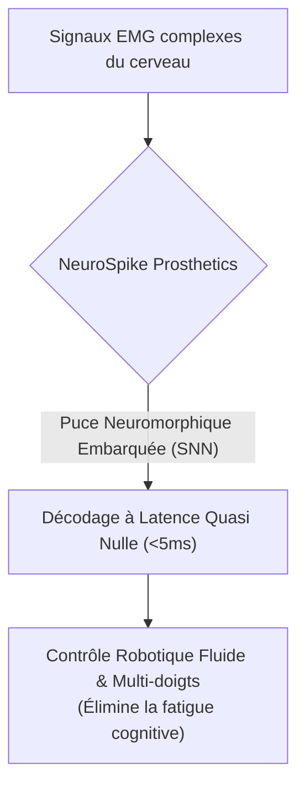
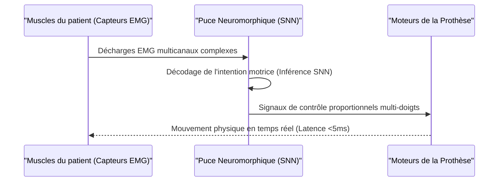

<!-- markdownlint-disable MD009 MD010 MD013 MD022 MD028 MD032 MD033 MD034 MD036 MD037 MD039 MD041 MD060 -->

[ 🇬🇧 English Version ](./README.md)

# NeuroSpike Prosthetics

> **Résumé exécutif :** NeuroSpike Prosthetics intègre des réseaux de neurones à impulsions (SNN) sur des puces neuromorphiques directement dans les prothèses bioniques pour décoder les signaux électromyographiques (EMG) complexes avec une latence quasi nulle, offrant aux amputés un contrôle fluide, intuitif et multifactoriel sans fatigue cognitive.

---

## 1. Aperçu visuel & Effet Wahou

## 2. La thèse contrariante (Peter Thiel Style)

**La croyance populaire :** De meilleures prothèses nécessitent de les connecter à de puissants GPU cloud ou d'intégrer d'énormes processeurs standards pour exécuter des algorithmes de deep learning complexes.
**La vérité cachée :** L'envoi de données vers le cloud introduit une latence inacceptable pour le mouvement, et un processeur standard (CPU/GPU) viderait la batterie de la prothèse en quelques heures tout en surchauffant. La véritable solution réside dans l'imitation des décharges électriques du cerveau via des Spiking Neural Networks (SNN) fonctionnant sur un matériel neuromorphique spécialisé, ultra-basse consommation, embarqué directement "at the edge" (dans le membre).

## 3. Le problème & La cible

**Modèle économique :** B2B2C
**Cible précise :** Fabricants de prothèses bioniques (Össur, Ottobock), centres de rééducation spécialisés, et amputés.
**La douleur urgente :** Le contrôle des prothèses myoélectriques actuelles est lent, peu intuitif et très limité (souvent réduit à l'ouverture/fermeture basique de la main). Le cerveau envoie des signaux électromyographiques (EMG) complexes, mais le matériel classique n'est pas assez rapide ou sophistiqué pour décoder ces intentions motrices fines et fluides en temps réel. La latence induit une énorme fatigue cognitive chez le patient.

## 4. Architecture technique & Plomberie

## 5. Modèle économique & Viabilité financière

| Métrique                | Valeur                                                        |
| ----------------------- | ------------------------------------------------------------- |
| **Structure de prix**   | Licence OEM par unité + Abonnement au logiciel de calibration |
| **Objectif 12 mois**    | 100 accords de licence / déploiements en essais cliniques     |
| **Calcul du CA**        | 100 unités \* 1 000€/licence                                  |
| **Marge brute estimée** | >90% (Licence Logicielle/IP)                                  |

## 6. Moteur de distribution & Fossé défensif (Moat)

**Stratégie d'acquisition :** Partenariats OEM avec les grands fabricants de prothèses (B2B) et essais cliniques avec les hôpitaux de rééducation de premier plan pour stimuler la demande des patients (B2C).
**Moat (Barrière à l'entrée) :** Il nécessite un couplage très spécifique entre les capteurs matériels, les puces neuromorphiques émergentes (comme Intel Loihi ou BrainChip Akida), et les algorithmes SNN de bas niveau. Les entreprises d'IA généralistes ne peuvent pas répliquer cela car les modèles d'apprentissage profond standards ne peuvent pas fonctionner sur ce matériel spécialisé sans vider la batterie ou introduire de la latence. La calibration personnalisée des algorithmes SNN pour les signaux EMG uniques de chaque moignon crée des coûts de changement très élevés.

## 7. Grille d'évaluation détaillée

| Critère                               | Score VC (/100) | Score Terrain (/100) |
| ------------------------------------- | --------------- | -------------------- |
| **Thèse & Monopole / Urgence**        | -- / 25         | -- / 25              |
| **Moat / Résistance aux LLM natifs**  | -- / 25         | -- / 25              |
| **Scalabilité / Friction d'adoption** | -- / 25         | -- / 25              |
| **Unit Economics / ROI direct**       | -- / 25         | -- / 25              |
| **TOTAL**                             | -- / 100        | -- / 100             |

> **Verdict VC :** En attente d'évaluation.
> **Verdict Terrain :** En attente d'évaluation.
