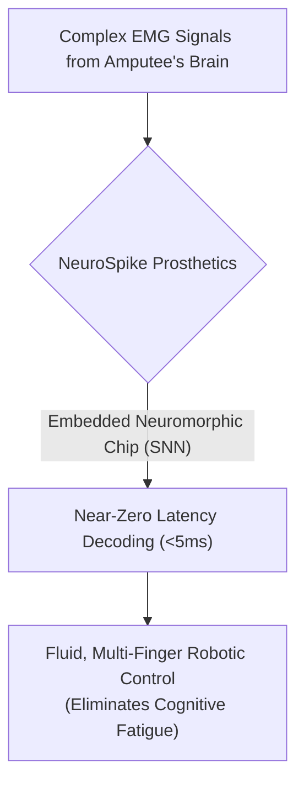
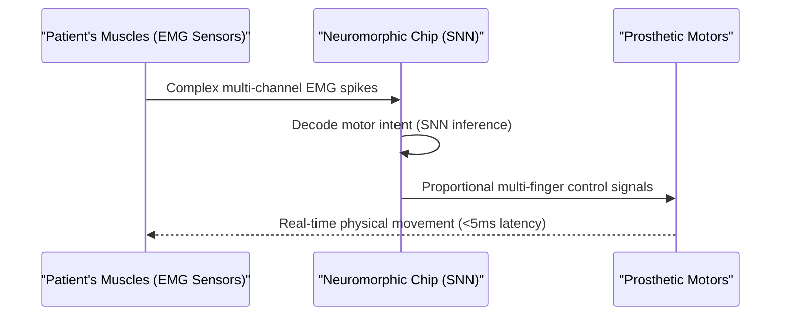

<!-- markdownlint-disable MD009 MD010 MD013 MD022 MD028 MD032 MD033 MD034 MD036 MD037 MD039 MD041 MD060 -->

[ 🇫🇷 Version Française ](./README.fr.md)

# NeuroSpike Prosthetics

> **Executive Summary:** NeuroSpike Prosthetics integrates Spiking Neural Networks (SNN) on neuromorphic chips directly into bionic prostheses to decode complex electromyographic (EMG) signals with near-zero latency, enabling amputees to achieve fluid, intuitive, multi-finger control without cognitive fatigue.

---

## 1. Visual Overview & Wow Effect

## 2. Contrarian Thesis (Peter Thiel Style)

**Popular Belief:** Better prosthetics require connecting them to powerful cloud GPUs or embedding massive standard processors to run complex deep learning algorithms.
**Hidden Truth:** Sending data to the cloud introduces unacceptable latency, and standard CPUs/GPUs drain a prosthesis battery in hours while overheating. The true solution lies in mimicking the brain's electrical spikes using Spiking Neural Networks (SNN) on specialized, ultra-low-power neuromorphic hardware embedded directly at the edge (in the limb).

## 3. Problem & Target Market

**Business Model:** B2B2C
**Target Audience:** Bionic prosthetics manufacturers (Össur, Ottobock), specialized rehabilitation centers, and amputees.
**Urgent Pain Point:** Control of current myoelectric prostheses is slow, unintuitive, and severely limited (often just basic open/close). The brain sends complex electromyographic (EMG) signals, but classic hardware isn't fast or sophisticated enough to decode these fine motor intentions in real-time. This latency causes enormous cognitive fatigue for the patient.

## 4. Technical Architecture & Infrastructure

## 5. Business Model & Financial Viability

| Metric                     | Value                                                      |
| -------------------------- | ---------------------------------------------------------- |
| **Pricing Structure**      | OEM Licensing per unit + Calibration software subscription |
| **12-Month Target**        | 100 licensing agreements / clinical trial deployments      |
| **Revenue Formula**        | 100 units \* €1,000/license                                |
| **Estimated Gross Margin** | >90% (Software/IP license)                                 |

## 6. Distribution Engine & Moat

**Acquisition Strategy:** OEM partnerships with major prosthetic manufacturers (B2B) and clinical trials with top-tier rehab hospitals to drive patient demand (B2C).
**Moat (Defensibility):** It requires a highly specific coupling between hardware sensors, emerging neuromorphic chips (like Intel Loihi or BrainChip Akida), and low-level SNN algorithms. Generalist AI companies cannot replicate this because standard deep learning models cannot run on this specialized hardware without draining the battery or introducing latency. The personalized calibration of SNN algorithms for unique stump EMG signals creates high switching costs.

## 7. Detailed Evaluation Grid

| Criterion                       | VC Score (/100) | Market Score (/100) |
| ------------------------------- | --------------- | ------------------- |
| **Thesis & Monopoly / Urgency** | -- / 25         | -- / 25             |
| **Moat / LLM Immunity**         | -- / 25         | -- / 25             |
| **Scalability / UX Friction**   | -- / 25         | -- / 25             |
| **Unit Economics / ROI**        | -- / 25         | -- / 25             |
| **TOTAL**                       | -- / 100        | -- / 100            |

> **VC Verdict:** Pending evaluation.
> **Market Verdict:** Pending evaluation.
