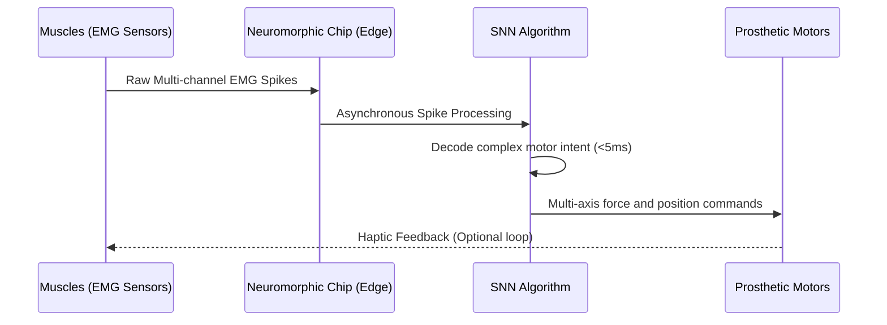

<!-- markdownlint-disable MD009 MD010 MD013 MD022 MD028 MD032 MD033 MD034 MD036 MD037 MD039 MD041 MD058 MD060 -->

[ 🇫🇷 Version Française ](./README.fr.md)

# NeuroSpike Prosthetics

> **Executive Summary:** A neuromorphic Spiking Neural Network (SNN) architecture embedded directly on bionic prosthetics, decoding complex electromyographic (EMG) signals with near-zero latency for intuitive, multi-factor motor control.

---

## 1. Visual Overview & Wow Effect

## 2. Contrarian Thesis (Peter Thiel Style)

**Popular Belief:** To improve bionic limb control, we must rely on invasive brain implants (like Neuralink) or stream data to powerful cloud servers for heavy AI processing.

**Hidden Truth:** The peripheral nervous system (EMG at the stump) already contains the necessary high-fidelity motor intent. By using brain-inspired Spiking Neural Networks (SNNs) running locally on ultra-low-power neuromorphic chips, we can achieve real-time, fluid control without invasive brain surgery or cloud latency.

## 3. Problem & Target Market

**Business Model:** B2B2C

**Target Audience:** Bionic prosthetic manufacturers (Össur, Ottobock), specialized rehabilitation centers, and ultimately, amputees.

**Urgent Pain Point:** Current myoelectric prosthetics are slow, unintuitive, and limited (often just basic open/close grip). The brain sends complex signals, but standard hardware cannot decode these fine motor intentions in real time without massive lag. This latency induces enormous cognitive fatigue for the patient, leading to high abandonment rates of expensive prosthetics.

## 4. Technical Architecture & Infrastructure

## 5. Business Model & Financial Viability

| Metric                 | Value                                                                  |
| :--------------------- | :--------------------------------------------------------------------- |
| Pricing Structure      | Hardware Module (Chip + Sensors) + Per-patient SNN Calibration License |
| 12-Month Target        | Integration pilot with 1 major manufacturer & 20 test patients         |
| Revenue Formula        | 1 Pilot (€50k) + (20 patients \* €2.5k license) = €100k ARR            |
| Estimated Gross Margin | 75% (High margin on the SNN software calibration license)              |

## 6. Distribution Engine & Moat

**Acquisition Strategy:** B2B partnerships with Tier-1 prosthetic manufacturers. Supply the neuromorphic computing module and calibration software as an OEM component to upgrade their next-generation bionic limbs.

**Moat (Defensibility):** Cloud-based AI or standard embedded CPUs (which drain batteries in hours) cannot solve the latency/power constraint. The moat is the deep, low-level coupling between custom SNN algorithms and cutting-edge neuromorphic hardware (like Intel Loihi or BrainChip Akida). It requires specialized expertise in computational neuroscience that standard deep learning engineers lack.

## 7. Detailed Evaluation Grid

| Criterion                   | VC Score (/100) | Market Score (/100) |
| :-------------------------- | :-------------- | :------------------ |
| Thesis & Monopoly / Urgency | -- / 25         | 24 / 25             |
| Moat / LLM Immunity         | -- / 25         | 25 / 25             |
| Scalability / UX Friction   | -- / 25         | 14 / 25             |
| Unit Economics / ROI        | -- / 25         | 21 / 25             |
| **TOTAL**                   | **-- / 100**    | **84 / 100**        |

> **VC Verdict:** Pending evaluation.
> **Market Verdict:** Strong urgency and obvious value for the target market. LLM resistance is high due to strong hardware or physical integration. Despite some adoption friction, B2B monetization is very clear.
