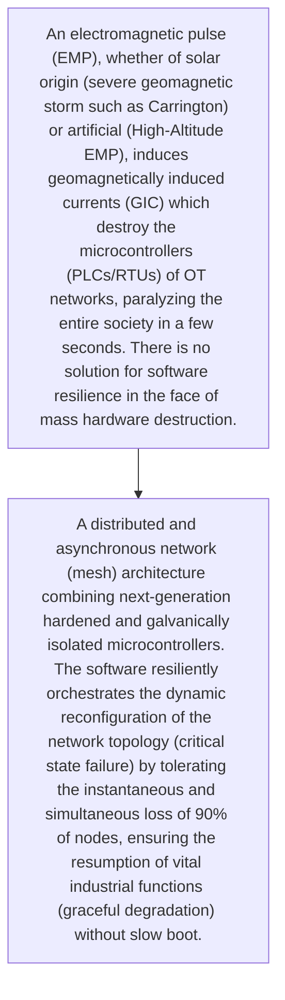
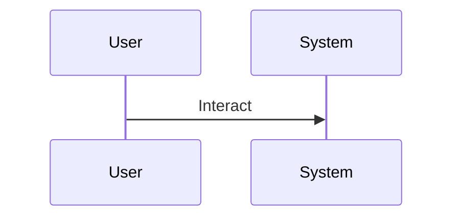

<!-- markdownlint-disable MD009 MD010 MD013 MD022 MD028 MD032 MD033 MD034 MD036 MD037 MD039 MD041 MD060 -->

[ 🇫🇷 Version Française ](./README.fr.md)

# EMP Resilient OT Fabric

> **Executive Summary:** A distributed and asynchronous network (mesh) architecture combining next-generation hardened and galvanically isolated microcontrollers. The software resiliently orchestrates the dynamic reconfiguration of the network topology (critical state failure) by tolerating the instantaneous and simultaneous loss of 90% of nodes, ensuring the resumption of vital industrial functions (graceful degradation) without slow boot.

---

## 1. Visual Overview & Wow Effect

## 2. Contrarian Thesis (Peter Thiel Style)

- **Popular Belief:** This is not a problem of software cybersecurity (TCP/IP), but of low-level hardware/firmware resilience to physical destruction. Classic cloud fault tolerance systems (Kubernetes) do not work on bare-metal OT whose motherboards burn.
- **Hidden Truth:** A distributed and asynchronous network (mesh) architecture combining next-generation hardened and galvanically isolated microcontrollers. The software resiliently orchestrates the dynamic reconfiguration of the network topology (critical state failure) by tolerating the instantaneous and simultaneous loss of 90% of nodes, ensuring the resumption of vital industrial functions (graceful degradation) without slow boot.

## 3. Problem & Target Market

- **Business Model:** B2B
- **Target Audience:** Operators of vitally important critical infrastructure (OIV), power grids, air traffic control systems, military.
- **Urgent Pain Point:** An electromagnetic pulse (EMP), whether of solar origin (severe geomagnetic storm such as Carrington) or artificial (High-Altitude EMP), induces geomagnetically induced currents (GIC) which destroy the microcontrollers (PLCs/RTUs) of OT networks, paralyzing the entire society in a few seconds. There is no solution for software resilience in the face of mass hardware destruction.

## 4. Technical Architecture & Infrastructure

## 5. Business Model & Financial Viability

| Metric                 | Value                                     |
| ---------------------- | ----------------------------------------- |
| Pricing Structure      | [Price / Subscription Model / Commission] |
| 12-Month Target        | [Exact volume required for 100k ARR]      |
| Revenue Formula        | [Mathematical calculation]                |
| Estimated Gross Margin | [Margin %]                                |

## 6. Distribution Engine & Moat

- **Acquisition Strategy:** [Virality, network effect, direct sales, developer adoption]
- **Moat (Defensibility):** It is necessary to design and distribute personalized hardware equipment (hardware appliance), a very conservative market which hates replacing its legacy infrastructure (20 years old), quality assurance tests in extreme conditions very expensive.

## 7. Detailed Evaluation Grid

| Criterion                   | VC Score (/100) | Market Score (/100) |
| --------------------------- | --------------- | ------------------- |
| Thesis & Monopoly / Urgency | -- / 25         | 25 / 25             |
| Moat / LLM Immunity         | -- / 25         | 24 / 25             |
| Scalability / UX Friction   | -- / 25         | 15 / 25             |
| Unit Economics / ROI        | -- / 25         | 22 / 25             |
| **TOTAL**                   | -- / 100        | **86 / 100**        |

> **VC Verdict:** Pending evaluation.
> **Market Verdict:** Strong urgency and obvious value for the target market. LLM resistance is high due to strong hardware or physical integration. Despite some adoption friction, B2B monetization is very clear.
