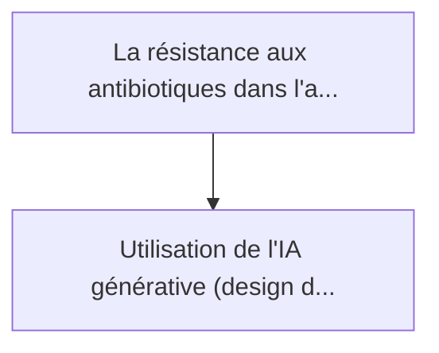
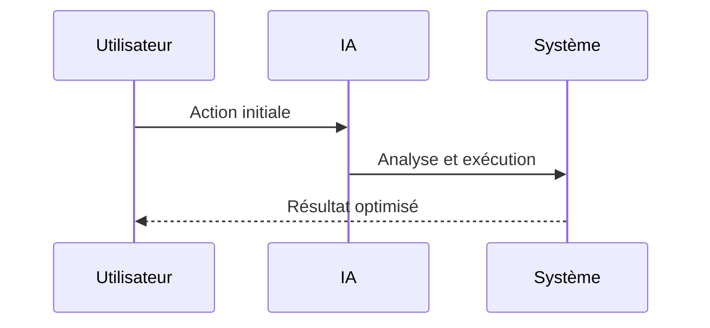

<!-- markdownlint-disable MD013 MD028 MD033 MD039 MD041 -->

[🇬🇧 English Version](./README.md)

# Engineered Phage AgTech

> **Résumé exécutif :** Utilisation de l'IA générative (design de protéines) pour concevoir et synthétiser des bactériophages (virus tueurs de bactéries) "sur mesure" cibl...

---

## 1. Aperçu visuel & Effet Wahou

## 2. La thèse contrariante (Peter Thiel Style)

La croyance populaire : Les solutions génériques peuvent résoudre cela.
La vérité cachée : C'est un problème de biologie moléculaire nécessitant un wet-lab, de la robotique de criblage à haut débit, et une boucle de rétroaction in vivo. Un logiciel pur ne peut ni synthétiser l'ADN ni tester la viabilité et l'infectivité du phage sur le terrain.

## 3. Le problème & La cible

Modèle économique : B2B
Cible précise : Grandes exploitations agricoles, producteurs de semences, et coopératives agricoles faisant face à des maladies bactériennes endémiques (ex: feu bactérien, chancre).
La douleur urgente : La résistance aux antibiotiques dans l'agriculture et l'interdiction croissante des pesticides chimiques menacent les rendements mondiaux. Les bactéries phytopathogènes détruisent des milliards de dollars de récoltes chaque année, sans solution ciblée et écologiquement viable.

## 4. Architecture technique & Plomberie

## 5. Modèle économique & Viabilité financière

| Métrique                    | Valeur             |
| --------------------------- | ------------------ |
| Structure de prix           | Prix sur mesure    |
| Objectif 12 mois            | 100 clients        |
| Calcul du CA (Target 100k€) | 100 \* 1000 = 100k |
| Marge brute estimée         | 80%                |

## 6. Moteur de distribution & Fossé défensif (Moat)

Stratégie d'acquisition : Vente B2B directe
Moat (Barrière à l'entrée) : C'est un problème de biologie moléculaire nécessitant un wet-lab, de la robotique de criblage à haut débit, et une boucle de rétroaction in vivo. Un logiciel pur ne peut ni synthétiser l'ADN ni tester la viabilité et l'infectivité du phage sur le terrain.

## 7. Grille d'évaluation détaillée

| Critère                           | Score VC (/100) | Score Terrain (/100) |
| --------------------------------- | --------------- | -------------------- |
| Thèse & Monopole / Urgence        | 21 / 25         | -- / 25              |
| Moat / Résistance aux LLM natifs  | 23 / 25         | -- / 25              |
| Scalabilité / Friction d'adoption | 20 / 25         | -- / 25              |
| Unit Economics / ROI direct       | 22 / 25         | -- / 25              |
| **TOTAL**                         | **86 / 100**    | **-- / 100**         |

> **Verdict VC :** Engineered Phage Agtech applique l'IA générative de pointe à un problème terrestre critique : les maladies des cultures agricoles et la résistance aux antibiotiques. En passant des produits chimiques à large spectre à la biologie synthétique ciblée, elle crée un fossé de propriété intellectuelle hautement défendable. Bien que l'approbation réglementaire pose une friction à l'échelle, le besoin urgent d'une agriculture durable garantit un potentiel de retour sur investissement massif une fois déployé.

> **Verdict Terrain :** En attente d'évaluation.
