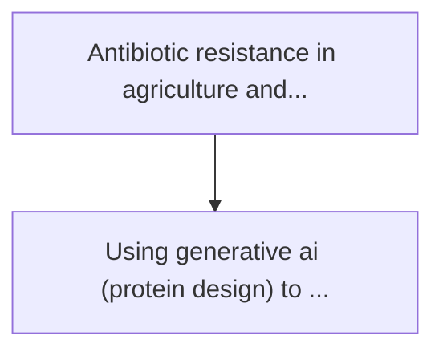
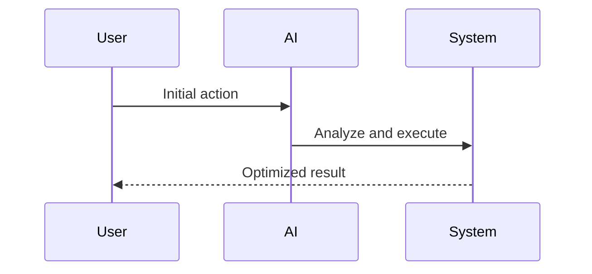

<!-- markdownlint-disable MD013 MD028 MD033 MD039 MD041 -->

[🇫🇷 Version Française](./README.fr.md)

# Engineered phage agtech

> **Executive Summary:** Using generative ai (protein design) to design and synthesize bacteriophages (bacterial killer viruses) "tailor-made" targeted by the...

---

## 1. Visual Overview & Wow Effect

## 2. Contrarian Thesis (Peter Thiel Style)

Popular Belief: Generic solutions can solve this.
Hidden Truth: This is a molecular biology problem requiring a wet-lab, high-speed screening robotics, and an in vivo feedback loop. pure software cannot synthesize dna or test the viability and infectivity of phage in the field.

## 3. Problem & Target Market

Business Model: B2B
Target Audience: Large farms, seed producers, and agricultural cooperatives dealing with endemic bacterial diseases (e.g. fire, canker).
Urgent Pain Point: Antibiotic resistance in agriculture and the growing ban on chemical pesticides threaten global yields. phytopathogenic bacteria destroy billions of dollars of crops every year, without a targeted and environmentally sustainable solution.

## 4. Technical Architecture & Infrastructure

## 5. Business Model & Financial Viability

| Metric                 | Value              |
| ---------------------- | ------------------ |
| Pricing Structure      | Custom Pricing     |
| 12-Month Target        | 100 customers      |
| Revenue Formula        | 100 \* 1000 = 100k |
| Estimated Gross Margin | 80%                |

## 6. Distribution Engine & Moat

Acquisition Strategy: Direct B2B Sales
Moat (Defensibility): This is a molecular biology problem requiring a wet-lab, high-speed screening robotics, and an in vivo feedback loop. pure software cannot synthesize dna or test the viability and infectivity of phage in the field.

## 7. Detailed Evaluation Grid

| Criterion                   | VC Score (/100) | Market Score (/100) |
| --------------------------- | --------------- | ------------------- |
| Thesis & Monopoly / Urgency | 21 / 25         | -- / 25             |
| Moat / LLM Immunity         | 23 / 25         | -- / 25             |
| Scalability / UX Friction   | 20 / 25         | -- / 25             |
| Unit Economics / ROI        | 22 / 25         | -- / 25             |
| **TOTAL**                   | **86 / 100**    | **-- / 100**        |

> **VC Verdict:** Engineered Phage Agtech applies cutting-edge generative AI to a critical, terrestrial problem: agricultural crop disease and antibiotic resistance. By moving away from broad-spectrum chemicals to targeted synthetic biology, it creates a highly defensible IP moat. While regulatory approval poses scaling friction, the urgent need for sustainable agriculture guarantees massive ROI potential once deployed.

> **Market Verdict:** Pending evaluation.
