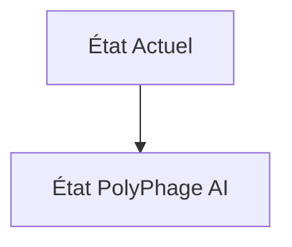
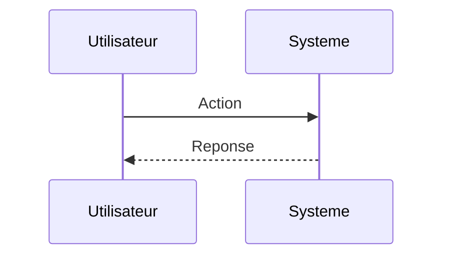

<!-- markdownlint-disable MD009 MD010 MD013 MD022 MD028 MD032 MD033 MD034 MD036 MD037 MD039 MD041 MD060 -->

[ 🇬🇧 English Version ](./README.md)

# PolyPhage AI

> **Résumé exécutif :** Un modèle d'IA génératif structurel (type AlphaFold 3 / ESM-3 étendu) couplé à un pipeline de dynamique moléculaire (MD) accéléré par ML, spécifiquement entraîné (fine-tuned) sur les interactions enzyme-polymères plastiques. L'objectif est la génération _in silico_ de séquences d'acides aminés inédites formant des enzymes "mangeuses de plastique" hyper-optimisées pour des conditions industrielles précises.

---

## 1. Aperçu visuel & Effet Wahou

## 2. La thèse contrariante (Peter Thiel Style)

**La croyance populaire :** Les solutions généralistes IA peuvent résoudre ce problème.

**La vérité cachée :** Les LLMs textuels ne "comprennent" pas le repliement des protéines ni l'énergie de liaison (binding affinity). La physique quantique (DFT) et la dynamique moléculaire des interactions biocatalytiques nécessitent une infrastructure de compute massive et des architectures de GNN (Graph Neural Networks) spécialisées, pas une interface de chat.

## 3. Le problème & La cible

**Modèle économique :** B2B (Licensing IP / JVs)

**Cible précise :** Géants de la pétrochimie en transition, entreprises de traitement des déchets (Veolia, Suez) et fabricants de plastiques.

**La douleur urgente :** Le recyclage mécanique du plastique (PET, PE, PP) dégrade la matière et est inefficace pour les plastiques mélangés. Le recyclage enzymatique (dépolymérisation) est le Saint Graal, mais la découverte d'enzymes robustes, rapides et capables d'opérer à température ambiante sur des déchets complexes prend des années en laboratoire par essais-erreurs (wet-lab).

## 4. Architecture technique & Plomberie

## 5. Modèle économique & Viabilité financière

| Métrique                    | Valeur                        |
| --------------------------- | ----------------------------- |
| Structure de prix           | Abonnement SaaS               |
| Objectif 12 mois            | 10 clients                    |
| Calcul du CA (Target 100k€) | 10 clients \* 10k€/an = 100k€ |
| Marge brute estimée         | 80%                           |

## 6. Moteur de distribution & Fossé défensif (Moat)

**Stratégie d'acquisition :** Vente directe B2B

**Moat (Barrière à l'entrée) :** Le "Reality Gap" : une enzyme brillante sur le simulateur peut être instable, insoluble ou impossible à exprimer dans des bactéries productrices (E. coli, levures) en réalité (wet-lab bottleneck). Nécessite un laboratoire de validation robotisé.

## 7. Grille d'évaluation détaillée

| Critère                           | Score VC (/100) | Score Terrain (/100) |
| --------------------------------- | --------------- | -------------------- |
| Thèse & Monopole / Urgence        | -- / 25         | -- / 25              |
| Moat / Résistance aux LLM natifs  | -- / 25         | -- / 25              |
| Scalabilité / Friction d'adoption | -- / 25         | -- / 25              |
| Unit Economics / ROI direct       | -- / 25         | -- / 25              |
| **TOTAL**                         | **-- / 100**    | **-- / 100**         |

> **Verdict VC :** En attente d'évaluation.

> **Verdict Terrain :** En attente d'évaluation.
