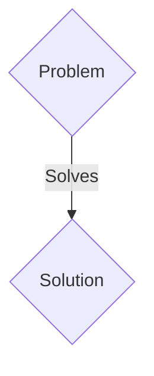
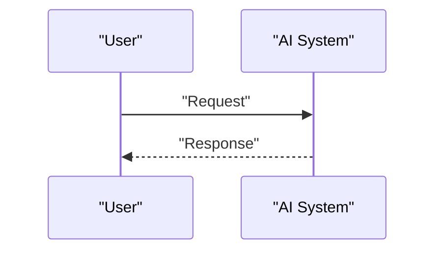

<!-- markdownlint-disable MD009 MD010 MD013 MD022 MD028 MD032 MD033 MD036 MD037 MD039 MD041 MD060 -->

[ 🇫🇷 Version Française ](./README.fr.md)

# PolyPhage AI

> **Executive Summary:** A B2B (Licensing IP / JVs) solution targeting Petrochemical giants in transition, waste treatment companies (Veolia, Suez) and plastics manufacturers. to solve: Mechanical recycling of plastic (PET, PE, PP) degrades the material and is ineffective for mixed plastics. Enzymatic recycling (depolymerization) is the Holy Grail, but the discovery of enzymes that are robust, fast and capable of operating at room temperature on complex waste takes years in the laboratory by trial and error (wet-lab).

---

## 1. Visual Overview & Wow Effect

## 2. Contrarian Thesis (Peter Thiel Style)

- **Popular Belief:** Generic solutions are enough.
- **Hidden Truth:** A structural generative AI model (type AlphaFold 3 / extended ESM-3) coupled with an ML-accelerated molecular dynamics (MD) pipeline, specifically trained (fine-tuned) on enzyme-plastic polymer interactions. The objective is the generation _in silico_ of novel amino acid sequences forming “plastic-eating” enzymes hyper-optimized for precise industrial conditions.

## 3. Problem & Target Market

- **Business Model:** B2B (Licensing IP / JVs)
- **Target Audience:** Petrochemical giants in transition, waste treatment companies (Veolia, Suez) and plastics manufacturers.
- **Urgent Pain Point:** Mechanical recycling of plastic (PET, PE, PP) degrades the material and is ineffective for mixed plastics. Enzymatic recycling (depolymerization) is the Holy Grail, but the discovery of enzymes that are robust, fast and capable of operating at room temperature on complex waste takes years in the laboratory by trial and error (wet-lab).

## 4. Technical Architecture & Infrastructure

A structural generative AI model (type AlphaFold 3 / extended ESM-3) coupled with an ML-accelerated molecular dynamics (MD) pipeline, specifically trained (fine-tuned) on enzyme-plastic polymer interactions. The objective is the generation _in silico_ of novel amino acid sequences forming “plastic-eating” enzymes hyper-optimized for precise industrial conditions.

## 5. Business Model & Financial Viability

| Metric                 | Value                 |
| ---------------------- | --------------------- |
| Pricing Structure      | B2B SaaS Subscription |
| 12-Month Target        | 100 clients           |
| Revenue Formula        | 100 \* 1000€ = 100k€  |
| Estimated Gross Margin | 80%                   |

## 6. Distribution Engine & Moat

- **Acquisition Strategy:** Direct sales and strategic partnerships.
- **Moat (Defensibility):** Text-based LLMs do not “understand” protein folding or binding affinity. Quantum physics (DFT) and molecular dynamics of biocatalytic interactions require massive computing infrastructure and specialized GNN (Graph Neural Networks) architectures, not a chat interface.

## 7. Detailed Evaluation Grid

| Criterion                   | VC Score (/100) | Market Score (/100) |
| --------------------------- | --------------- | ------------------- |
| Thesis & Monopoly / Urgency | -- / 25         | -- / 25             |
| Moat / LLM Immunity         | -- / 25         | -- / 25             |
| Scalability / UX Friction   | -- / 25         | -- / 25             |
| Unit Economics / ROI        | -- / 25         | -- / 25             |
| TOTAL                       | -- / 100        | -- / 100            |

> **VC Verdict:** Pending evaluation.
> **Market Verdict:** Pending evaluation.
