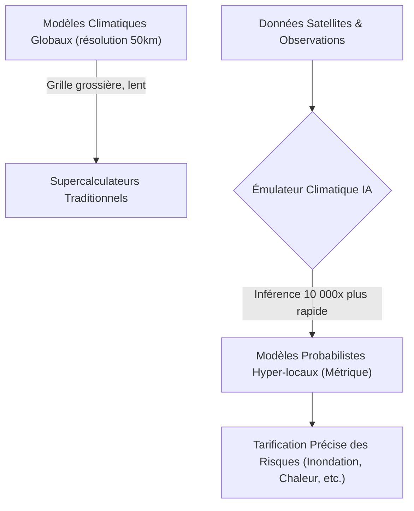
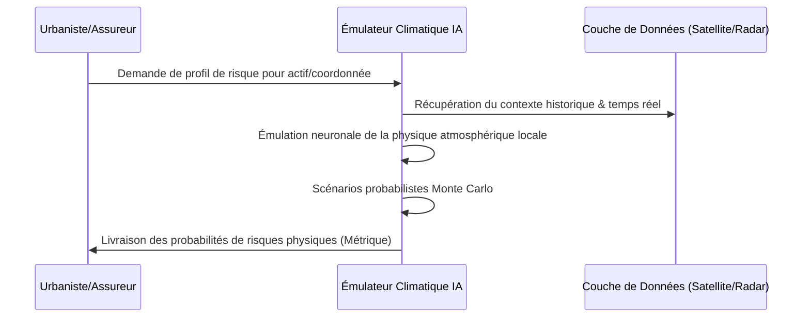

<!-- markdownlint-disable MD009 MD010 MD013 MD022 MD028 MD032 MD033 MD034 MD036 MD037 MD039 MD041 MD058 MD060 -->

[ 🇬🇧 English Version ](./README.md)

# Exascale Climate Emulator

> **Résumé exécutif :** Un émulateur de Machine Learning remplaçant les solveurs physiques déterministes traditionnels pour générer des modèles de risques climatiques hyper-locaux à l'échelle exascale, 10 000 fois plus rapidement qu'un supercalculateur classique.

---

## 1. Aperçu visuel & Effet Wahou

## 2. La thèse contrariante (Peter Thiel Style)

**La croyance populaire :** Prédire avec précision l'impact climatique local nécessite des clusters HPC (High-Performance Computing) toujours plus massifs pour résoudre en force brute les équations de Navier-Stokes sur des grilles globales plus fines.
**La vérité cachée :** Les solveurs physiques déterministes se heurtent à un mur computationnel insurmontable ; les modèles IA de substitution (Physics-Informed Neural Networks) entraînés sur la physique peuvent émuler les calculs exascale, compressant la physique en une inférence ultra-rapide pour offrir une précision à l'échelle de la rue instantanément.

## 3. Le problème & La cible

**Modèle économique :** B2B / B2G
**Cible précise :** Assureurs (réassurance), fonds d'infrastructures, urbanistes, et gouvernements nécessitant des prévisions hyper-locales des risques climatiques physiques.
**La douleur urgente :** Les modèles actuels sont trop grossiers (50-100km) pour prédire les impacts micro-locaux (ex: inondation d'un quartier précis, stress thermique d'une usine). La tarification du risque et la conception d'infrastructures sont donc aveugles à la réalité du terrain, entraînant des pertes financières massives non couvertes.

## 4. Architecture technique & Plomberie

## 5. Modèle économique & Viabilité financière

| Métrique                    | Valeur                                                      |
| --------------------------- | ----------------------------------------------------------- |
| Structure de prix           | Accès API tarifé par actif analysé / Abonnement Entreprise  |
| Objectif 12 mois            | 4 contrats de Réassurance ou Gouvernementaux (à 25 000€/an) |
| Calcul du CA (Target 100k€) | 4 \* 25 000€ = 100 000€ de revenus annuels récurrents       |
| Marge brute estimée         | 80%                                                         |

## 6. Moteur de distribution & Fossé défensif (Moat)

**Stratégie d'acquisition :** Ventes directes B2B/B2G, ciblant les Chief Risk Officers et les agences de développement urbain.
**Moat (Barrière à l'entrée) :** Compiler des décennies de données d'entraînement générées à l'échelle exascale et ajuster des réseaux neuronaux informés par la physique pour éviter les "hallucinations physiques" (violation des lois de la thermodynamique lors d'événements extrêmes Black Swans) requiert une expertise hautement spécialisée impossible à simuler par des LLM génériques.

## 7. Grille d'évaluation détaillée

| Critère                           | Score VC (/100) | Score Terrain (/100) |
| --------------------------------- | --------------- | -------------------- |
| Thèse & Monopole / Urgence        | 24 / 25         | -- / 25              |
| Moat / Résistance aux LLM natifs  | 25 / 25         | -- / 25              |
| Scalabilité / Friction d'adoption | 22 / 25         | -- / 25              |
| Unit Economics / ROI direct       | 20 / 25         | -- / 25              |
| **TOTAL**                         | **91 / 100**    | **-- / 100**         |

> **Verdict VC :** Exascale Climate Emulator applique une approche d'IA basée sur la physique pour résoudre l'un des problèmes les plus critiques et coûteux en calcul de notre époque. Remplacer les solveurs numériques traditionnels de Navier-Stokes par des émulateurs neuronaux crée un monopole sur l'évaluation des risques climatiques hyper-locaux en temps réel. Les barrières de calcul élevées assurent un moat fort, bien que l'acquisition de clients dans le secteur public puisse être lente.
> **Verdict Terrain :** En attente d'évaluation.
