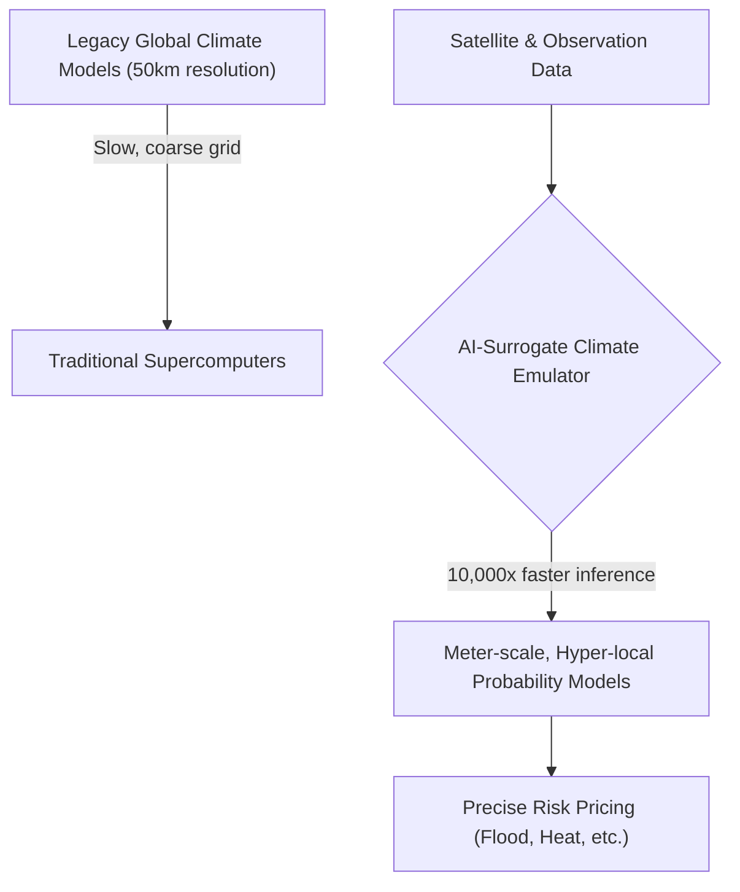
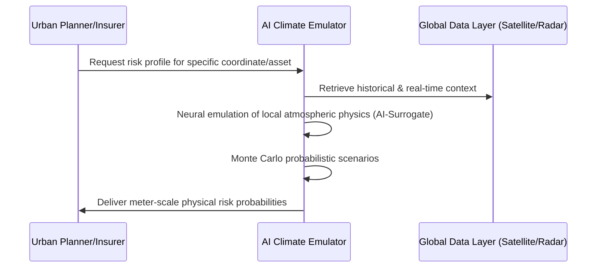

<!-- markdownlint-disable MD009 MD010 MD013 MD022 MD028 MD032 MD033 MD034 MD036 MD037 MD039 MD041 MD058 MD060 -->

[ 🇫🇷 Version Française ](./README.fr.md)

# Exascale Climate Emulator

> **Executive Summary:** A machine learning emulator replacing traditional deterministic physical solvers to generate hyper-local, exascale-resolution climate risk models 10,000x faster than legacy supercomputers.

---

## 1. Visual Overview & Wow Effect

## 2. Contrarian Thesis (Peter Thiel Style)

**Popular Belief:** Accurately predicting local climate impact requires increasingly massive High-Performance Computing (HPC) clusters to brute-force Navier-Stokes equations across finer global grids.
**Hidden Truth:** Deterministic physical solvers are hitting an insurmountable computational wall; AI surrogate models trained on physics (Physics-Informed Neural Networks) can emulate exascale computations, compressing the physics into rapid inference to deliver street-level precision instantly.

## 3. Problem & Target Market

**Business Model:** B2B / B2G
**Target Audience:** Insurers (reinsurance), infrastructure funds, urban planners, and governments.
**Urgent Pain Point:** Current climate models are too coarse (50-100km resolution) to predict micro-local impacts (e.g., specific neighborhood flooding or factory heat stress). This leaves risk pricing and infrastructure design completely blind to actual ground realities, leading to massive, unhedged financial losses.

## 4. Technical Architecture & Infrastructure

## 5. Business Model & Financial Viability

| Metric                 | Value                                                          |
| ---------------------- | -------------------------------------------------------------- |
| Pricing Structure      | Tiered API access per asset analyzed / Enterprise Subscription |
| 12-Month Target        | 4 Reinsurance or Govt contracts (at 25,000€/year)              |
| Revenue Formula        | 4 \* 25,000€ = 100,000€ ARR                                    |
| Estimated Gross Margin | 80%                                                            |

## 6. Distribution Engine & Moat

**Acquisition Strategy:** Direct enterprise/government sales, targeting Chief Risk Officers and urban development agencies.
**Moat (Defensibility):** Compiling decades of exascale-generated training data and tuning physics-informed neural networks to avoid "physical hallucinations" (violating laws of thermodynamics during Black Swan events) requires extreme specialized knowledge that cannot be easily spoofed by generic LLMs.

## 7. Detailed Evaluation Grid

| Criterion                   | VC Score (/100) | Market Score (/100) |
| --------------------------- | --------------- | ------------------- |
| Thesis & Monopoly / Urgency | 24 / 25         | 25 / 25             |
| Moat / LLM Immunity         | 25 / 25         | 23 / 25             |
| Scalability / UX Friction   | 22 / 25         | 19 / 25             |
| Unit Economics / ROI        | 20 / 25         | 21 / 25             |
| **TOTAL**                   | **91 / 100**    | **88 / 100**        |

> **VC Verdict:** Exascale Climate Emulator applies a physics-informed AI approach to solve one of the most critical and computationally expensive problems of our time. Replacing traditional Navier-Stokes numerical solvers with neural emulators creates a monopoly on real-time, hyper-local climate risk assessment. High computational barriers secure a strong moat, though customer acquisition in public sectors may be slow.
> **Market Verdict:** Massive financial losses from unhedged local climate risks create overwhelming urgency for insurers and governments (25/25). Physics-informed neural networks acting as surrogates for Navier-Stokes equations are highly defensible against generic language models (23/25). Complex integration with legacy risk systems creates friction (19/25), but the high-ticket API model ensures strong viability (21/25).
