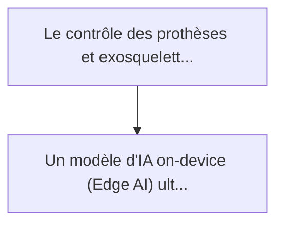
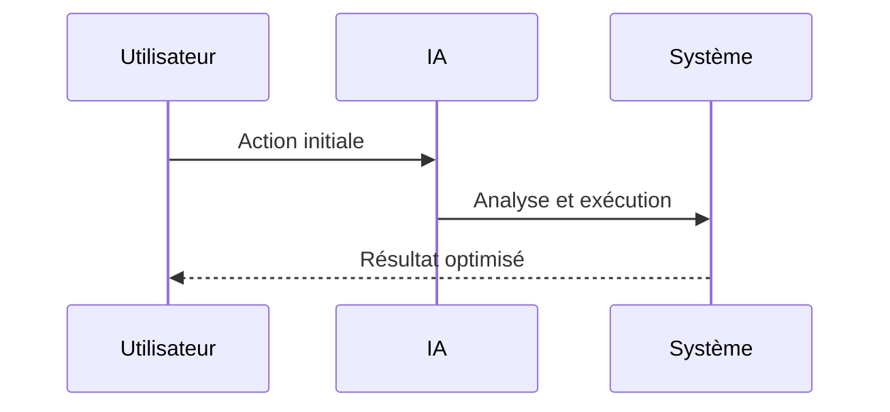

<!-- markdownlint-disable MD013 MD028 MD033 MD039 MD041 -->

[🇬🇧 English Version](./README.md)

# Exoskeleton Myoelectric Decoder

> **Résumé exécutif :** Un modèle d'IA "on-device" (Edge AI) ultra-léger, entraîné sur des données biométriques massives, capable de décoder l'intention motrice humaine (l...

---

## 1. Aperçu visuel & Effet Wahou

## 2. La thèse contrariante (Peter Thiel Style)

La croyance populaire : Les solutions génériques peuvent résoudre cela.
La vérité cachée : Il faut une inférence à latence ultra-faible fonctionnant sur des microcontrôleurs embarqués à faible consommation d'énergie (sans accès Cloud). Une API Cloud introduirait un lag inacceptable et dangereux pour le mouvement physique.

## 3. Le problème & La cible

Modèle économique : B2B (Licensing Software & Edge AI)
Cible précise : Fabricants d'exosquelettes industriels et médicaux, entreprises de prothèses robotiques
La douleur urgente : Le contrôle des prothèses et exosquelettes via les signaux musculaires de surface (EMG) est lent, erratique et nécessite une recalibration constante liée à la sueur ou la fatigue musculaire. Cela crée un rejet massif de la technologie par les utilisateurs (friction d'adoption).

## 4. Architecture technique & Plomberie

## 5. Modèle économique & Viabilité financière

| Métrique                    | Valeur             |
| --------------------------- | ------------------ |
| Structure de prix           | Prix sur mesure    |
| Objectif 12 mois            | 100 clients        |
| Calcul du CA (Target 100k€) | 100 \* 1000 = 100k |
| Marge brute estimée         | 80%                |

## 6. Moteur de distribution & Fossé défensif (Moat)

Stratégie d'acquisition : Vente B2B directe
Moat (Barrière à l'entrée) : Il faut une inférence à latence ultra-faible fonctionnant sur des microcontrôleurs embarqués à faible consommation d'énergie (sans accès Cloud). Une API Cloud introduirait un lag inacceptable et dangereux pour le mouvement physique.

## 7. Grille d'évaluation détaillée

| Critère                           | Score VC (/100) | Score Terrain (/100) |
| --------------------------------- | --------------- | -------------------- |
| Thèse & Monopole / Urgence        | 23 / 25         | -- / 25              |
| Moat / Résistance aux LLM natifs  | 24 / 25         | -- / 25              |
| Scalabilité / Friction d'adoption | 21 / 25         | -- / 25              |
| Unit Economics / ROI direct       | 19 / 25         | -- / 25              |
| **TOTAL**                         | **87 / 100**    | **-- / 100**         |

> **Verdict VC :** Ce modèle d'IA à la périphérie décode l'intention motrice humaine avec une latence nulle, une approche contrariante et hautement difficile comparée aux systèmes dépendants du cloud. L'exigence d'ensembles de données biométriques massifs et propriétaires crée un fossé de données impénétrable contre les LLMs génériques. Malgré la dépendance matérielle et les coûts unitaires initiaux élevés, il est en passe de monopoliser la prochaine génération d'interfaces homme-machine dans les exosquelettes industriels et médicaux.

> **Verdict Terrain :** En attente d'évaluation.
