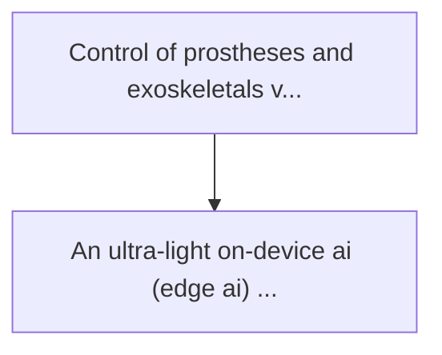
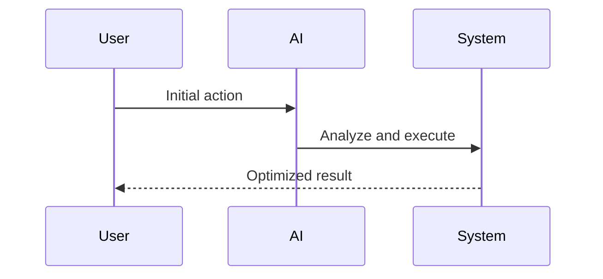

<!-- markdownlint-disable MD013 MD028 MD033 MD039 MD041 -->

[ 🇫🇷 Version Française ](./README.fr.md)

# Exoskeleton myoelectric decoder

> **Executive Summary:** An ultra-light "on-device" ai (edge ai) model, driven on massive biometric data, capable of decoding the human motor intent (i.e., the ...

---

## 1. Visual Overview & Wow Effect

## 2. Contrarian Thesis (Peter Thiel Style)

Popular Belief: Generic solutions can solve this.
Hidden Truth: It requires an ultra-low latency inference operating on on-board microcontrollers with low energy consumption (without cloud access). a cloud api would introduce an unacceptable and dangerous lagoon for physical movement.

## 3. Problem & Target Market

Business Model: B2B (Licensing Software & Edge AI)
Target Audience: Manufacturers of industrial and medical exoskeletons, robotic prosthetics companies
Urgent Pain Point: Control of prostheses and exoskeletals via surface muscle signals (emg) is slow, erratic and requires constant recalibration due to sweat or muscle fatigue. this creates a massive rejection of technology by users (adoption friction).

## 4. Technical Architecture & Infrastructure

## 5. Business Model & Financial Viability

| Metric                 | Value              |
| ---------------------- | ------------------ |
| Pricing Structure      | Custom Pricing     |
| 12-Month Target        | 100 customers      |
| Revenue Formula        | 100 \* 1000 = 100k |
| Estimated Gross Margin | 80%                |

## 6. Distribution Engine & Moat

Acquisition Strategy: Direct B2B Sales
Moat (Defensibility): It requires an ultra-low latency inference operating on on-board microcontrollers with low energy consumption (without cloud access). a cloud api would introduce an unacceptable and dangerous lagoon for physical movement.

## 7. Detailed Evaluation Grid

| Criterion                   | VC Score (/100) | Market Score (/100) |
| --------------------------- | --------------- | ------------------- |
| Thesis & Monopoly / Urgency | -- / 25         | -- / 25             |
| Moat / LLM Immunity         | -- / 25         | -- / 25             |
| Scalability / UX Friction   | -- / 25         | -- / 25             |
| Unit Economics / ROI        | -- / 25         | -- / 25             |
| **TOTAL**                   | **-- / 100**    | **-- / 100**        |

> **VC Verdict:** Pending evaluation.

> **Market Verdict:** Pending evaluation.
