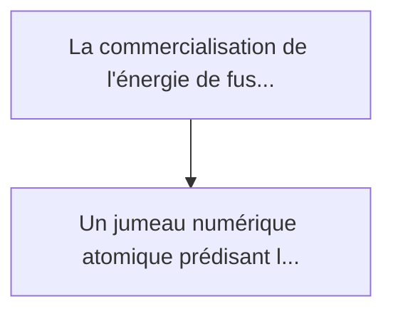
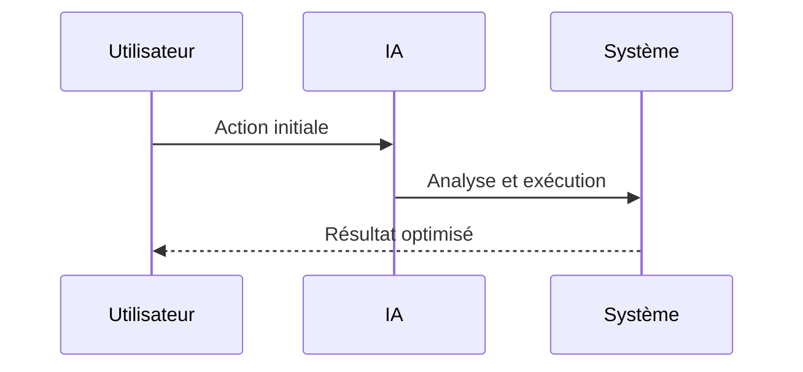

<!-- markdownlint-disable MD013 MD028 MD033 MD039 MD041 -->

[🇬🇧 English Version](./README.md)

# Fusion First-Wall Material Twin

> **Résumé exécutif :** Un jumeau numérique atomique prédisant la dégradation micro-structurelle (transmutation, déplacements par atome, cloquage par hélium) des matériaux...

---

## 1. Aperçu visuel & Effet Wahou

## 2. La thèse contrariante (Peter Thiel Style)

La croyance populaire : Les solutions génériques peuvent résoudre cela.
La vérité cachée : Les outils de conception assistée (CAD) ou les solveurs d'éléments finis (FEA) ne descendent pas à l'échelle quantique/atomique. L'IA générative standard ne respecte pas les lois de conservation de l'énergie et ne peut simuler des cascades de collisions neutroniques.

## 3. Le problème & La cible

Modèle économique : B2B
Cible précise : Entreprises de fusion nucléaire (tokamaks, confinement inertiel, stellarators), instituts de recherche en matériaux sous conditions extrêmes.
La douleur urgente : La commercialisation de l'énergie de fusion est bloquée par la dégradation des matériaux de la "première paroi" du réacteur. Face aux flux intenses de neutrons rapides et aux charges thermiques extrêmes du plasma, les alliages actuels (tungstène, aciers spécifiques) se fragilisent, gonflent ou fondent prématurément. Tester physiquement de nouveaux matériaux prend des mois et coûte des millions par échantillon.

## 4. Architecture technique & Plomberie

## 5. Modèle économique & Viabilité financière

| Métrique                    | Valeur             |
| --------------------------- | ------------------ |
| Structure de prix           | Prix sur mesure    |
| Objectif 12 mois            | 100 clients        |
| Calcul du CA (Target 100k€) | 100 \* 1000 = 100k |
| Marge brute estimée         | 80%                |

## 6. Moteur de distribution & Fossé défensif (Moat)

Stratégie d'acquisition : Vente B2B directe
Moat (Barrière à l'entrée) : Les outils de conception assistée (CAD) ou les solveurs d'éléments finis (FEA) ne descendent pas à l'échelle quantique/atomique. L'IA générative standard ne respecte pas les lois de conservation de l'énergie et ne peut simuler des cascades de collisions neutroniques.

## 7. Grille d'évaluation détaillée

| Critère                           | Score VC (/100) | Score Terrain (/100) |
| --------------------------------- | --------------- | -------------------- |
| Thèse & Monopole / Urgence        | 25 / 25         | -- / 25              |
| Moat / Résistance aux LLM natifs  | 24 / 25         | -- / 25              |
| Scalabilité / Friction d'adoption | 18 / 25         | -- / 25              |
| Unit Economics / ROI direct       | 21 / 25         | -- / 25              |
| **TOTAL**                         | **88 / 100**    | **-- / 100**         |

> **Verdict VC :** Ce jumeau numérique atomique représente le chaînon manquant pour la fusion nucléaire commerciale. Simuler la dégradation des matériaux sous des conditions de plasma extrêmes est un jeu de monopole deep tech qui échappe totalement aux LLMs généralistes en raison de sa dépendance à la mécanique quantique et aux données de science des matériaux. Le marché est concentré et précoce, mais capturer l'infrastructure matérielle sous-jacente pour l'énergie de fusion garantit un marché adressable d'un millier de milliards de dollars.

> **Verdict Terrain :** En attente d'évaluation.
