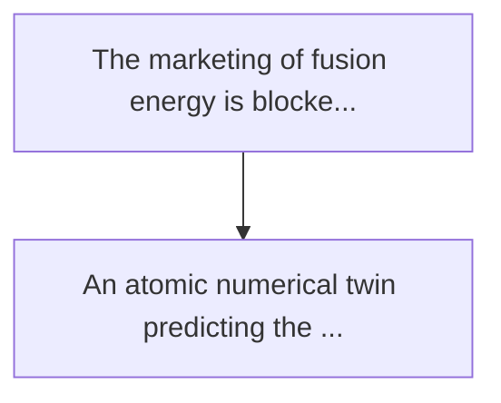
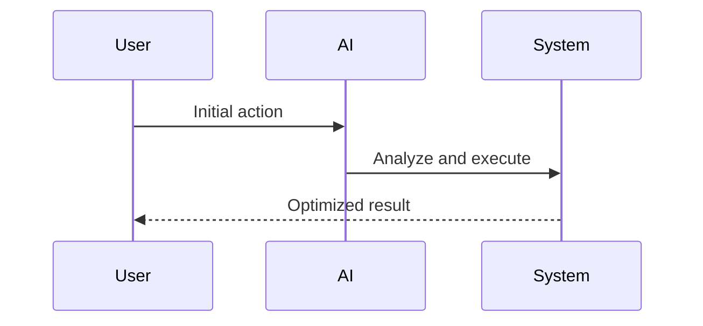

<!-- markdownlint-disable MD013 MD028 MD033 MD039 MD041 -->

[ 🇫🇷 Version Française ](./README.fr.md)

# Fusion first-wall material twin

> **Executive Summary:** An atomic numerical twin predicting the microstructural degradation (transmutation, atom displacement, helium blistering) of materials...

---

## 1. Visual Overview & Wow Effect

## 2. Contrarian Thesis (Peter Thiel Style)

Popular Belief: Generic solutions can solve this.
Hidden Truth: Assisted design tools (acds) or finished element solvers (feas) do not descend to the quantum/atomic scale. standard generative ai does not comply with energy conservation laws and cannot simulate neutronic collision cascades.

## 3. Problem & Target Market

Business Model: B2B
Target Audience: Nuclear fusion companies (tokamaks, inertial containment, stellarators), materials research institutes under extreme conditions.
Urgent Pain Point: The marketing of fusion energy is blocked by the degradation of materials in the "first wall" of the reactor. faced with the intense fluxes of fast neutrons and the extreme thermal loads of plasma, today's alloys (tungsten, specific steels) weaken, inflate or melt prematurely. physical testing of new materials takes months and costs millions per sample.

## 4. Technical Architecture & Infrastructure

## 5. Business Model & Financial Viability

| Metric                 | Value              |
| ---------------------- | ------------------ |
| Pricing Structure      | Custom Pricing     |
| 12-Month Target        | 100 customers      |
| Revenue Formula        | 100 \* 1000 = 100k |
| Estimated Gross Margin | 80%                |

## 6. Distribution Engine & Moat

Acquisition Strategy: Direct B2B Sales
Moat (Defensibility): Assisted design tools (acds) or finished element solvers (feas) do not descend to the quantum/atomic scale. standard generative ai does not comply with energy conservation laws and cannot simulate neutronic collision cascades.

## 7. Detailed Evaluation Grid

| Criterion                   | VC Score (/100) | Market Score (/100) |
| --------------------------- | --------------- | ------------------- |
| Thesis & Monopoly / Urgency | 25 / 25         | -- / 25             |
| Moat / LLM Immunity         | 24 / 25         | -- / 25             |
| Scalability / UX Friction   | 18 / 25         | -- / 25             |
| Unit Economics / ROI        | 21 / 25         | -- / 25             |
| **TOTAL**                   | **88 / 100**    | **-- / 100**        |

> **VC Verdict:** This atomic digital twin represents the missing link for commercial nuclear fusion. Simulating material degradation under extreme plasma conditions is a deep tech monopoly play that absolutely evades generalist LLMs due to its reliance on quantum mechanics and materials science data. The market is concentrated and early, but capturing the underlying material infrastructure for fusion energy ensures a trillion-dollar TAM.

> **Market Verdict:** Pending evaluation.
