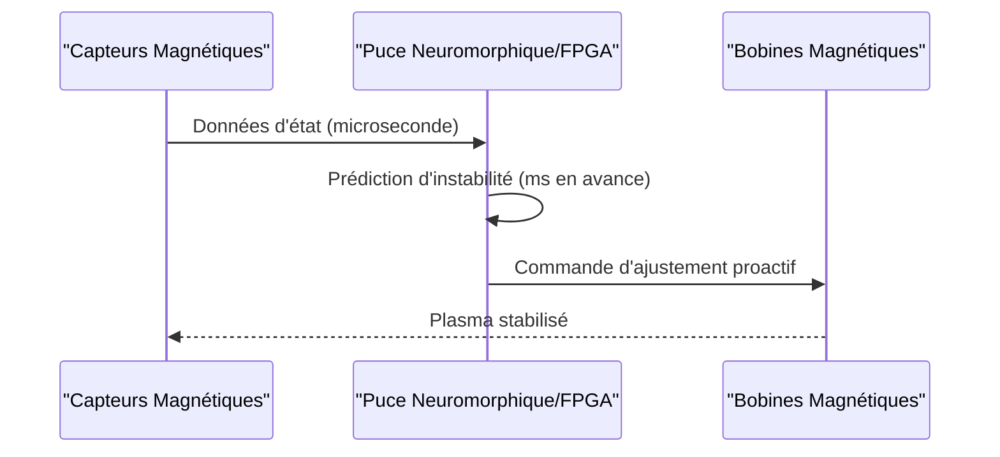

<!-- markdownlint-disable MD009 MD010 MD013 MD022 MD028 MD032 MD033 MD034 MD036 MD037 MD039 MD041 MD058 MD060 -->

[🇬🇧 English Version](./README.md)

# Fusion Plasma Containment Optimizer

> **Résumé exécutif :** Prédiction en temps réel et ajustement proactif des bobines magnétiques pour stabiliser le plasma de fusion via des réseaux neuronaux ultra-rapides sur matériel spécialisé.


---

## 1. Aperçu visuel & Effet Wahou

```mermaid
graph TD
    %% Schéma comparatif Problème vs Solution ou Flux d'architecture
    A[Réacteur de Fusion (Tokamak/Stellarator)] -->|Début de l'instabilité| B[Systèmes de contrôle classiques]
    B -->|Réactif| C[Perte du plasma & de l'énergie]
    A -->|Données des capteurs magnétiques| D{Fusion Plasma Containment Optimizer}
    D -->|Contrôle proactif via puces neuromorphiques| E[Plasma stable & énergie nette]
```

## 2. La thèse contrariante (Peter Thiel Style)

La croyance populaire : L'IA standard basée sur le cloud ou même les clusters GPU peuvent gérer les simulations physiques complexes pour les réacteurs de fusion.
La vérité cachée : La latence requise pour prévenir les disruptions magnétohydrodynamiques (MHD) est de l'ordre de la microseconde. Seules des puces neuromorphiques spécialisées ou des FPGA exécutant des Liquid Neural Networks directement couplés aux capteurs peuvent atteindre la latence ultra-faible et déterministe nécessaire pour confiner proactivement le plasma.

## 3. Le problème & La cible

Modèle économique : B2B
Cible précise : Startups de fusion nucléaire (Tokamaks, Stellarators), laboratoires de recherche gouvernementaux (ITER).
La douleur urgente : Maintenir le plasma en fusion stable (à 100 millions de degrés) nécessite de contrôler des instabilités magnétohydrodynamiques (MHD) chaotiques en temps réel. Les systèmes de contrôle actuels réagissent aux disruptions une fois qu'elles commencent, entraînant souvent la perte du plasma et l'arrêt de la réaction, empêchant la production d'énergie nette.

## 4. Architecture technique & Plomberie



## 5. Modèle économique & Viabilité financière

| Métrique                    | Valeur                                        |
| --------------------------- | --------------------------------------------- |
| Structure de prix           | Licence de haute valeur par réacteur / projet |
| Objectif 12 mois            | 1 à 2 déploiements pilotes majeurs            |
| Calcul du CA (Target 100k€) | 1 \* 100k = 100k                              |
| Marge brute estimée         | 90%                                           |

## 6. Moteur de distribution & Fossé défensif (Moat)

Stratégie d'acquisition : Ventes directes et partenariats avec les méga-projets expérimentaux et startups deep-tech en fusion.
Moat (Barrière à l'entrée) : Opérer au niveau matériel avec des exigences de latence de l'ordre de la microseconde crée une barrière insurmontable pour les modèles d'IA génériques. Le coût d'un échec est astronomique (endommager un réacteur d'un milliard de dollars), ce qui signifie qu'une fois prouvé, le système bénéficie d'un effet de verrouillage (lock-in) extrême.

## 7. Grille d'évaluation détaillée

| Critère                           | Score VC (/100) | Score Terrain (/100) |
| --------------------------------- | --------------- | -------------------- |
| Thèse & Monopole / Urgence        | 23 / 25         | -- / 25              |
| Moat / Résistance aux LLM natifs  | 24 / 25         | -- / 25              |
| Scalabilité / Friction d'adoption | 19 / 25         | -- / 25              |
| Unit Economics / ROI direct       | 20 / 25         | -- / 25              |
| **TOTAL**                         | **86 / 100**    | **-- / 100**         |

> **Verdict VC :** Ce projet présente une thèse fortement contrariante avec un véritable potentiel de monopole (23/25). Le fossé technologique profond et les exigences d'ingénierie rendent la solution quasi-impossible à répliquer par de simples concurrents SaaS (24/25). La friction à l'échelle (19/25) pourrait ralentir l'hyper-croissance, bien que les unit economics (20/25) soutiennent toujours un modèle d'affaires viable.
>
> **Verdict Terrain :** En attente d'évaluation.
