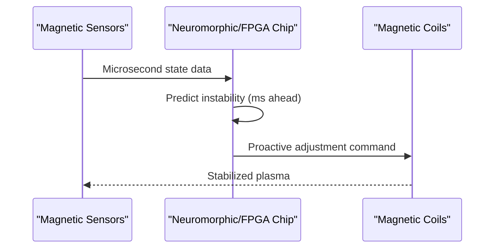

<!-- markdownlint-disable MD009 MD010 MD013 MD022 MD028 MD032 MD033 MD034 MD036 MD037 MD039 MD041 MD058 MD060 -->

[🇫🇷 Version Française](./README.fr.md)

# Fusion Plasma Containment Optimizer

> **Executive Summary:** Real-time prediction and proactive adjustment of magnetic coils to stabilize fusion plasma using ultra-fast neural networks on specialized hardware.


---

## 1. Visual Overview & Wow Effect

```mermaid
graph TD
    %% Problem vs Solution or Architecture Diagram
    A[Fusion Reactor (Tokamak/Stellarator)] -->|Plasma instability starts| B[Classic control systems]
    B -->|Reactive| C[Loss of plasma & energy]
    A -->|Magnetic sensor data| D{Fusion Plasma Containment Optimizer}
    D -->|Proactive control via neuromorphic chips| E[Stable plasma & net energy]
```

## 2. Contrarian Thesis (Peter Thiel Style)

Popular Belief: Standard cloud-based AI or even GPU clusters can handle complex physical simulations for fusion reactors.
Hidden Truth: The latency required to prevent magnetohydrodynamic (MHD) disruptions is in the microsecond range. Only specialized neuromorphic chips or FPGAs running Liquid Neural Networks directly coupled to sensors can achieve the deterministic, ultra-low latency needed to proactively contain the plasma.

## 3. Problem & Target Market

Business Model: B2B
Target Audience: Nuclear fusion startups (Tokamaks, Stellarators), government research laboratories (ITER).
Urgent Pain Point: Maintaining stable plasma at 100 million degrees requires real-time control of chaotic MHD instabilities. Current systems react only after disruptions start, often leading to plasma loss, halting the reaction, and preventing net energy production.

## 4. Technical Architecture & Infrastructure



## 5. Business Model & Financial Viability

| Metric                 | Value                                               |
| ---------------------- | --------------------------------------------------- |
| Pricing Structure      | High-value licensing per reactor / research project |
| 12-Month Target        | 1 to 2 major pilot deployments                      |
| Revenue Formula        | 1 \* 100k = 100k                                    |
| Estimated Gross Margin | 90%                                                 |

## 6. Distribution Engine & Moat

Acquisition Strategy: Direct sales and partnerships with experimental mega-projects and deep-tech fusion startups.
Moat (Defensibility): Operating at the hardware level with microsecond latency requirements creates an insurmountable barrier for generic AI models. The cost of failure is astronomical (damaging a billion-dollar reactor), meaning once proven, the system benefits from extreme lock-in.

## 7. Detailed Evaluation Grid

| Criterion                   | VC Score (/100) | Market Score (/100) |
| --------------------------- | --------------- | ------------------- |
| Thesis & Monopoly / Urgency | 23 / 25         | -- / 25             |
| Moat / LLM Immunity         | 24 / 25         | -- / 25             |
| Scalability / UX Friction   | 19 / 25         | -- / 25             |
| Unit Economics / ROI        | 20 / 25         | -- / 25             |
| **TOTAL**                   | **86 / 100**    | **-- / 100**        |

> **VC Verdict:** This project presents a strongly contrarian thesis with genuine monopoly potential (23/25). The deep technical moat and hard engineering requirements make it essentially impossible for casual SaaS competitors to replicate (24/25). Scalability friction (19/25) may slow hyper-growth, though the unit economics (20/25) still support a viable venture scale business.
>
> **Market Verdict:** Pending evaluation.
