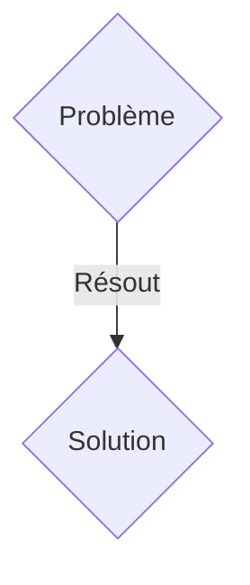
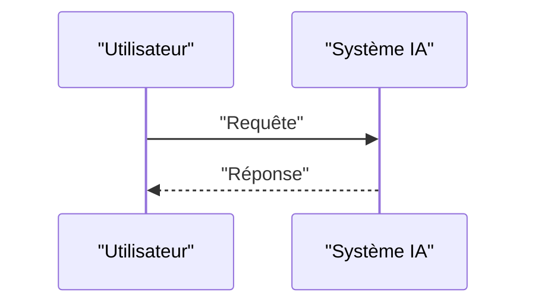

<!-- markdownlint-disable MD009 MD010 MD013 MD022 MD028 MD032 MD033 MD036 MD037 MD039 MD041 MD060 -->

[ 🇬🇧 English Version ](./README.md)

# PlasmaControl AI

> **Résumé exécutif :** Une solution B2B ciblant Startups de fusion nucléaire (Tokamak, Stellarator, confinement inertiel), instituts de recherche gouvernementaux (ITER). pour résoudre : Maintenir un plasma à des millions de degrés de manière stable est le verrou de la fusion nucléaire. Les instabilités magnétohydrodynamiques (MHD) se développent en quelques microsecondes et détruisent le confinement, interrompant la réaction et endommageant les parois du réacteur.

---

## 1. Aperçu visuel & Effet Wahou

## 2. La thèse contrariante (Peter Thiel Style)

- **La croyance populaire :** Les solutions génériques suffisent.
- **La vérité cachée :** Un contrôleur d'IA basé sur l'apprentissage par renforcement profond (Deep RL) à ultra-basse latence, entraîné sur des simulateurs physiques massivement parallèles. Il analyse les données des capteurs de diagnostic en temps réel et ajuste les bobines magnétiques des milliers de fois par seconde pour prévenir la disruption du plasma.

## 3. Le problème & La cible

- **Modèle économique :** B2B
- **Cible précise :** Startups de fusion nucléaire (Tokamak, Stellarator, confinement inertiel), instituts de recherche gouvernementaux (ITER).
- **La douleur urgente :** Maintenir un plasma à des millions de degrés de manière stable est le verrou de la fusion nucléaire. Les instabilités magnétohydrodynamiques (MHD) se développent en quelques microsecondes et détruisent le confinement, interrompant la réaction et endommageant les parois du réacteur.

## 4. Architecture technique & Plomberie

Un contrôleur d'IA basé sur l'apprentissage par renforcement profond (Deep RL) à ultra-basse latence, entraîné sur des simulateurs physiques massivement parallèles. Il analyse les données des capteurs de diagnostic en temps réel et ajuste les bobines magnétiques des milliers de fois par seconde pour prévenir la disruption du plasma.

## 5. Modèle économique & Viabilité financière

| Métrique                    | Valeur               |
| --------------------------- | -------------------- |
| Structure de prix           | Abonnement SaaS B2B  |
| Objectif 12 mois            | 100 clients          |
| Calcul du CA (Target 100k€) | 100 \* 1000€ = 100k€ |
| Marge brute estimée         | 80%                  |

## 6. Moteur de distribution & Fossé défensif (Moat)

- **Stratégie d'acquisition :** Vente directe et partenariats stratégiques.
- **Moat (Barrière à l'entrée) :** Le temps de réaction requis est de l'ordre de la microseconde. L'inférence du modèle d'IA doit s'exécuter directement sur des FPGA couplés aux capteurs, aucune latence réseau n'est tolérée. Il faut modéliser la physique des plasmas qui est extrêmement chaotique.

## 7. Grille d'évaluation détaillée

| Critère                           | Score VC (/100) | Score Terrain (/100) |
| --------------------------------- | --------------- | -------------------- |
| Thèse & Monopole / Urgence        | -- / 25         | -- / 25              |
| Moat / Résistance aux LLM natifs  | -- / 25         | -- / 25              |
| Scalabilité / Friction d'adoption | -- / 25         | -- / 25              |
| Unit Economics / ROI direct       | -- / 25         | -- / 25              |
| TOTAL                             | -- / 100        | -- / 100             |

> **Verdict VC :** En attente d'évaluation.
> **Verdict Terrain :** En attente d'évaluation.
