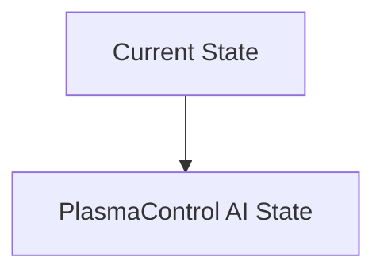
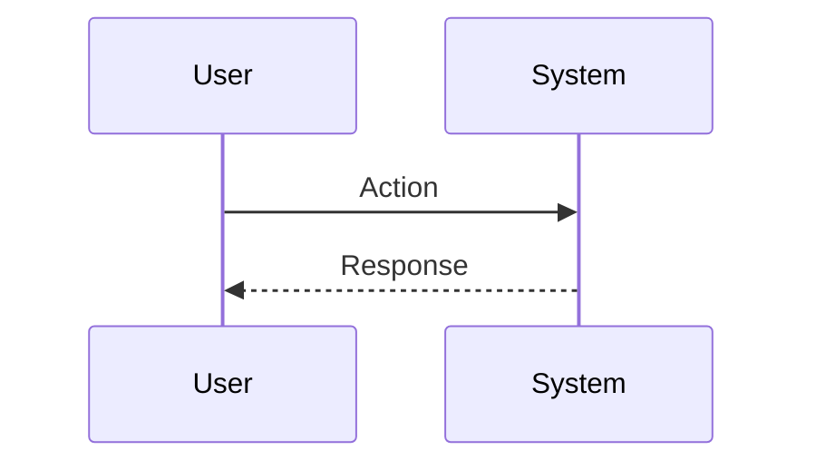

<!-- markdownlint-disable MD009 MD010 MD013 MD022 MD028 MD032 MD033 MD034 MD036 MD037 MD039 MD041 MD060 -->

[ 🇫🇷 Version Française ](./README.fr.md)

# PlasmaControl AI

> **Executive Summary:** An ultra-low latency deep reinforcement learning (Deep RL)-based AI controller trained on massively parallel physics simulators. It analyzes data from diagnostic sensors in real time and adjusts the magnetic coils thousands of times per second to prevent plasma disruption.

---

## 1. Visual Overview & Wow Effect

## 2. Contrarian Thesis (Peter Thiel Style)

**Popular Belief:** General AI solutions can solve this problem.

**Hidden Truth:** The reaction time required is of the order of microseconds. AI model inference must run directly on FPGAs coupled to the sensors, no network latency is tolerated. It is necessary to model plasma physics which is extremely chaotic.

## 3. Problem & Target Market

**Business Model:** B2B

**Target Audience:** Nuclear fusion startups (Tokamak, Stellarator, inertial confinement), government research institutes (ITER).

**Urgent Pain Point:** Maintaining a plasma at millions of degrees in a stable manner is the key to nuclear fusion. Magnetohydrodynamic (MHD) instabilities develop within microseconds and destroy the confinement, interrupting the reaction and damaging the reactor walls.

## 4. Technical Architecture & Infrastructure

## 5. Business Model & Financial Viability

| Metric                 | Value                           |
| ---------------------- | ------------------------------- |
| Pricing Structure      | SaaS subscription               |
| 12-Month Target        | 10 customers                    |
| Revenue Formula        | 10 clients \* 10k€/year = 100k€ |
| Estimated Gross Margin | 80%                             |

## 6. Distribution Engine & Moat

**Acquisition Strategy:** B2B direct sales

**Moat (Defensibility):** No massive commercial market in the short term (fusion industry is in R&D); validation impossible without access to experimental reactors worth billions of dollars; scientific risk that long-term confinement is physically impossible.

## 7. Detailed Evaluation Grid

| Criterion                   | VC Score (/100) | Market Score (/100) |
| --------------------------- | --------------- | ------------------- |
| Thesis & Monopoly / Urgency | -- / 25         | -- / 25             |
| Moat / LLM Immunity         | -- / 25         | -- / 25             |
| Scalability / UX Friction   | -- / 25         | -- / 25             |
| Unit Economics / ROI        | -- / 25         | -- / 25             |
| **TOTAL**                   | **-- / 100**    | **-- / 100**        |

> **VC Verdict:** Pending evaluation.

> **Market Verdict:** Pending evaluation.
