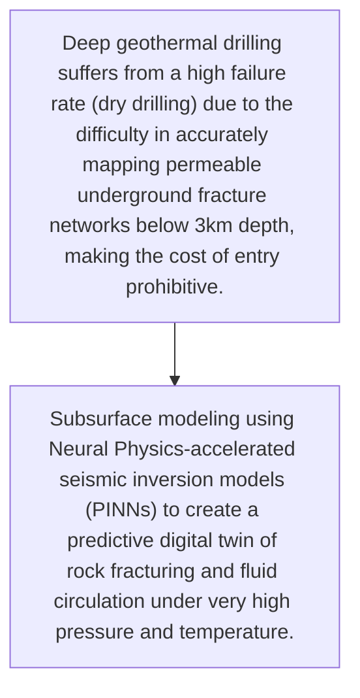
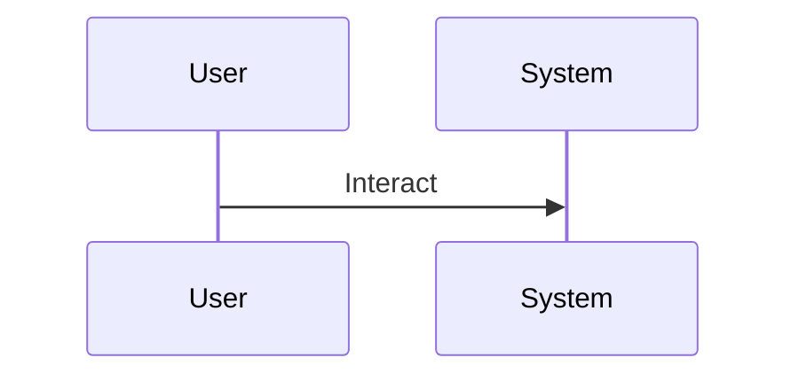

<!-- markdownlint-disable MD009 MD010 MD013 MD022 MD028 MD032 MD033 MD034 MD036 MD037 MD039 MD041 MD060 -->

[ 🇫🇷 Version Française ](./README.fr.md)

# Magma Twin Engine

> **Executive Summary:** Subsurface modeling using Neural Physics-accelerated seismic inversion models (PINNs) to create a predictive digital twin of rock fracturing and fluid circulation under very high pressure and temperature.

---

## 1. Visual Overview & Wow Effect

## 2. Contrarian Thesis (Peter Thiel Style)

- **Popular Belief:** Requires massive ingestion of multi-terabyte raw seismic data and resolution of non-linear differential equations (thermo-hydro-mechanical), far removed from standard B2B SaaS software.
- **Hidden Truth:** Subsurface modeling using Neural Physics-accelerated seismic inversion models (PINNs) to create a predictive digital twin of rock fracturing and fluid circulation under very high pressure and temperature.

## 3. Problem & Target Market

- **Business Model:** B2B
- **Target Audience:** Deep geothermal energy operators, drilling companies and transitioning oil companies
- **Urgent Pain Point:** Deep geothermal drilling suffers from a high failure rate (dry drilling) due to the difficulty in accurately mapping permeable underground fracture networks below 3km depth, making the cost of entry prohibitive.

## 4. Technical Architecture & Infrastructure

## 5. Business Model & Financial Viability

| Metric                 | Value                                     |
| ---------------------- | ----------------------------------------- |
| Pricing Structure      | [Price / Subscription Model / Commission] |
| 12-Month Target        | [Exact volume required for 100k ARR]      |
| Revenue Formula        | [Mathematical calculation]                |
| Estimated Gross Margin | [Margin %]                                |

## 6. Distribution Engine & Moat

- **Acquisition Strategy:** [Virality, network effect, direct sales, developer adoption]
- **Moat (Defensibility):** Quality and scarcity of high-resolution seismic data, massive computational costs, high inherent residual geological uncertainty.

## 7. Detailed Evaluation Grid

| Criterion                   | VC Score (/100) | Market Score (/100) |
| --------------------------- | --------------- | ------------------- |
| Thesis & Monopoly / Urgency | -- / 25         | 24 / 25             |
| Moat / LLM Immunity         | -- / 25         | 23 / 25             |
| Scalability / UX Friction   | -- / 25         | 16 / 25             |
| Unit Economics / ROI        | -- / 25         | 21 / 25             |
| **TOTAL**                   | -- / 100        | **84 / 100**        |

> **VC Verdict:** Pending evaluation.
> **Market Verdict:** Strong urgency and obvious value for the target market. LLM resistance is high due to strong hardware or physical integration. Despite some adoption friction, B2B monetization is very clear.
