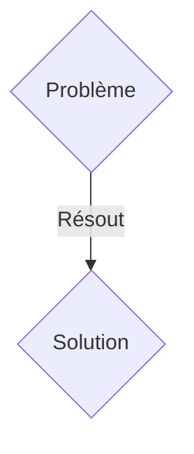
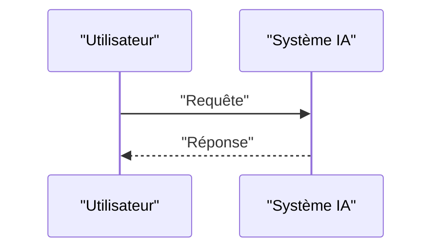

<!-- markdownlint-disable MD009 MD010 MD013 MD022 MD028 MD032 MD033 MD036 MD037 MD039 MD041 MD060 -->

[ 🇬🇧 English Version ](./README.md)

# GPS-Denied Swarm

> **Résumé exécutif :** Une solution B2G / B2B ciblant Défense, sécurité civile (recherche et sauvetage en sous-sol), inspection industrielle complexe (canalisations, mines profondes). pour résoudre : Les flottes de drones ou de robots terrestres dépendent presque exclusivement du GPS pour la navigation globale. Dans des environnements "GPS-denied" (brouillage militaire, bunkers souterrains, mines effondrées), les flottes deviennent aveugles, incapables de se coordonner spatialement ou de cartographier leur environnement collectivement, ce qui rend l'exploration de ces zones mortelle ou impossible.

---

## 1. Aperçu visuel & Effet Wahou

## 2. La thèse contrariante (Peter Thiel Style)

- **La croyance populaire :** Les solutions génériques suffisent.
- **La vérité cachée :** Un système de navigation inertielle collaborative (Collaborative SLAM - Simultaneous Localization and Mapping). En fusionnant les données de capteurs inertiels ultra-précis (centrale à inertie) et les flux LiDAR/VIO (Visual Inertial Odometry) distribués sur plusieurs robots, la flotte recalibre sa position absolue de manière décentralisée via un réseau M2M (mesh network ultra-wideband), sans aucun signal externe.

## 3. Le problème & La cible

- **Modèle économique :** B2G / B2B
- **Cible précise :** Défense, sécurité civile (recherche et sauvetage en sous-sol), inspection industrielle complexe (canalisations, mines profondes).
- **La douleur urgente :** Les flottes de drones ou de robots terrestres dépendent presque exclusivement du GPS pour la navigation globale. Dans des environnements "GPS-denied" (brouillage militaire, bunkers souterrains, mines effondrées), les flottes deviennent aveugles, incapables de se coordonner spatialement ou de cartographier leur environnement collectivement, ce qui rend l'exploration de ces zones mortelle ou impossible.

## 4. Architecture technique & Plomberie

Un système de navigation inertielle collaborative (Collaborative SLAM - Simultaneous Localization and Mapping). En fusionnant les données de capteurs inertiels ultra-précis (centrale à inertie) et les flux LiDAR/VIO (Visual Inertial Odometry) distribués sur plusieurs robots, la flotte recalibre sa position absolue de manière décentralisée via un réseau M2M (mesh network ultra-wideband), sans aucun signal externe.

## 5. Modèle économique & Viabilité financière

| Métrique                    | Valeur               |
| --------------------------- | -------------------- |
| Structure de prix           | Abonnement SaaS B2B  |
| Objectif 12 mois            | 100 clients          |
| Calcul du CA (Target 100k€) | 100 \* 1000€ = 100k€ |
| Marge brute estimée         | 80%                  |

## 6. Moteur de distribution & Fossé défensif (Moat)

- **Stratégie d'acquisition :** Vente directe et partenariats stratégiques.
- **Moat (Barrière à l'entrée) :** C'est un problème d'algorithmique embarquée temps réel (Edge Computing) et de fusion de données multi-capteurs contrainte par de faibles puissances de calcul et une bande passante réseau instable. Un LLM ne sert à rien pour résoudre des matrices de covariance distribuées ou filtrer du bruit inertiel en microsecondes.

## 7. Grille d'évaluation détaillée

| Critère                           | Score VC (/100) | Score Terrain (/100) |
| --------------------------------- | --------------- | -------------------- |
| Thèse & Monopole / Urgence        | -- / 25         | -- / 25              |
| Moat / Résistance aux LLM natifs  | -- / 25         | -- / 25              |
| Scalabilité / Friction d'adoption | -- / 25         | -- / 25              |
| Unit Economics / ROI direct       | -- / 25         | -- / 25              |
| TOTAL                             | -- / 100        | -- / 100             |

> **Verdict VC :** En attente d'évaluation.
> **Verdict Terrain :** En attente d'évaluation.
