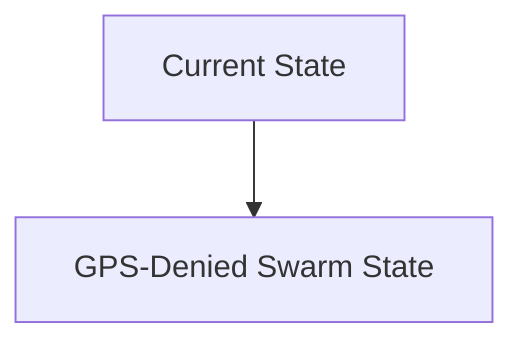
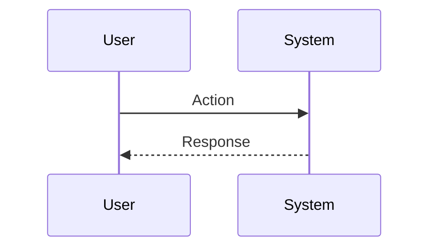

<!-- markdownlint-disable MD009 MD010 MD013 MD022 MD028 MD032 MD033 MD034 MD036 MD037 MD039 MD041 MD060 -->

[ 🇫🇷 Version Française ](./README.fr.md)

# GPS-Denied Swarm

> **Executive Summary:** A collaborative inertial navigation system (Collaborative SLAM - Simultaneous Localization and Mapping). By merging data from ultra-precise inertial sensors (inertia control unit) and LiDAR/VIO (Visual Inertial Odometry) flows distributed across several robots, the fleet recalibrates its absolute position in a decentralized manner via an M2M network (ultra-wideband mesh network), without any external signal.

---

## 1. Visual Overview & Wow Effect

## 2. Contrarian Thesis (Peter Thiel Style)

**Popular Belief:** General AI solutions can solve this problem.

**Hidden Truth:** It is a real-time embedded algorithmic problem (Edge Computing) and multi-sensor data fusion constrained by low computing power and unstable network bandwidth. An LLM is of no use for solving distributed covariance matrices or filtering inertial noise in microseconds.

## 3. Problem & Target Market

**Business Model:** B2G / B2B

**Target Audience:** Defense, civil security (underground search and rescue), complex industrial inspection (pipes, deep mines).

**Urgent Pain Point:** Fleets of drones or ground robots rely almost exclusively on GPS for global navigation. In "GPS-denied" environments (military jamming, underground bunkers, collapsed mines), fleets become blind, unable to coordinate spatially or map their surroundings collectively, making exploration of these areas deadly or impossible.

## 4. Technical Architecture & Infrastructure

## 5. Business Model & Financial Viability

| Metric                 | Value                           |
| ---------------------- | ------------------------------- |
| Pricing Structure      | SaaS subscription               |
| 12-Month Target        | 10 customers                    |
| Revenue Formula        | 10 clients \* 10k€/year = 100k€ |
| Estimated Gross Margin | 80%                             |

## 6. Distribution Engine & Moat

**Acquisition Strategy:** B2B direct sales

**Moat (Defensibility):** Mathematical complexity of Collaborative SLAM (exponential drift of inertial errors), need for robust hardware in the face of shocks/interferences, slow and demanding government sales cycles (B2G).

## 7. Detailed Evaluation Grid

| Criterion                   | VC Score (/100) | Market Score (/100) |
| --------------------------- | --------------- | ------------------- |
| Thesis & Monopoly / Urgency | -- / 25         | -- / 25             |
| Moat / LLM Immunity         | -- / 25         | -- / 25             |
| Scalability / UX Friction   | -- / 25         | -- / 25             |
| Unit Economics / ROI        | -- / 25         | -- / 25             |
| **TOTAL**                   | **-- / 100**    | **-- / 100**        |

> **VC Verdict:** Pending evaluation.

> **Market Verdict:** Pending evaluation.
