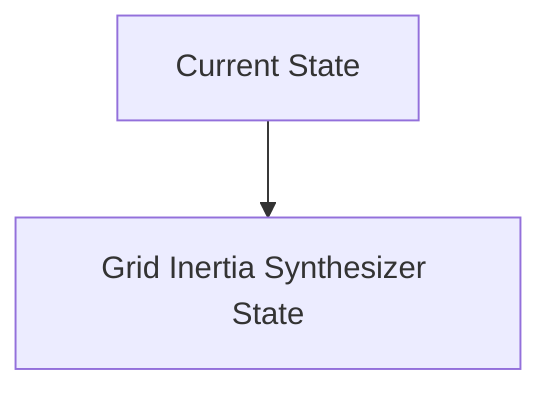
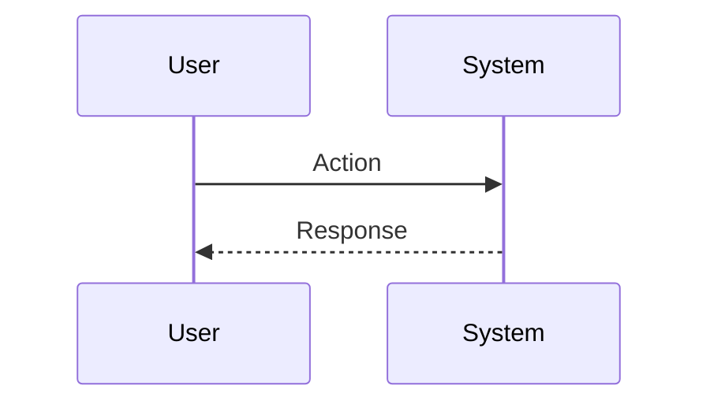

<!-- markdownlint-disable MD009 MD010 MD013 MD022 MD028 MD032 MD033 MD034 MD036 MD037 MD039 MD041 MD060 -->

[ 🇫🇷 Version Française ](./README.fr.md)

# Grid Inertia Synthesizer

> **Executive Summary:** A hardware/software controller (edge ​​computing) for massive inverters (Grid-forming inverters) coupled with an AI for predicting micro-instabilities which synthesizes virtual inertia by injecting or absorbing power in a few milliseconds via decentralized batteries.

---

## 1. Visual Overview & Wow Effect

## 2. Contrarian Thesis (Peter Thiel Style)

**Popular Belief:** General AI solutions can solve this problem.

**Hidden Truth:** Critical cyber-physical problem requiring ultra-fast low-level control (AC sub-cycle) at the hardware level. A cloud SaaS would introduce fatal latency leading to network collapse.

## 3. Problem & Target Market

**Business Model:** B2B

**Target Audience:** Transmission network operators (TSO) and renewable energy producers (RTE, National Grid, wind/solar farm operators).

**Urgent Pain Point:** The transition to renewable energy removes the “rotating inertia” of large fossil turbines, making power grids increasingly unstable and prone to blackouts during frequency fluctuations.

## 4. Technical Architecture & Infrastructure

## 5. Business Model & Financial Viability

| Metric                 | Value                           |
| ---------------------- | ------------------------------- |
| Pricing Structure      | SaaS subscription               |
| 12-Month Target        | 10 customers                    |
| Revenue Formula        | 10 clients \* 10k€/year = 100k€ |
| Estimated Gross Margin | 80%                             |

## 6. Distribution Engine & Moat

**Acquisition Strategy:** B2B direct sales

**Moat (Defensibility):** Network regulations very slow to evolve, need for significant capital for hardware deployment, legal liability in the event of a major power outage.

## 7. Detailed Evaluation Grid

| Criterion                   | VC Score (/100) | Market Score (/100) |
| --------------------------- | --------------- | ------------------- |
| Thesis & Monopoly / Urgency | -- / 25         | -- / 25             |
| Moat / LLM Immunity         | -- / 25         | -- / 25             |
| Scalability / UX Friction   | -- / 25         | -- / 25             |
| Unit Economics / ROI        | -- / 25         | -- / 25             |
| **TOTAL**                   | **-- / 100**    | **-- / 100**        |

> **VC Verdict:** Pending evaluation.

> **Market Verdict:** Pending evaluation.
