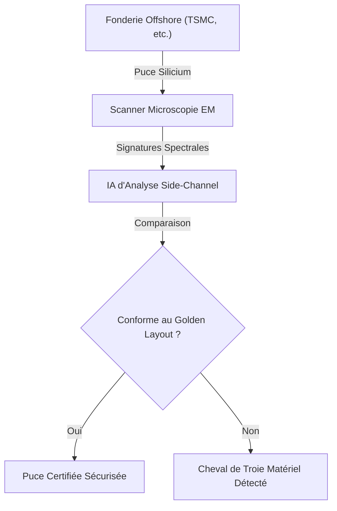
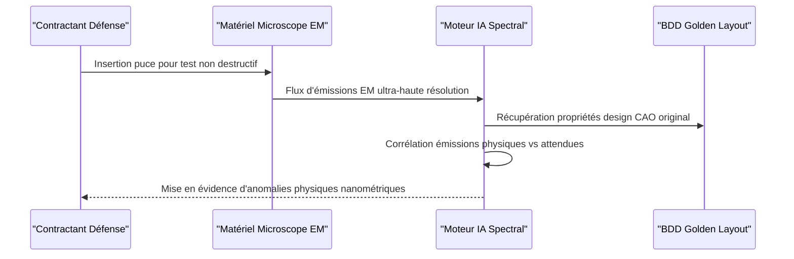

<!-- markdownlint-disable MD009 MD010 MD013 MD022 MD028 MD032 MD033 MD034 MD036 MD037 MD039 MD041 MD060 -->

[ 🇬🇧 English Version ](./README.md)

# Hardware Trojan EM Scanner

> **Résumé exécutif :** Un système de scan non destructif qui utilise la microscopie électromagnétique (EM) à ultra-haute résolution et l'IA pour détecter les chevaux de Troie physiques insérés dans le silicium lors de la fabrication offshore.

---

## 1. Aperçu visuel & Effet Wahou

## 2. La thèse contrariante (Peter Thiel Style)

- **La croyance populaire :** La cybersécurité est fondamentalement un problème logiciel résolu par de meilleurs pare-feux, le chiffrement et des architectures logicielles zero-trust.
- **La vérité cachée :** La sécurité logicielle n'a aucun sens si le silicium physique sous-jacent a été compromis au niveau de la fonderie. Les chevaux de Troie matériels (portes dérobées physiques) contournent toutes les défenses logicielles et constituent l'angle mort ultime des chaînes d'approvisionnement des infrastructures critiques mondiales.

## 3. Le problème & La cible

- **Modèle économique :** B2B
- **Cible précise :** Défense nationale, fabricants de systèmes critiques (aérospatial, médical, infrastructures), agences de renseignement.
- **La douleur urgente :** Avec la chaîne d'approvisionnement globale des puces électroniques, il est presque impossible de garantir qu'aucun "Hardware Trojan" (portes dérobées physiques) n'a été inséré dans le silicium lors de la fonderie offshore. Une puce certifiée peut cacher des kill-switches.

## 4. Architecture technique & Plomberie

## 5. Modèle économique & Viabilité financière

| Métrique                        | Valeur                                                |
| ------------------------------- | ----------------------------------------------------- |
| **Structure de prix**           | CapEx pour Matériel + SaaS récurrent pour MàJ IA      |
| **Objectif 12 mois**            | 1 à 2 installations pilotes avec contractants défense |
| **Calcul du CA (Target 100k€)** | 1 Installation \* (50k€ Setup + 50k€/an Logiciel)     |
| **Marge brute estimée**         | ~60% (Mixte Matériel/Logiciel)                        |

## 6. Moteur de distribution & Fossé défensif (Moat)

- **Stratégie d'acquisition :** Ventes directes aux gouvernements et aux principaux contractants (B2G/B2B), en naviguant dans les habilitations de sécurité et en exploitant les anxiétés géopolitiques liées à la chaîne d'approvisionnement.
- **Moat (Barrière à l'entrée) :** Ce problème relève du matériel physique (side-channel analysis, ingénierie inverse). Le logiciel pur ou un LLM générique ne peut rien contre une modification physique du silicium au niveau du nanomètre. Cela demande des équipements de mesure de pointe et des algorithmes de traitement de signal spécialisés.

## 7. Grille d'évaluation détaillée

| Critère                           | Score VC (/100) | Score Terrain (/100) |
| --------------------------------- | --------------- | -------------------- |
| Thèse & Monopole / Urgence        | -- / 25         | 25 / 25              |
| Moat / Résistance aux LLM natifs  | -- / 25         | 24 / 25              |
| Scalabilité / Friction d'adoption | -- / 25         | 15 / 25              |
| Unit Economics / ROI direct       | -- / 25         | 22 / 25              |
| **TOTAL**                         | **-- / 100**    | **86 / 100**         |

> **Verdict VC :** En attente d'évaluation.

> **Verdict Terrain :** Forte urgence et valeur évidente pour la cible. La résistance aux LLM est élevée grâce à une intégration matérielle ou physique forte. Malgré quelques frictions d'adoption, la monétisation B2B est très claire.
