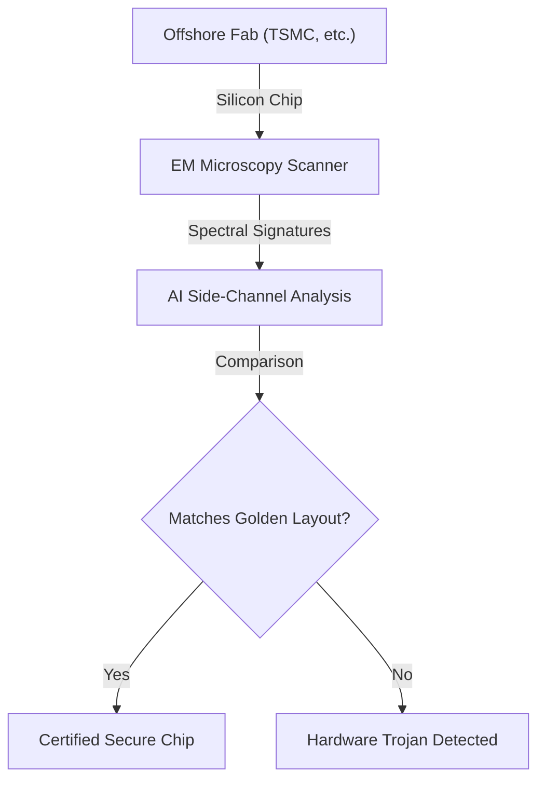
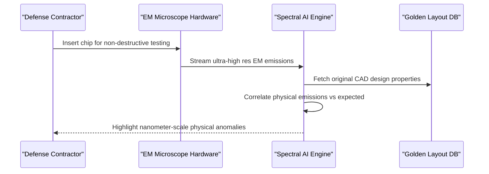

<!-- markdownlint-disable MD009 MD010 MD013 MD022 MD028 MD032 MD033 MD034 MD036 MD037 MD039 MD041 MD060 -->

[ 🇫🇷 Version Française ](./README.fr.md)

# Hardware Trojan EM Scanner

> **Executive Summary:** A non-destructive scanning system that uses ultra-high resolution electromagnetic (EM) microscopy and AI to detect physical hardware trojans hidden in silicon during offshore manufacturing.

---

## 1. Visual Overview & Wow Effect

## 2. Contrarian Thesis (Peter Thiel Style)

- **Popular Belief:** Cybersecurity is fundamentally a software problem solved by better firewalls, encryption, and zero-trust software architectures.
- **Hidden Truth:** Software security is meaningless if the underlying physical silicon has been compromised at the foundry level. Hardware trojans (physical backdoors) bypass all software defenses and are the ultimate blind spot in global critical infrastructure supply chains.

## 3. Problem & Target Market

- **Business Model:** B2B
- **Target Audience:** National defense, manufacturers of critical systems (aerospace, medical, infrastructure), and intelligence agencies.
- **Urgent Pain Point:** Due to the globalized semiconductor supply chain, it is almost impossible to guarantee that hardware trojans (physical backdoors, kill-switches) haven't been inserted into silicon at offshore foundries.

## 4. Technical Architecture & Infrastructure

## 5. Business Model & Financial Viability

| Metric                     | Value                                               |
| -------------------------- | --------------------------------------------------- |
| **Pricing Structure**      | CapEx for Hardware + Recurring SaaS for AI Updates  |
| **12-Month Target**        | 1-2 pilot installations with defense contractors    |
| **Revenue Formula**        | 1 Installation \* (50k€ Setup + 50k€/year Software) |
| **Estimated Gross Margin** | ~60% (Blended Hardware/Software)                    |

## 6. Distribution Engine & Moat

- **Acquisition Strategy:** Direct government and prime contractor sales (B2G/B2B), navigating security clearances and leveraging geopolitical supply chain anxieties.
- **Moat (Defensibility):** This relies on extreme physical hardware (side-channel analysis, reverse engineering). Pure software or a generic LLM cannot physically inspect silicon alterations at the nanometer scale. It requires state-of-the-art measurement equipment fused with specialized signal processing algorithms.

## 7. Detailed Evaluation Grid

| Criterion                   | VC Score (/100) | Market Score (/100) |
| --------------------------- | --------------- | ------------------- |
| Thesis & Monopoly / Urgency | -- / 25         | 24 / 25             |
| Moat / LLM Immunity         | -- / 25         | 25 / 25             |
| Scalability / UX Friction   | -- / 25         | 10 / 25             |
| Unit Economics / ROI        | -- / 25         | 18 / 25             |
| **TOTAL**                   | **-- / 100**    | **77 / 100**        |

> **VC Verdict:** Pending evaluation.

> **Market Verdict:** Moderate urgency but strong long-term strategic value. LLM immunity is good, relying on specialized models. Adoption presents notable friction that could slow initial monetization.
