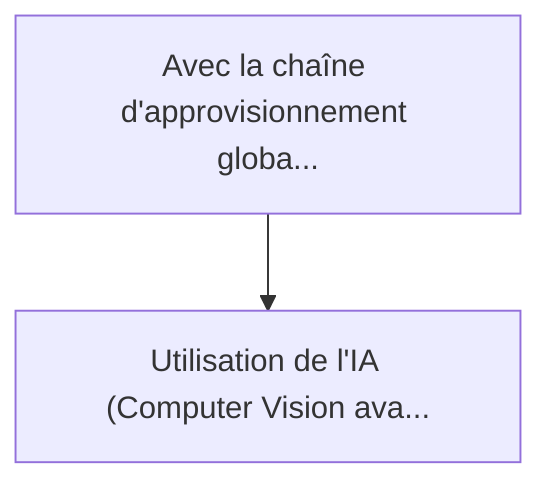
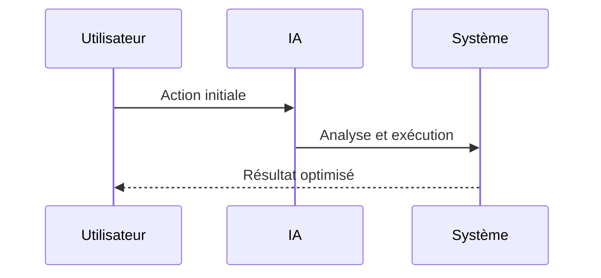

<!-- markdownlint-disable MD013 MD028 MD033 MD039 MD041 -->

[ 🇬🇧 English Version ](./README.md)

# Hardware Trojan Scanner

> **Résumé exécutif :** Utilisation de l'IA (Computer Vision avancée et Graph Neural Networks) pour comparer les plans CAO d'origine (GDSII) avec des images au microscope ...

---

## 1. Aperçu visuel & Effet Wahou

## 2. La thèse contrariante (Peter Thiel Style)

La croyance populaire : Les solutions génériques peuvent résoudre cela.
La vérité cachée : C'est un problème d'inspection de milliards de transistors physiques. Une vérification manuelle ou par simple algorithme heuristique est mathématiquement impossible en temps raisonnable vu la densité des puces modernes (5nm et moins).

## 3. Le problème & La cible

Modèle économique : B2B
Cible précise : Fabricants de semi-conducteurs, armée, aérospatial, opérateurs de datacenters cloud
La douleur urgente : Avec la chaîne d'approvisionnement globale des puces (fabriquées souvent à l'étranger), le risque d'insertion de "Hardware Trojans" (portes dérobées physiques ajoutées au niveau du silicium pour provoquer des pannes ou fuir des données) est massif et indétectable par la sécurité logicielle.

## 4. Architecture technique & Plomberie

## 5. Modèle économique & Viabilité financière

| Métrique                    | Valeur             |
| --------------------------- | ------------------ |
| Structure de prix           | Prix sur mesure    |
| Objectif 12 mois            | 100 clients        |
| Calcul du CA (Target 100k€) | 100 \* 1000 = 100k |
| Marge brute estimée         | 80%                |

## 6. Moteur de distribution & Fossé défensif (Moat)

Stratégie d'acquisition : Vente B2B directe
Moat (Barrière à l'entrée) : C'est un problème d'inspection de milliards de transistors physiques. Une vérification manuelle ou par simple algorithme heuristique est mathématiquement impossible en temps raisonnable vu la densité des puces modernes (5nm et moins).

## 7. Grille d'évaluation détaillée

| Critère                           | Score VC (/100) | Score Terrain (/100) |
| --------------------------------- | --------------- | -------------------- |
| Thèse & Monopole / Urgence        | 24 / 25         | -- / 25              |
| Moat / Résistance aux LLM natifs  | 23 / 25         | -- / 25              |
| Scalabilité / Friction d'adoption | 20 / 25         | -- / 25              |
| Unit Economics / ROI direct       | 22 / 25         | -- / 25              |
| **TOTAL**                         | **89 / 100**    | **-- / 100**         |

> **Verdict VC :** Le Hardware Trojan Scanner répond à une vulnérabilité existentielle dans la chaîne d'approvisionnement mondiale des semi-conducteurs. En utilisant la vision par ordinateur avancée et les réseaux de neurones graphiques pour vérifier physiquement les micropuces par rapport aux conceptions CAO originales, il établit un fossé de sécurité ancré dans le matériel. Cette défense est totalement hors de portée pour l'IA conversationnelle, le positionnant comme un péage indispensable pour la sécurité nationale et les infrastructures critiques.

> **Verdict Terrain :** En attente d'évaluation.
