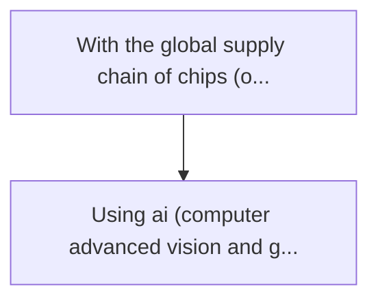
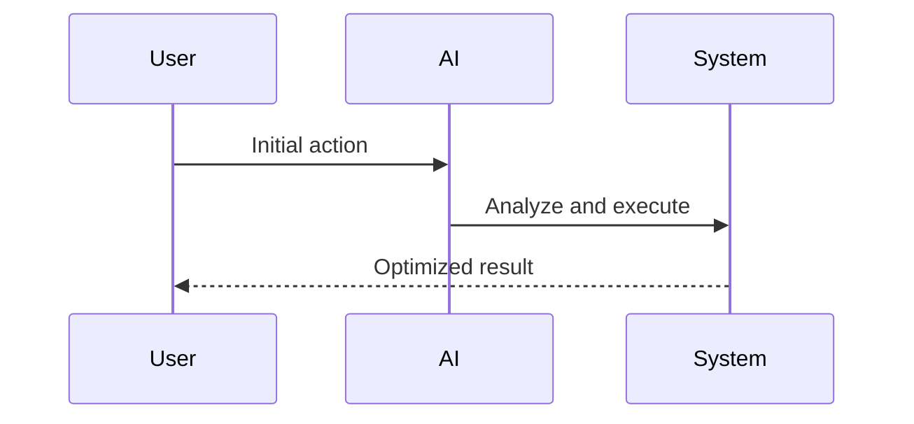

<!-- markdownlint-disable MD013 MD028 MD033 MD039 MD041 -->

[🇫🇷 Version Française](./README.fr.md)

# Hardware trojan scanner

> **Executive Summary:** Using ai (computer advanced vision and graph neural networks) to compare original cad plans (gdsii) with microscopic images ...

---

## 1. Visual Overview & Wow Effect

## 2. Contrarian Thesis (Peter Thiel Style)

Popular Belief: Generic solutions can solve this.
Hidden Truth: This is a problem of inspecting billions of physical transistors. a manual or simple heuristic algorithm check is mathematically impossible in reasonable time given the density of modern chips (5nm and less).

## 3. Problem & Target Market

Business Model: B2B
Target Audience: Semiconductor manufacturers, armed, aerospace, cloud data center operators
Urgent Pain Point: With the global supply chain of chips (often manufactured abroad), the risk of inserting "hardware trojans" (physically removed doors added to silicon to cause breakdowns or leak data) is massive and undetectable by software security.

## 4. Technical Architecture & Infrastructure

## 5. Business Model & Financial Viability

| Metric                 | Value              |
| ---------------------- | ------------------ |
| Pricing Structure      | Custom Pricing     |
| 12-Month Target        | 100 customers      |
| Revenue Formula        | 100 \* 1000 = 100k |
| Estimated Gross Margin | 80%                |

## 6. Distribution Engine & Moat

Acquisition Strategy: Direct B2B Sales
Moat (Defensibility): This is a problem of inspecting billions of physical transistors. a manual or simple heuristic algorithm check is mathematically impossible in reasonable time given the density of modern chips (5nm and less).

## 7. Detailed Evaluation Grid

| Criterion                   | VC Score (/100) | Market Score (/100) |
| --------------------------- | --------------- | ------------------- |
| Thesis & Monopoly / Urgency | -- / 25         | -- / 25             |
| Moat / LLM Immunity         | -- / 25         | -- / 25             |
| Scalability / UX Friction   | -- / 25         | -- / 25             |
| Unit Economics / ROI        | -- / 25         | -- / 25             |
| **TOTAL**                   | **-- / 100**    | **-- / 100**        |

> **VC Verdict:** Pending evaluation.

> **Market Verdict:** Pending evaluation.
