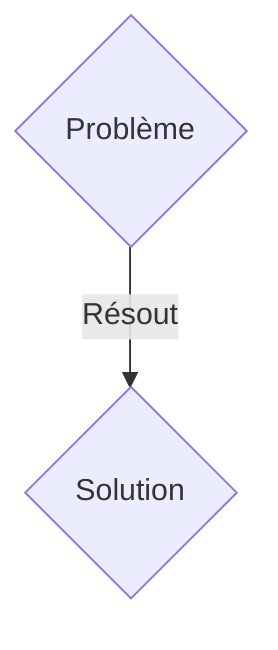
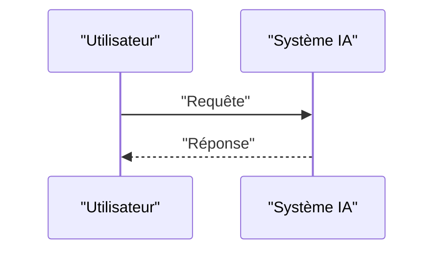

<!-- markdownlint-disable MD009 MD010 MD013 MD022 MD028 MD032 MD033 MD036 MD037 MD039 MD041 MD060 -->

[ 🇬🇧 English Version ](./README.md)

# Mach 7 AI

> **Résumé exécutif :** Une solution B2B / B2G (Business to Government) ciblant Contractants de la défense (Lockheed Martin, Thales), agences spatiales (NASA, ESA), startups aérospatiales (SpaceX, Relativity Space). pour résoudre : Concevoir des véhicules hypersoniques (> Mach 5) est freiné par l'impossibilité de tester physiquement les matériaux et l'aérodynamique sur de longues durées : les souffleries hypersoniques coûtent des millions par seconde de test et fondent littéralement. Les simulations CFD traditionnelles prennent des mois de supercalculateur pour quelques millisecondes de vol simulé, ralentissant l'itération des designs.

---

## 1. Aperçu visuel & Effet Wahou

## 2. La thèse contrariante (Peter Thiel Style)

- **La croyance populaire :** Les solutions génériques suffisent.
- **La vérité cachée :** Un modèle fondateur de substitution (Surrogate Model) basé sur des réseaux de neurones informés par la physique (PINNs - Physics-Informed Neural Networks). Ce moteur "apprend" les équations de la thermochimie, des chocs compressibles et des plasmas d'ablation pour générer des prédictions de flux de chaleur et d'aérodynamique en temps quasi-réel, accélérant la simulation d'un facteur 10,000x avec une précision d'ingénierie.

## 3. Le problème & La cible

- **Modèle économique :** B2B / B2G (Business to Government)
- **Cible précise :** Contractants de la défense (Lockheed Martin, Thales), agences spatiales (NASA, ESA), startups aérospatiales (SpaceX, Relativity Space).
- **La douleur urgente :** Concevoir des véhicules hypersoniques (> Mach 5) est freiné par l'impossibilité de tester physiquement les matériaux et l'aérodynamique sur de longues durées : les souffleries hypersoniques coûtent des millions par seconde de test et fondent littéralement. Les simulations CFD traditionnelles prennent des mois de supercalculateur pour quelques millisecondes de vol simulé, ralentissant l'itération des designs.

## 4. Architecture technique & Plomberie

Un modèle fondateur de substitution (Surrogate Model) basé sur des réseaux de neurones informés par la physique (PINNs - Physics-Informed Neural Networks). Ce moteur "apprend" les équations de la thermochimie, des chocs compressibles et des plasmas d'ablation pour générer des prédictions de flux de chaleur et d'aérodynamique en temps quasi-réel, accélérant la simulation d'un facteur 10,000x avec une précision d'ingénierie.

## 5. Modèle économique & Viabilité financière

| Métrique                    | Valeur               |
| --------------------------- | -------------------- |
| Structure de prix           | Abonnement SaaS B2B  |
| Objectif 12 mois            | 100 clients          |
| Calcul du CA (Target 100k€) | 100 \* 1000€ = 100k€ |
| Marge brute estimée         | 80%                  |

## 6. Moteur de distribution & Fossé défensif (Moat)

- **Stratégie d'acquisition :** Vente directe et partenariats stratégiques.
- **Moat (Barrière à l'entrée) :** L'interaction entre la chimie à haute température (dissociation de l'air en plasma) et l'aérodynamique (chocs) est un problème multiphysique extrême. Les LLMs ou les outils CAD/SaaS traditionnels sont aveugles aux lois fondamentales de la conservation de la masse et de l'énergie.

## 7. Grille d'évaluation détaillée

| Critère                           | Score VC (/100) | Score Terrain (/100) |
| --------------------------------- | --------------- | -------------------- |
| Thèse & Monopole / Urgence        | -- / 25         | -- / 25              |
| Moat / Résistance aux LLM natifs  | -- / 25         | -- / 25              |
| Scalabilité / Friction d'adoption | -- / 25         | -- / 25              |
| Unit Economics / ROI direct       | -- / 25         | -- / 25              |
| TOTAL                             | -- / 100        | -- / 100             |

> **Verdict VC :** En attente d'évaluation.
> **Verdict Terrain :** En attente d'évaluation.
