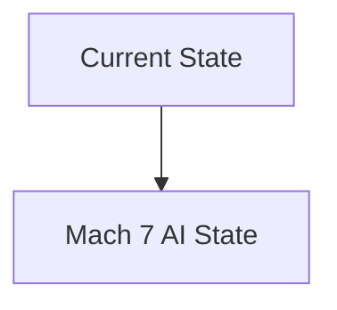
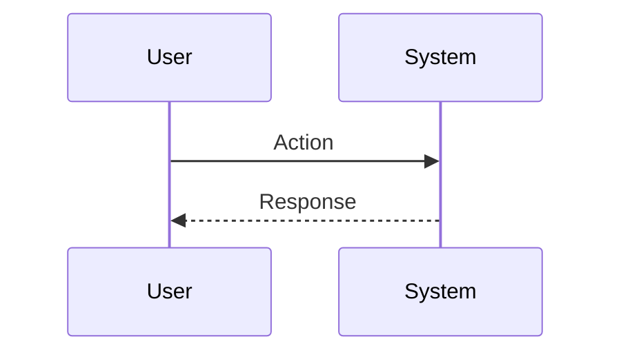

<!-- markdownlint-disable MD009 MD010 MD013 MD022 MD028 MD032 MD033 MD034 MD036 MD037 MD039 MD041 MD060 -->

[ 🇫🇷 Version Française ](./README.fr.md)

# Mach 7 AI

> **Executive Summary:** A Surrogate Model based on Physics-Informed Neural Networks (PINNs). This engine “learns” the equations of thermochemistry, compressible shocks, and ablation plasmas to generate heat flow and aerodynamic predictions in near real time, accelerating simulation by a factor of 10,000x with engineering precision.

---

## 1. Visual Overview & Wow Effect

## 2. Contrarian Thesis (Peter Thiel Style)

**Popular Belief:** General AI solutions can solve this problem.

**Hidden Truth:** The interaction between high temperature chemistry (dissociation of air into plasma) and aerodynamics (shocks) is an extreme multiphysics problem. Traditional LLMs or CAD/SaaS tools are blind to the fundamental laws of conservation of mass and energy.

## 3. Problem & Target Market

**Business Model:** B2B / B2G (Business to Government)

**Target Audience:** Defense contractors (Lockheed Martin, Thales), space agencies (NASA, ESA), aerospace startups (SpaceX, Relativity Space).

**Urgent Pain Point:** Designing hypersonic vehicles (> Mach 5) is hampered by the impossibility of physically testing materials and aerodynamics over long periods of time: hypersonic wind tunnels cost millions per second of testing and literally melt. Traditional CFD simulations take months of supercomputer time for milliseconds of simulated flight, slowing down the iteration of designs.

## 4. Technical Architecture & Infrastructure

## 5. Business Model & Financial Viability

| Metric                 | Value                           |
| ---------------------- | ------------------------------- |
| Pricing Structure      | SaaS subscription               |
| 12-Month Target        | 10 customers                    |
| Revenue Formula        | 10 clients \* 10k€/year = 100k€ |
| Estimated Gross Margin | 80%                             |

## 6. Distribution Engine & Moat

**Acquisition Strategy:** B2B direct sales

**Moat (Defensibility):** ITAR and regulations on arms exports: strong go-to-market friction. Critical difficulty in obtaining the highly classified real or experimental flight data needed for model fine-tuning.

## 7. Detailed Evaluation Grid

| Criterion                   | VC Score (/100) | Market Score (/100) |
| --------------------------- | --------------- | ------------------- |
| Thesis & Monopoly / Urgency | -- / 25         | -- / 25             |
| Moat / LLM Immunity         | -- / 25         | -- / 25             |
| Scalability / UX Friction   | -- / 25         | -- / 25             |
| Unit Economics / ROI        | -- / 25         | -- / 25             |
| **TOTAL**                   | **-- / 100**    | **-- / 100**        |

> **VC Verdict:** Pending evaluation.

> **Market Verdict:** Pending evaluation.
