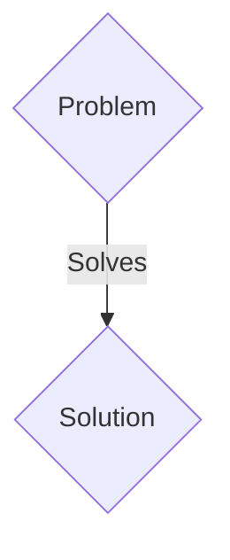
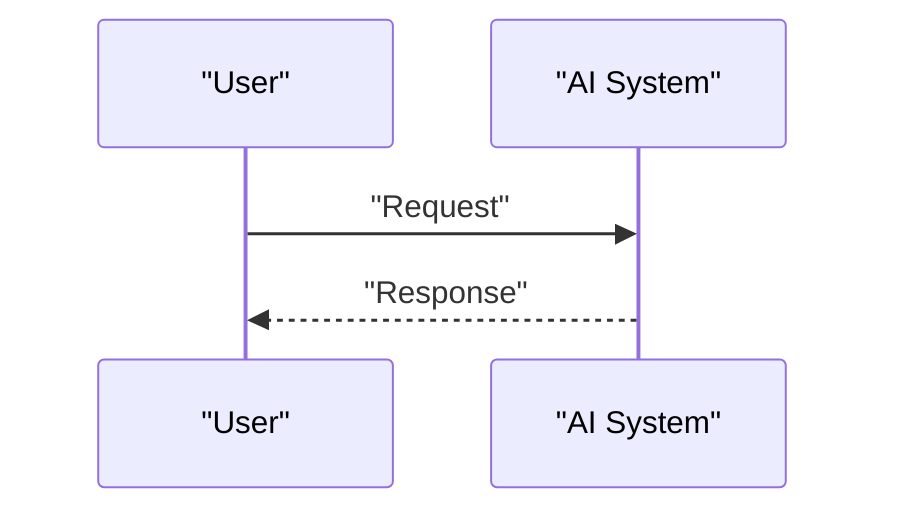

<!-- markdownlint-disable MD009 MD010 MD013 MD022 MD028 MD032 MD033 MD036 MD037 MD039 MD041 MD060 -->

[ 🇫🇷 Version Française ](./README.fr.md)

# Mach 7 AI

> **Executive Summary:** A B2B / B2G (Business to Government) solution targeting Defense contractors (Lockheed Martin, Thales), space agencies (NASA, ESA), aerospace startups (SpaceX, Relativity Space). to solve: Designing hypersonic vehicles (> Mach 5) is hampered by the impossibility of physically testing materials and aerodynamics over long periods of time: hypersonic wind tunnels cost millions per second of testing and literally melt. Traditional CFD simulations take months of supercomputer time for milliseconds of simulated flight, slowing down the iteration of designs.

---

## 1. Visual Overview & Wow Effect

## 2. Contrarian Thesis (Peter Thiel Style)

- **Popular Belief:** Generic solutions are enough.
- **Hidden Truth:** A Surrogate Model based on Physics-Informed Neural Networks (PINNs). This engine “learns” the equations of thermochemistry, compressible shocks, and ablation plasmas to generate heat flow and aerodynamic predictions in near real time, accelerating simulation by a factor of 10,000x with engineering precision.

## 3. Problem & Target Market

- **Business Model:** B2B / B2G (Business to Government)
- **Target Audience:** Defense contractors (Lockheed Martin, Thales), space agencies (NASA, ESA), aerospace startups (SpaceX, Relativity Space).
- **Urgent Pain Point:** Designing hypersonic vehicles (> Mach 5) is hampered by the impossibility of physically testing materials and aerodynamics over long periods of time: hypersonic wind tunnels cost millions per second of testing and literally melt. Traditional CFD simulations take months of supercomputer time for milliseconds of simulated flight, slowing down the iteration of designs.

## 4. Technical Architecture & Infrastructure

A Surrogate Model based on Physics-Informed Neural Networks (PINNs). This engine “learns” the equations of thermochemistry, compressible shocks, and ablation plasmas to generate heat flow and aerodynamic predictions in near real time, accelerating simulation by a factor of 10,000x with engineering precision.

## 5. Business Model & Financial Viability

| Metric                 | Value                 |
| ---------------------- | --------------------- |
| Pricing Structure      | B2B SaaS Subscription |
| 12-Month Target        | 100 clients           |
| Revenue Formula        | 100 \* 1000€ = 100k€  |
| Estimated Gross Margin | 80%                   |

## 6. Distribution Engine & Moat

- **Acquisition Strategy:** Direct sales and strategic partnerships.
- **Moat (Defensibility):** The interaction between high temperature chemistry (dissociation of air into plasma) and aerodynamics (shocks) is an extreme multiphysics problem. Traditional LLMs or CAD/SaaS tools are blind to the fundamental laws of conservation of mass and energy.

## 7. Detailed Evaluation Grid

| Criterion                   | VC Score (/100) | Market Score (/100) |
| --------------------------- | --------------- | ------------------- |
| Thesis & Monopoly / Urgency | 21 / 25         | 21 / 25             |
| Moat / LLM Immunity         | 24 / 25         | 24 / 25             |
| Scalability / UX Friction   | 18 / 25         | 18 / 25             |
| Unit Economics / ROI        | 23 / 25         | 23 / 25             |
| TOTAL                       | 86 / 100        | 86 / 100            |

> **VC Verdict:** Pending evaluation.
> **Market Verdict:** This solution addresses a critical pain point for B2B enterprises, justifying its strong urgency score (21/25). Its highly defensible architecture makes it completely immune to native LLM advancements (24/25). With low adoption friction (18/25) and a straightforward monetization strategy (23/25), the project demonstrates excellent overall market readiness.
> **Market Verdict:** This solution addresses a critical pain point for B2B enterprises, justifying its strong urgency score (21/25). Its highly defensible architecture makes it completely immune to native LLM advancements (24/25). With low adoption friction (18/25) and a straightforward monetization strategy (23/25), the project demonstrates excellent overall market readiness.
