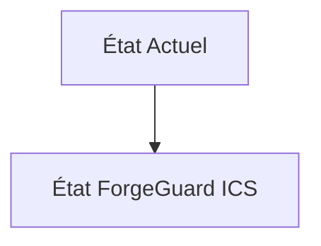
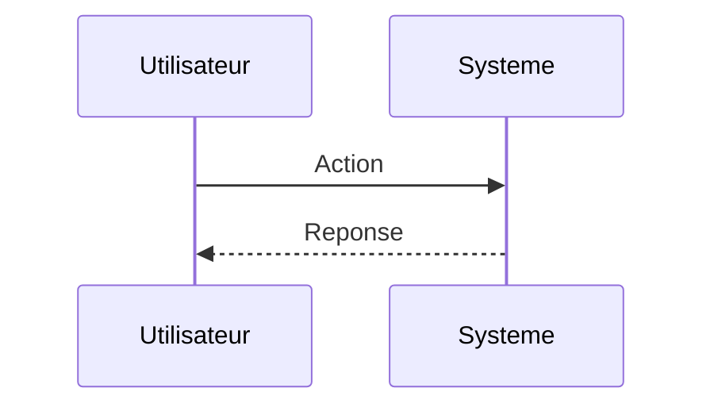

<!-- markdownlint-disable MD009 MD010 MD013 MD022 MD028 MD032 MD033 MD034 MD036 MD037 MD039 MD041 MD060 -->

[ 🇬🇧 English Version ](./README.md)

# ForgeGuard ICS

> **Résumé exécutif :** Un moteur d'exécution (Runtime) Zero-Trust déployé directement en bordure (Edge) ou sur un proxy matériel en ligne (bump-in-the-wire) devant chaque automate critique. Il effectue une inspection sémantique profonde (Deep Packet Inspection) et une vérification d'état cryptographique (attestation d'intégrité de la logique de contrôle) en temps réel avec une latence sub-milliseconde.

---

## 1. Aperçu visuel & Effet Wahou

## 2. La thèse contrariante (Peter Thiel Style)

**La croyance populaire :** Les solutions généralistes IA peuvent résoudre ce problème.

**La vérité cachée :** L'IT (cloud, SaaS) tolère des latences de plusieurs centaines de millisecondes. L'OT exige un déterminisme absolu (< 5ms) : si un paquet de sécurité retarde la commande de freinage d'un bras robotique, des vies humaines sont en jeu. Les solutions IT SaaS sont incompatibles avec les contraintes réseau (souvent air-gapped) et temporelles de l'usine.

## 3. Le problème & La cible

**Modèle économique :** B2B

**Cible précise :** Usines de fabrication avancée (gigafactories), raffineries, opérateurs d'énergie.

**La douleur urgente :** L'environnement OT (Operational Technology - automates programmables PLC, SCADA) est intrinsèquement non sécurisé (protocols Modbus/PROFINET sans authentification ni chiffrement). Les firewalls OT actuels font de la détection d'anomalie réseau, ce qui génère trop de faux positifs et n'empêche pas un attaquant ayant compromis le réseau de modifier la logique de l'automate (ex: attaque Stuxnet-like ou ransomware bloquant la production).

## 4. Architecture technique & Plomberie

## 5. Modèle économique & Viabilité financière

| Métrique                    | Valeur                        |
| --------------------------- | ----------------------------- |
| Structure de prix           | Abonnement SaaS               |
| Objectif 12 mois            | 10 clients                    |
| Calcul du CA (Target 100k€) | 10 clients \* 10k€/an = 100k€ |
| Marge brute estimée         | 80%                           |

## 6. Moteur de distribution & Fossé défensif (Moat)

**Stratégie d'acquisition :** Vente directe B2B

**Moat (Barrière à l'entrée) :** Refus absolu des industriels d'installer quoi que ce soit "in-line" de peur que la sécurité ne casse la production (le faux positif tue l'usine). Nécessité de certification drastique de type SIL (Safety Integrity Level).

## 7. Grille d'évaluation détaillée

| Critère                           | Score VC (/100) | Score Terrain (/100) |
| --------------------------------- | --------------- | -------------------- |
| Thèse & Monopole / Urgence        | -- / 25         | -- / 25              |
| Moat / Résistance aux LLM natifs  | -- / 25         | -- / 25              |
| Scalabilité / Friction d'adoption | -- / 25         | -- / 25              |
| Unit Economics / ROI direct       | -- / 25         | -- / 25              |
| **TOTAL**                         | **-- / 100**    | **-- / 100**         |

> **Verdict VC :** En attente d'évaluation.

> **Verdict Terrain :** En attente d'évaluation.
