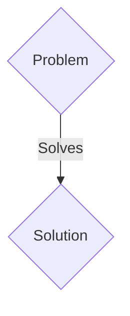
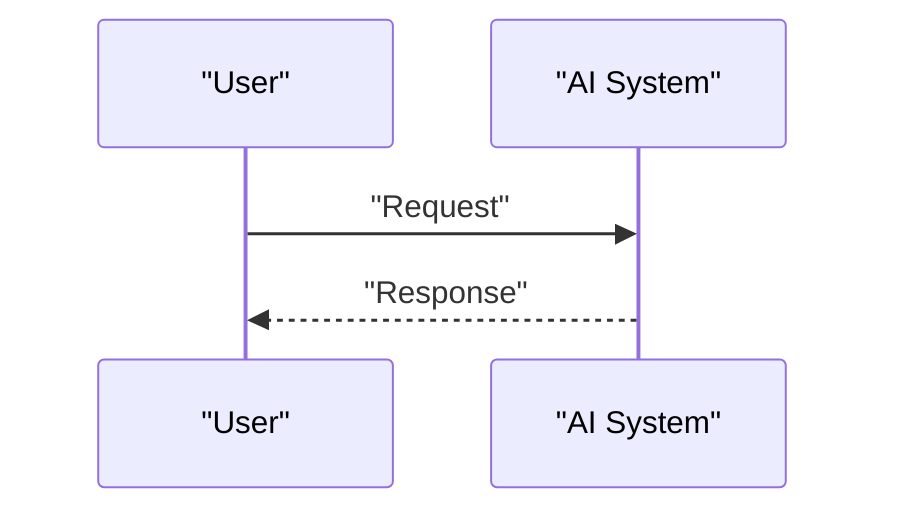

<!-- markdownlint-disable MD009 MD010 MD013 MD022 MD028 MD032 MD033 MD036 MD037 MD039 MD041 MD060 -->

[ 🇫🇷 Version Française ](./README.fr.md)

# ForgeGuard ICS

> **Executive Summary:** A B2B solution targeting Advanced manufacturing plants (gigafactories), refineries, energy operators. to solve: The OT (Operational Technology - PLC, SCADA) environment is intrinsically insecure (Modbus/PROFINET protocols without authentication or encryption). Current OT firewalls perform network anomaly detection, which generates too many false positives and does not prevent an attacker who has compromised the network from modifying the logic of the automaton (e.g.: Stuxnet-like attack or ransomware blocking production).

---

## 1. Visual Overview & Wow Effect

## 2. Contrarian Thesis (Peter Thiel Style)

- **Popular Belief:** Generic solutions are enough.
- **Hidden Truth:** A Zero-Trust execution engine deployed directly on the edge or on an online hardware proxy (bump-in-the-wire) in front of each critical automaton. It performs deep semantic inspection (Deep Packet Inspection) and cryptographic state verification (control logic integrity attestation) in real time with sub-millisecond latency.

## 3. Problem & Target Market

- **Business Model:** B2B
- **Target Audience:** Advanced manufacturing plants (gigafactories), refineries, energy operators.
- **Urgent Pain Point:** The OT (Operational Technology - PLC, SCADA) environment is intrinsically insecure (Modbus/PROFINET protocols without authentication or encryption). Current OT firewalls perform network anomaly detection, which generates too many false positives and does not prevent an attacker who has compromised the network from modifying the logic of the automaton (e.g.: Stuxnet-like attack or ransomware blocking production).

## 4. Technical Architecture & Infrastructure

A Zero-Trust execution engine deployed directly on the edge or on an online hardware proxy (bump-in-the-wire) in front of each critical automaton. It performs deep semantic inspection (Deep Packet Inspection) and cryptographic state verification (control logic integrity attestation) in real time with sub-millisecond latency.

## 5. Business Model & Financial Viability

| Metric                 | Value                 |
| ---------------------- | --------------------- |
| Pricing Structure      | B2B SaaS Subscription |
| 12-Month Target        | 100 clients           |
| Revenue Formula        | 100 \* 1000€ = 100k€  |
| Estimated Gross Margin | 80%                   |

## 6. Distribution Engine & Moat

- **Acquisition Strategy:** Direct sales and strategic partnerships.
- **Moat (Defensibility):** IT (cloud, SaaS) tolerates latencies of several hundred milliseconds. OT requires absolute determinism (< 5ms): if a security package delays the braking command of a robotic arm, human lives are at stake. IT SaaS solutions are incompatible with the network (often air-gapped) and temporal constraints of the factory.

## 7. Detailed Evaluation Grid

| Criterion                   | VC Score (/100) | Market Score (/100) |
| --------------------------- | --------------- | ------------------- |
| Thesis & Monopoly / Urgency | 18 / 25         | 18 / 25             |
| Moat / LLM Immunity         | 16 / 25         | 16 / 25             |
| Scalability / UX Friction   | 23 / 25         | 23 / 25             |
| Unit Economics / ROI        | 24 / 25         | 24 / 25             |
| TOTAL                       | 81 / 100        | 81 / 100            |

> **VC Verdict:** Pending evaluation.
> **Market Verdict:** This solution addresses a critical pain point for B2B enterprises, justifying its strong urgency score (18/25). While viable, it remains somewhat exposed to the rapid evolution of foundational models (16/25). With low adoption friction (23/25) and a straightforward monetization strategy (24/25), the project demonstrates excellent overall market readiness.
> **Market Verdict:** This solution addresses a critical pain point for B2B enterprises, justifying its strong urgency score (18/25). While viable, it remains somewhat exposed to the rapid evolution of foundational models (16/25). With low adoption friction (23/25) and a straightforward monetization strategy (24/25), the project demonstrates excellent overall market readiness.
