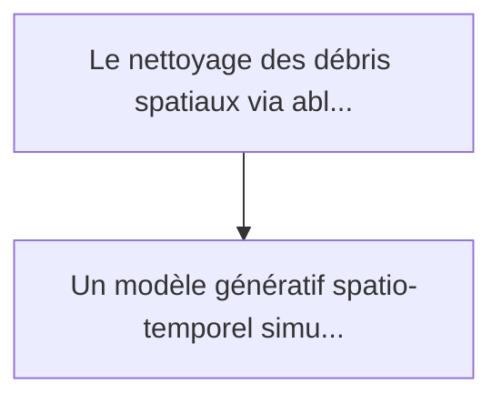
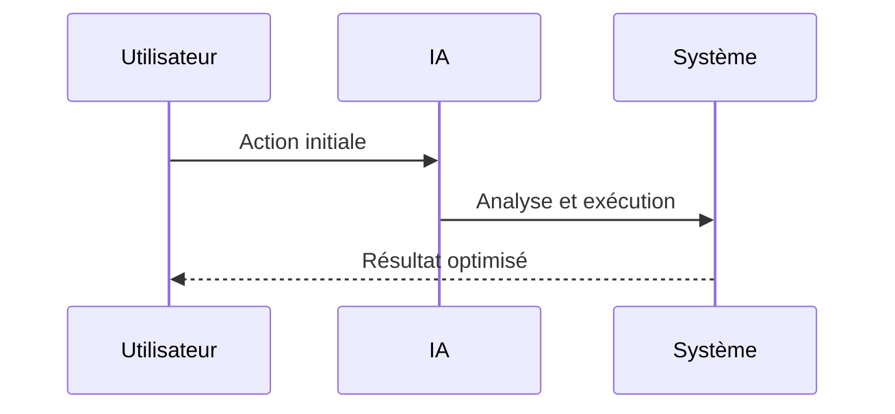

<!-- markdownlint-disable MD013 MD028 MD033 MD039 MD041 -->

[ 🇬🇧 English Version ](./README.md)

# Orbital Laser Ablation Debris Predictor

> **Résumé exécutif :** Un modèle génératif spatio-temporel simulant la dynamique d'ablation laser dans le vide et la dispersion du panache plasma/débris en microgravité. ...

---

## 1. Aperçu visuel & Effet Wahou

## 2. La thèse contrariante (Peter Thiel Style)

La croyance populaire : Les solutions génériques peuvent résoudre cela.
La vérité cachée : L'interaction laser-matière dans le vide spatial implique des transitions de phase complexes (solide à plasma) et des effets de pression de radiation. Les simulateurs orbitaux (comme STK) ne modélisent pas la thermodynamique de l'ablation à l'échelle moléculaire, et les SaaS IA standards n'ont aucune notion de la physique des plasmas.

## 3. Le problème & La cible

Modèle économique : B2B / B2G
Cible précise : Agences spatiales (ESA, NASA), opérateurs de constellations satellitaires en orbite basse (LEO) et startups de nettoyage de l'espace.
La douleur urgente : Le nettoyage des débris spatiaux via ablation laser (tirer un laser depuis le sol ou l'espace pour vaporiser une partie du débris et modifier son orbite) crée de la matière éjectée (plasma et fragments microscopiques). Cette éjection crée une impulsion mais génère aussi un micro-nuage secondaire dont la trajectoire est chaotique et menace les autres satellites. Prévoir cette dispersion thermique et cinétique en LEO est actuellement trop lent et imprécis.

## 4. Architecture technique & Plomberie

## 5. Modèle économique & Viabilité financière

| Métrique                    | Valeur             |
| --------------------------- | ------------------ |
| Structure de prix           | Prix sur mesure    |
| Objectif 12 mois            | 100 clients        |
| Calcul du CA (Target 100k€) | 100 \* 1000 = 100k |
| Marge brute estimée         | 80%                |

## 6. Moteur de distribution & Fossé défensif (Moat)

Stratégie d'acquisition : Vente B2B directe
Moat (Barrière à l'entrée) : L'interaction laser-matière dans le vide spatial implique des transitions de phase complexes (solide à plasma) et des effets de pression de radiation. Les simulateurs orbitaux (comme STK) ne modélisent pas la thermodynamique de l'ablation à l'échelle moléculaire, et les SaaS IA standards n'ont aucune notion de la physique des plasmas.

## 7. Grille d'évaluation détaillée

| Critère                           | Score VC (/100) | Score Terrain (/100) |
| --------------------------------- | --------------- | -------------------- |
| Thèse & Monopole / Urgence        | -- / 25         | -- / 25              |
| Moat / Résistance aux LLM natifs  | -- / 25         | -- / 25              |
| Scalabilité / Friction d'adoption | -- / 25         | -- / 25              |
| Unit Economics / ROI direct       | -- / 25         | -- / 25              |
| **TOTAL**                         | **-- / 100**    | **-- / 100**         |

> **Verdict VC :** En attente d'évaluation.

> **Verdict Terrain :** En attente d'évaluation.
