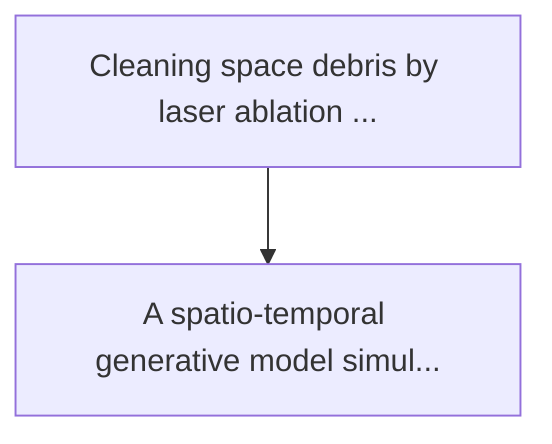
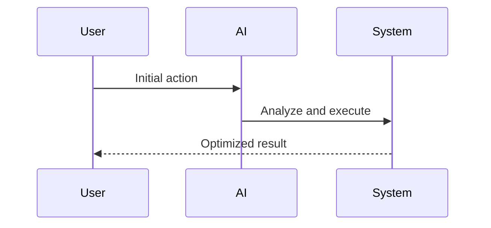

<!-- markdownlint-disable MD013 MD028 MD033 MD039 MD041 -->

[ 🇫🇷 Version Française ](./README.fr.md)

# Orbital laser ablation debris predictor

> **Executive Summary:** A spatio-temporal generative model simulating the laser ablation dynamics in the vacuum and the dispersion of the plasma/debris plume in microgravity. ...

---

## 1. Visual Overview & Wow Effect

## 2. Contrarian Thesis (Peter Thiel Style)

Popular Belief: Generic solutions can solve this.
Hidden Truth: Laser-matter interaction in space vacuum involves complex phase transitions (plasma solid) and radiation pressure effects. orbital simulators (such as stk) do not model the thermodynamics of ablation on a molecular scale, and standard saas ia have no idea of plasma physics.

## 3. Problem & Target Market

Business Model: B2B / B2G
Target Audience: Space agencies (esa, nasa), satellite constellation operators in low orbit (leo) and space clean-up startups.
Urgent Pain Point: Cleaning space debris by laser ablation (drawing a laser from the ground or space to spray part of the debris and modify its orbit) creates ejected matter (plasma and microscopic fragments). this ejection creates an impulse but also generates a secondary micronuage whose trajectory is chaotic and threatens other satellites. predicting this thermal and kinetic dispersion in leo is currently too slow and imprecise.

## 4. Technical Architecture & Infrastructure

## 5. Business Model & Financial Viability

| Metric                 | Value              |
| ---------------------- | ------------------ |
| Pricing Structure      | Custom Pricing     |
| 12-Month Target        | 100 customers      |
| Revenue Formula        | 100 \* 1000 = 100k |
| Estimated Gross Margin | 80%                |

## 6. Distribution Engine & Moat

Acquisition Strategy: Direct B2B Sales
Moat (Defensibility): Laser-matter interaction in space vacuum involves complex phase transitions (plasma solid) and radiation pressure effects. orbital simulators (such as stk) do not model the thermodynamics of ablation on a molecular scale, and standard saas ia have no idea of plasma physics.

## 7. Detailed Evaluation Grid

| Criterion                   | VC Score (/100) | Market Score (/100) |
| --------------------------- | --------------- | ------------------- |
| Thesis & Monopoly / Urgency | -- / 25         | 17 / 25             |
| Moat / LLM Immunity         | -- / 25         | 25 / 25             |
| Scalability / UX Friction   | -- / 25         | 18 / 25             |
| Unit Economics / ROI        | -- / 25         | 17 / 25             |
| **TOTAL**                   | **-- / 100**    | **77 / 100**        |

> **VC Verdict:** Pending evaluation.

> **Market Verdict:** Managing space debris is an escalating issue, though active laser ablation remains a nascent and unproven approach. High-fidelity physical plasma simulations in microgravity are deeply specialized and LLM-immune. The friction is very high as it relies on future space infrastructure deployments.
