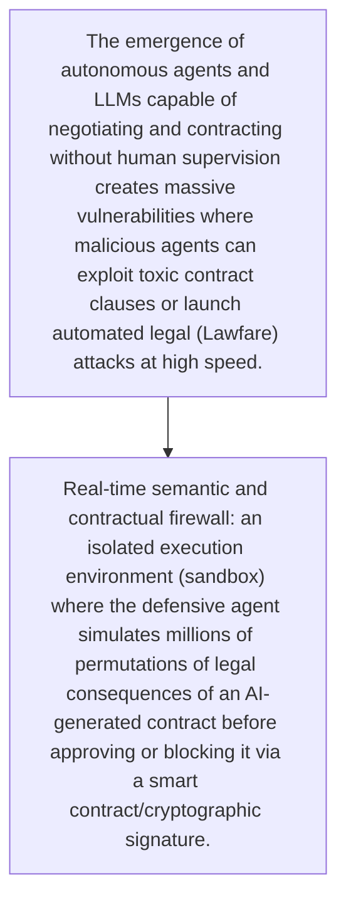
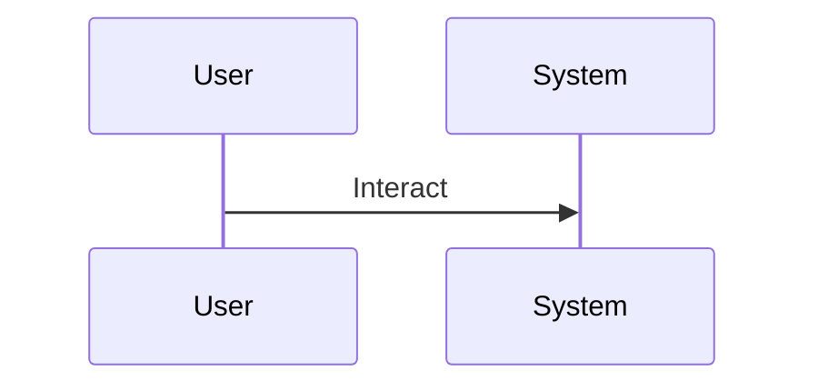

<!-- markdownlint-disable MD009 MD010 MD013 MD022 MD028 MD032 MD033 MD034 MD036 MD037 MD039 MD041 MD060 -->

[ 🇫🇷 Version Française ](./README.fr.md)

# Aegis Legal Autonomous

> **Executive Summary:** Real-time semantic and contractual firewall: an isolated execution environment (sandbox) where the defensive agent simulates millions of permutations of legal consequences of an AI-generated contract before approving or blocking it via a smart contract/cryptographic signature.

---

## 1. Visual Overview & Wow Effect

## 2. Contrarian Thesis (Peter Thiel Style)

- **Popular Belief:** It is a battle of agents (M2M) requiring very high-level semantic understanding combined with ultra-fast executions, beyond the reach of traditional document databases or legal chatbots.
- **Hidden Truth:** Real-time semantic and contractual firewall: an isolated execution environment (sandbox) where the defensive agent simulates millions of permutations of legal consequences of an AI-generated contract before approving or blocking it via a smart contract/cryptographic signature.

## 3. Problem & Target Market

- **Business Model:** B2B
- **Target Audience:** Legal departments of tech companies, international law firms, government institutions
- **Urgent Pain Point:** The emergence of autonomous agents and LLMs capable of negotiating and contracting without human supervision creates massive vulnerabilities where malicious agents can exploit toxic contract clauses or launch automated legal (Lawfare) attacks at high speed.

## 4. Technical Architecture & Infrastructure

## 5. Business Model & Financial Viability

| Metric                 | Value                                     |
| ---------------------- | ----------------------------------------- |
| Pricing Structure      | [Price / Subscription Model / Commission] |
| 12-Month Target        | [Exact volume required for 100k ARR]      |
| Revenue Formula        | [Mathematical calculation]                |
| Estimated Gross Margin | [Margin %]                                |

## 6. Distribution Engine & Moat

- **Acquisition Strategy:** [Virality, network effect, direct sales, developer adoption]
- **Moat (Defensibility):** Regulatory vagueness on the legal responsibility of autonomous agents, complexity of modeling intentionality, risk of contractual paralysis by false positives.

## 7. Detailed Evaluation Grid

| Criterion                   | VC Score (/100) | Market Score (/100) |
| --------------------------- | --------------- | ------------------- |
| Thesis & Monopoly / Urgency | -- / 25         | 22 / 25             |
| Moat / LLM Immunity         | -- / 25         | 23 / 25             |
| Scalability / UX Friction   | -- / 25         | 15 / 25             |
| Unit Economics / ROI        | -- / 25         | 20 / 25             |
| **TOTAL**                   | -- / 100        | **80 / 100**        |

> **VC Verdict:** Pending evaluation.
> **Market Verdict:** Moderate urgency but strong long-term strategic value. LLM immunity is good, relying on specialized models. Adoption presents notable friction that could slow initial monetization.
