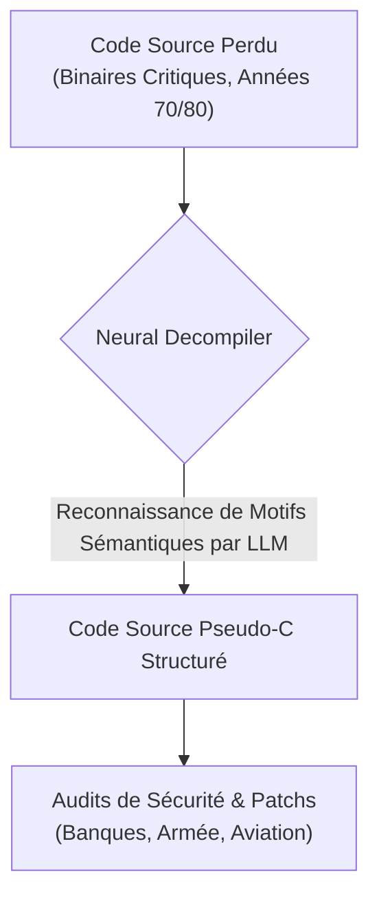
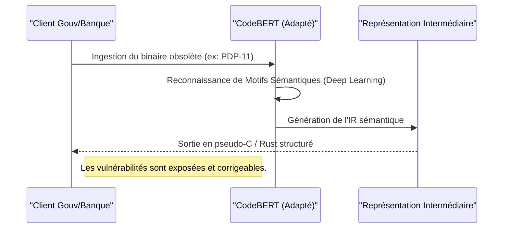

<!-- markdownlint-disable MD009 MD010 MD013 MD022 MD028 MD032 MD033 MD034 MD036 MD037 MD039 MD041 MD060 -->

[ 🇬🇧 English Version ](./README.md)

# Neural Decompiler Legacy ISA

> **Résumé exécutif :** Neural Decompiler utilise un LLM spécialisé, entraîné sur des paires de binaires et de codes sources anciens, pour décompiler avec précision du code issu d'architectures obsolètes (mainframes des années 70/80), permettant ainsi d'auditer et de sécuriser les infrastructures critiques contre les failles modernes.

---

## 1. Aperçu visuel & Effet Wahou

## 2. La thèse contrariante (Peter Thiel Style)

**La croyance populaire :** Les systèmes hérités fonctionnant sur des architectures mortes doivent finalement être entièrement réécrits à partir de zéro, ou rétro-conçus manuellement par un groupe de plus en plus restreint d'ingénieurs vétérans.
**La vérité cachée :** Les règles régissant la compilation dans les années 70/80, bien que non standard et hautement obfusquées, forment un "langage" qu'une IA peut apprendre. Les décompilateurs standards échouent car ils utilisent des règles rigides, mais un LLM spécialisé peut effectuer une reconnaissance de motifs sémantiques pour traduire un binaire mort en un code source moderne (C/Rust) structuré et fonctionnel, économisant des décennies d'efforts de réécriture manuelle.

## 3. Le problème & La cible

**Modèle économique :** B2B / B2G
**Cible précise :** Secteur bancaire, compagnies aériennes, gouvernements et armées (utilisant des mainframes IBM, systèmes embarqués militaires, ou vieux systèmes de contrôle ferroviaire).
**La douleur urgente :** Des infrastructures critiques mondiales (systèmes de paiement, radars militaires, contrôles de vol) tournent sur du code compilé pour des architectures de jeux d'instructions (ISA) obsolètes des années 70/80. Les codes sources originaux sont souvent perdus, et les ingénieurs capables de lire ce binaire disparaissent. L'impossibilité de décompiler fidèlement et d'auditer ces binaires legacy empêche l'application de patchs de sécurité modernes, laissant ces systèmes vulnérables à des exploits bas niveau critiques.

## 4. Architecture technique & Plomberie

## 5. Modèle économique & Viabilité financière

| Métrique                | Valeur                                                                                         |
| ----------------------- | ---------------------------------------------------------------------------------------------- |
| **Structure de prix**   | Frais de consultation par projet + Licence SaaS pour audits continus                           |
| **Objectif 12 mois**    | 2 à 3 projets massifs de migration legacy avec l'industrie de la défense ou des banques Tier-1 |
| **Calcul du CA**        | 2 Projets \* 50 000€                                                                           |
| **Marge brute estimée** | >75% (Logiciel hautement scalable après l'entraînement initial)                                |

## 6. Moteur de distribution & Fossé défensif (Moat)

**Stratégie d'acquisition :** Ventes directes aux entreprises, contrats de défense gouvernementaux et partenariats avec de grands cabinets d'audit en cybersécurité.
**Moat (Barrière à l'entrée) :** La génération de données d'entraînement synthétiques fiables pour des architectures mortes est extrêmement ardue et coûteuse. Une fois le modèle entraîné, la barrière à l'entrée est colossale car les décompilateurs classiques (comme Ghidra ou IDA Pro) utilisent des règles heuristiques rigides qui échouent lamentablement face à du code fortement optimisé issu de compilateurs très anciens aux standards non-respectés. L'exigence de "zéro hallucination" (une différence fonctionnelle de 0,01% fait crasher un système critique) exige une ingénierie de stabilisation du LLM qui constitue un fossé technique massif.

## 7. Grille d'évaluation détaillée

| Critère                               | Score VC (/100) | Score Terrain (/100) |
| ------------------------------------- | --------------- | -------------------- |
| **Thèse & Monopole / Urgence**        | -- / 25         | -- / 25              |
| **Moat / Résistance aux LLM natifs**  | -- / 25         | -- / 25              |
| **Scalabilité / Friction d'adoption** | -- / 25         | -- / 25              |
| **Unit Economics / ROI direct**       | -- / 25         | -- / 25              |
| **TOTAL**                             | -- / 100        | -- / 100             |

> **Verdict VC :** En attente d'évaluation.
> **Verdict Terrain :** En attente d'évaluation.
