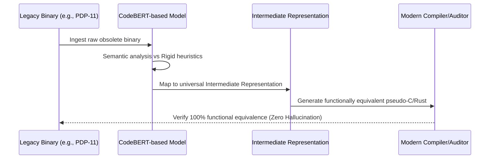

<!-- markdownlint-disable MD009 MD010 MD013 MD022 MD028 MD032 MD033 MD034 MD036 MD037 MD039 MD041 MD058 MD060 -->

[ 🇫🇷 Version Française ](./README.fr.md)

# Neural Decompiler Legacy ISA

> **Executive Summary:** A specialized AI neural decompiler that accurately translates dead, undocumented binary architectures from the 70s/80s into modern, structured C/Rust code, securing critical legacy infrastructure.

---

## 1. Visual Overview & Wow Effect

```mermaid
graph TD
    %% Problem vs Solution or Architecture Diagram
    subgraph Traditional_Decompilation ["Traditional Decompilers (Ghidra/IDA)"]
        A[Legacy Binary / Dead ISA] --> B[Rigid Heuristic Rules]
        B --> C[Failure on Obfuscation/Optimizations]
        C --> D[Unpatchable Critical Vulnerabilities]
    end
    subgraph Neural_Decompiler ["Neural Decompiler"]
        E[Legacy Binary / Dead ISA] --> F[Specialized CodeBERT AI]
        F --> G[Semantic Pattern Matching to IR]
        G --> H[Structurally Accurate C/Rust Source]
        H --> I[Modern Audits & Security Patching]
    end
```

## 2. Contrarian Thesis (Peter Thiel Style)

**Popular Belief:** To secure global critical infrastructure, we need to completely rewrite all legacy systems from scratch using modern languages and frameworks.

**Hidden Truth:** Rewriting decades-old, highly optimized legacy systems (like banking mainframes or military radars) is practically impossible and prohibitively expensive. The fastest path to security is not rewriting, but using AI to successfully decompile "dead" instruction set architectures (ISAs) to apply modern security patches to the original logic.

## 3. Problem & Target Market

**Business Model:** B2B / B2G

**Target Audience:** Banking sector, airlines, governments, and military (operators of IBM mainframes, military embedded systems, or old railway control systems).

**Urgent Pain Point:** Critical global infrastructure runs on code compiled for obsolete ISAs from the 1970s and 80s. Original source codes are often lost, and engineers who can read these binaries are retiring or deceased. The inability to faithfully decompile and audit these legacy binaries prevents the application of modern security patches, leaving these systems highly vulnerable to low-level exploits.

## 4. Technical Architecture & Infrastructure

## 5. Business Model & Financial Viability

| Metric                 | Value                                                    |
| :--------------------- | :------------------------------------------------------- |
| Pricing Structure      | Tiered Enterprise License + Per-Project Consulting/Audit |
| 12-Month Target        | 2 government/defense contracts or Tier-1 banks           |
| Revenue Formula        | 2 pilot audits \* €50,000 = €100k ARR                    |
| Estimated Gross Margin | 80% (Software + specialized expert services)             |

## 6. Distribution Engine & Moat

**Acquisition Strategy:** High-ticket B2B/B2G direct sales. Partner with top-tier cybersecurity audit firms (e.g., Mandiant) and defense contractors to offer this as an exclusive, life-saving capability for their critical infrastructure clients.

**Moat (Defensibility):** Standard decompilers rely on formal, rigid rules that fail on old, heavily optimized, or non-standard compilers. A neural approach uses semantic pattern matching. The massive barrier to entry is generating the synthetic training data (binary-to-source pairs) for dead architectures, and enforcing a strictly zero-hallucination constraint—because a 0.01% error in a decompiled radar system causes a catastrophic crash.

## 7. Detailed Evaluation Grid

| Criterion                   | VC Score (/100) | Market Score (/100) |
| :-------------------------- | :-------------- | :------------------ |
| Thesis & Monopoly / Urgency | -- / 25         | 25 / 25             |
| Moat / LLM Immunity         | -- / 25         | 24 / 25             |
| Scalability / UX Friction   | -- / 25         | 15 / 25             |
| Unit Economics / ROI        | -- / 25         | 22 / 25             |
| **TOTAL**                   | **-- / 100**    | **86 / 100**        |

> **VC Verdict:** Pending evaluation.
> **Market Verdict:** Strong urgency and obvious value for the target market. LLM resistance is high due to strong hardware or physical integration. Despite some adoption friction, B2B monetization is very clear.
