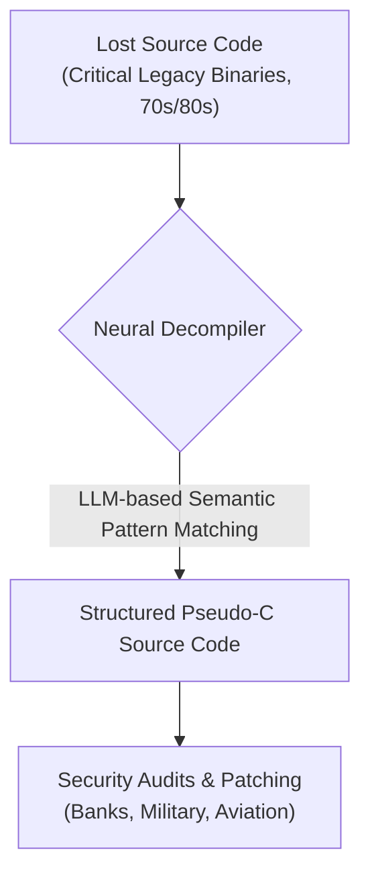
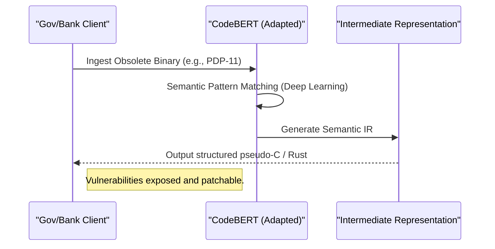

<!-- markdownlint-disable MD009 MD010 MD013 MD022 MD028 MD032 MD033 MD034 MD036 MD037 MD039 MD041 MD060 -->

[ 🇫🇷 Version Française ](./README.fr.md)

# Neural Decompiler Legacy ISA

> **Executive Summary:** Neural Decompiler uses a specialized LLM trained on legacy binary-to-source pairs to accurately decompile code from obsolete architectures (like 70s/80s mainframes), allowing critical infrastructure to be audited and secured against modern exploits.

---

## 1. Visual Overview & Wow Effect

## 2. Contrarian Thesis (Peter Thiel Style)

**Popular Belief:** Legacy systems running on dead architectures must eventually be entirely rewritten from scratch, or reverse-engineered manually by a shrinking pool of veteran engineers.
**Hidden Truth:** The rules governing compilation in the 70s/80s, while non-standard and highly obfuscated, form a "language" that an AI can learn. Standard decompilers fail because they use rigid rules, but a specialized LLM can perform semantic pattern matching to translate dead binary back into structured, functional modern source code (C/Rust), saving decades of manual rewrite effort.

## 3. Problem & Target Market

**Business Model:** B2B / B2G
**Target Audience:** Banking sector, airlines, governments, and militaries (using IBM mainframes, military embedded systems, or legacy railway control systems).
**Urgent Pain Point:** Global critical infrastructures (payment systems, military radars, flight controls) run on code compiled for obsolete Instruction Set Architectures (ISA). Original source codes are often lost, and engineers capable of reading this binary are disappearing. The inability to faithfully decompile and audit these legacy binaries prevents the application of modern security patches, leaving these systems vulnerable to critical low-level exploits.

## 4. Technical Architecture & Infrastructure

## 5. Business Model & Financial Viability

| Metric                     | Value                                                                          |
| -------------------------- | ------------------------------------------------------------------------------ |
| **Pricing Structure**      | Per-project consulting fee + SaaS licensing for continued audits               |
| **12-Month Target**        | 2-3 massive legacy migration projects with defense contractors or Tier-1 banks |
| **Revenue Formula**        | 2 Projects \* €50,000                                                          |
| **Estimated Gross Margin** | >75% (Highly scalable software after initial training)                         |

## 6. Distribution Engine & Moat

**Acquisition Strategy:** Direct enterprise sales, government defense contracts, and partnerships with major cybersecurity audit firms.
**Moat (Defensibility):** The generation of reliable synthetic training data for dead architectures is extremely difficult and costly. Once the model is trained, the barrier to entry is enormous because standard decompilers (like Ghidra or IDA Pro) use rigid heuristic rules that fail on highly optimized, non-standard ancient compilers. The requirement for zero "hallucination" (0.01% functional difference causes a system crash) means the engineering required to stabilize the LLM output is a massive technical moat.

## 7. Detailed Evaluation Grid

| Criterion                       | VC Score (/100) | Market Score (/100) |
| ------------------------------- | --------------- | ------------------- |
| **Thesis & Monopoly / Urgency** | -- / 25         | -- / 25             |
| **Moat / LLM Immunity**         | -- / 25         | -- / 25             |
| **Scalability / UX Friction**   | -- / 25         | -- / 25             |
| **Unit Economics / ROI**        | -- / 25         | -- / 25             |
| **TOTAL**                       | -- / 100        | -- / 100            |

> **VC Verdict:** Pending evaluation.
> **Market Verdict:** Pending evaluation.
