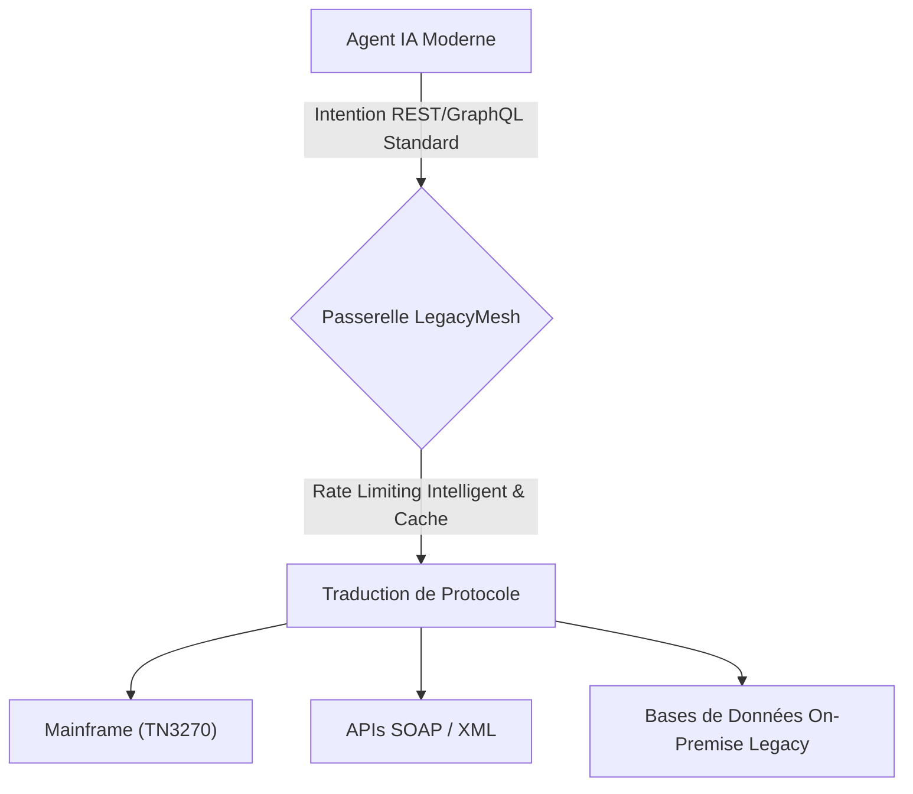
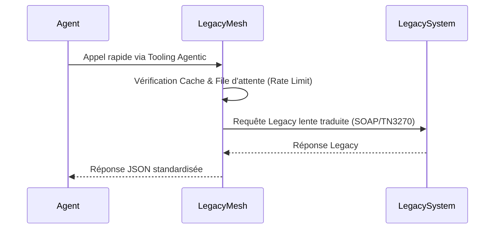

<!-- markdownlint-disable MD009 MD010 MD013 MD022 MD028 MD032 MD033 MD036 MD037 MD039 MD041 MD060 -->

[ 🇬🇧 English Version ](./README.md)

# LegacyMesh

> **Résumé exécutif :** Une passerelle API "Agent-to-Legacy" qui traduit dynamiquement les intentions des agents IA modernes en protocoles legacy sécurisés et limités en débit (SOAP, Mainframe, SQL) pour protéger les infrastructures fragiles.

---

## 1. Aperçu visuel

## 2. La thèse contrariante (Peter Thiel Style)

- **La croyance populaire :** La modernisation des entreprises nécessite de réécrire complètement les systèmes legacy pour qu'ils puissent interagir avec les applications d'IA modernes.
- **La vérité cachée :** Migrer des systèmes legacy (COBOL) prend des décennies et échoue souvent. Les agents n'ont pas besoin de systèmes modernes ; ils ont juste besoin d'un proxy de traduction et de limitation de débit fiable. La valeur immédiate est de connecter sans risque une IA très rapide à des systèmes lents et fragiles.

## 3. Le problème & La cible

- **Modèle économique :** B2B
- **Cible précise :** Grandes entreprises (banques, assurances, industrie, secteur public) possédant des infrastructures informatiques vieillissantes (legacy) et souhaitant déployer des agents autonomes.
- **La douleur urgente :** Intégrer des agents rapides avec des systèmes legacy (Mainframes, SOAP) coûte une fortune en développement spécifique et risque de faire crasher les infrastructures critiques à cause de requêtes en rafale non maîtrisées.

## 4. Architecture technique & Plomberie

## 5. Modèle économique & Viabilité financière

| Métrique                    | Valeur                                                    |
| --------------------------- | --------------------------------------------------------- |
| Structure de prix           | Abonnement Entreprise basé sur les nœuds Legacy connectés |
| Objectif 12 mois            | 40 Clients Entreprise                                     |
| Calcul du CA (Target 100k€) | 40 _ 2500€ / mois _ 12 = 1.2M€                            |
| Marge brute estimée         | 85%                                                       |

## 6. Moteur de distribution & Fossé défensif (Moat)

- **Stratégie d'acquisition :** Ventes directes B2B ciblant les DSI et Cloud Architects. Partenariats stratégiques avec les grands intégrateurs (ESN) comme Accenture ou Capgemini.
- **Moat (Barrière à l'entrée) :** Bien qu'un LLM puisse générer du code, il ne peut pas maintenir une session d'émulation terminal (TN3270), gérer la fiabilité réseau vers l'on-premise, ni imposer des limites strictes de débit. L'infrastructure lourde de middleware est la véritable barrière.

## 7. Grille d'évaluation détaillée

| Critère                           | Score VC (/100) | Score Terrain (/100) |
| --------------------------------- | --------------- | -------------------- |
| Thèse & Monopole / Urgence        | 24 / 25         | -- / 25              |
| Moat / Résistance aux LLM natifs  | 23 / 25         | -- / 25              |
| Scalabilité / Friction d'adoption | 21 / 25         | -- / 25              |
| Unit Economics / ROI direct       | 24 / 25         | -- / 25              |
| **TOTAL**                         | **92 / 100**    | **-- / 100**         |

> **Verdict VC :** Legacy Mesh capitalise sur le fossé massif et peu attrayant entre les ambitions modernes de l'IA et l'infrastructure d'entreprise fragile et archaïque. Sa défendabilité repose sur l'extrême complexité et le danger d'intégrer des mainframes, un problème que la plupart des fondateurs ignorent. Cela garantit des contrats d'entreprise à prix très élevés avec une attrition quasi nulle et des unit economics exceptionnels.

> **Verdict Terrain :** En attente d'évaluation.
