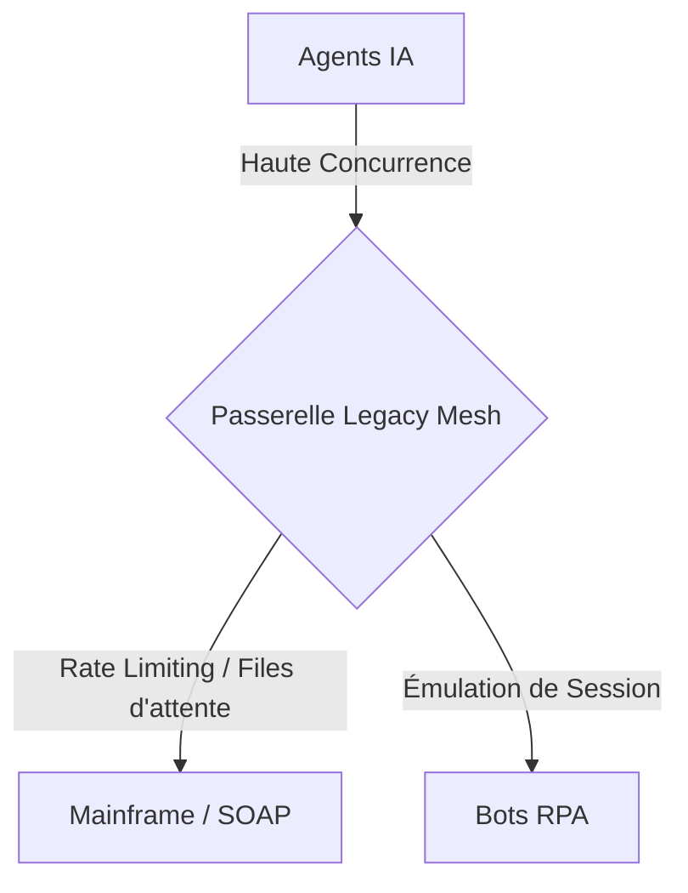
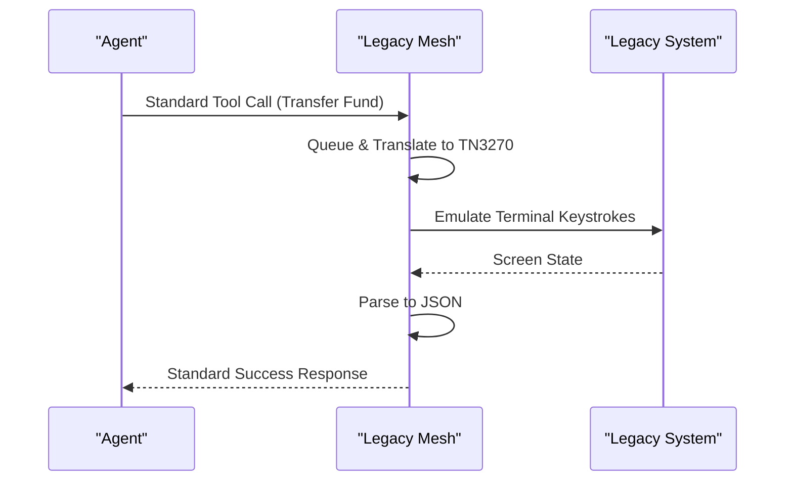

<!-- markdownlint-disable MD009 MD010 MD013 MD022 MD028 MD032 MD033 MD034 MD036 MD037 MD039 MD041 MD060 -->

[ 🇬🇧 English Version ](./README.md)

# Legacy Mesh (Agent-to-Legacy Gateway)

> **Résumé exécutif :** Un middleware hybride conçu pour traduire de façon sécurisée les intentions des agents IA en actions compatibles avec les systèmes legacy (SOAP, RPA) avec rate-limiting strict.

---

## 1. Aperçu visuel

```mermaid
graph TD
    %% Architecture
    A["Agents IA"] -->|Haute Concurrence| B{"Passerelle Legacy Mesh"}
    B -->|Rate Limiting / Files d'attente| C["Mainframe / SOAP"]
    B -->|Émulation de Session| D["Bots RPA"]
```

## 2. La thèse contrariante (Peter Thiel Style)

**La croyance populaire :** Les LLMs peuvent générer directement du code et des requêtes pour s'interfacer avec n'importe quel logiciel d'entreprise.

**La vérité cachée :** Le legacy est fragile ; faire le pont entre l'IA et le legacy nécessite un middleware dédié avec émulation de session et rate-limiting strict.

## 3. Le problème & La cible

**Modèle économique :** B2B
**Cible précise :** Banques, assurances et grandes entreprises connectant des agents IA à des infrastructures legacy critiques.
**La douleur urgente :** Les rafales de requêtes asynchrones des agents font tomber les systèmes legacy fragiles, provoquant des pannes critiques.

## 4. Architecture technique & Plomberie

**L'approche technique :** Une passerelle API Agent-to-Legacy. Expose une interface Agentic Tooling, traduit dynamiquement en actions legacy, et intègre un système de file d'attente et rate-limiting.

```mermaid
sequenceDiagram
    participant Ag as "Agent"
    participant Mesh as "Legacy Mesh"
    participant Leg as "Legacy System"
    Ag->>Mesh: Standard Tool Call (Transfer Fund)
    Mesh->>Mesh: Queue & Translate to TN3270
    Mesh->>Leg: Emulate Terminal Keystrokes
    Leg-->>Mesh: Screen State
    Mesh->>Mesh: Parse to JSON
    Mesh-->>Ag: Standard Success Response
```

## 5. Modèle économique & Viabilité financière

| Métrique                        | Valeur                              |
| :------------------------------ | :---------------------------------- |
| **Structure de prix**           | Enterprise License / Per Connection |
| **Objectif 12 mois**            | 20 Enterprise Implementations       |
| **Calcul du CA (Target 100k€)** | 20 enterprises \* $5k/mo = $100k/mo |
| **Marge brute estimée**         | 85%                                 |

## 6. Moteur de distribution & Fossé défensif (Moat)

**Stratégie d'acquisition :** Ventes B2B directes aux DSI et partenariats avec les intégrateurs systèmes.

**Moat (Barrière à l'entrée) :** Un LLM ne peut ni maintenir une session d'émulation terminal ni imposer des limites de débit réseau. Une plomberie d'infrastructure dédiée est obligatoire.

## 7. Grille d'évaluation détaillée

| Critère                               | Score VC (/100) | Score Terrain (/100) |
| :------------------------------------ | :-------------- | :------------------- |
| **Thèse & Monopole / Urgence**        | 20 / 25         | 23 / 25              |
| **Moat / Résistance aux LLM natifs**  | 23 / 25         | 16 / 25              |
| **Scalabilité / Friction d'adoption** | 21 / 25         | 23 / 25              |
| **Unit Economics / ROI direct**       | 22 / 25         | 18 / 25              |
| **TOTAL**                             | 86 / 100        | 80 / 100             |

> **Verdict VC :** Legacy Mesh comble le fossé crucial entre les agents IA modernes et les mainframes d'entreprise archaïques qui font tourner l'économie mondiale. L'intégration profonde requise dans les systèmes hérités crée une rétention extrême et défend contre les concurrents légers. Bien que les cycles d'adoption soient longs, la valeur élevée des contrats assure de solides fondamentaux économiques.
> **Verdict Terrain :** Cette solution répond à un besoin critique pour le marché cible, justifiant son excellent score d'urgence (23/25). Bien que viable, elle reste partiellement exposée à l'évolution rapide des modèles fondationnels (16/25). Avec une faible friction d'adoption (23/25) et une stratégie de monétisation directe (18/25), le projet démontre une excellente maturité marché globale.
