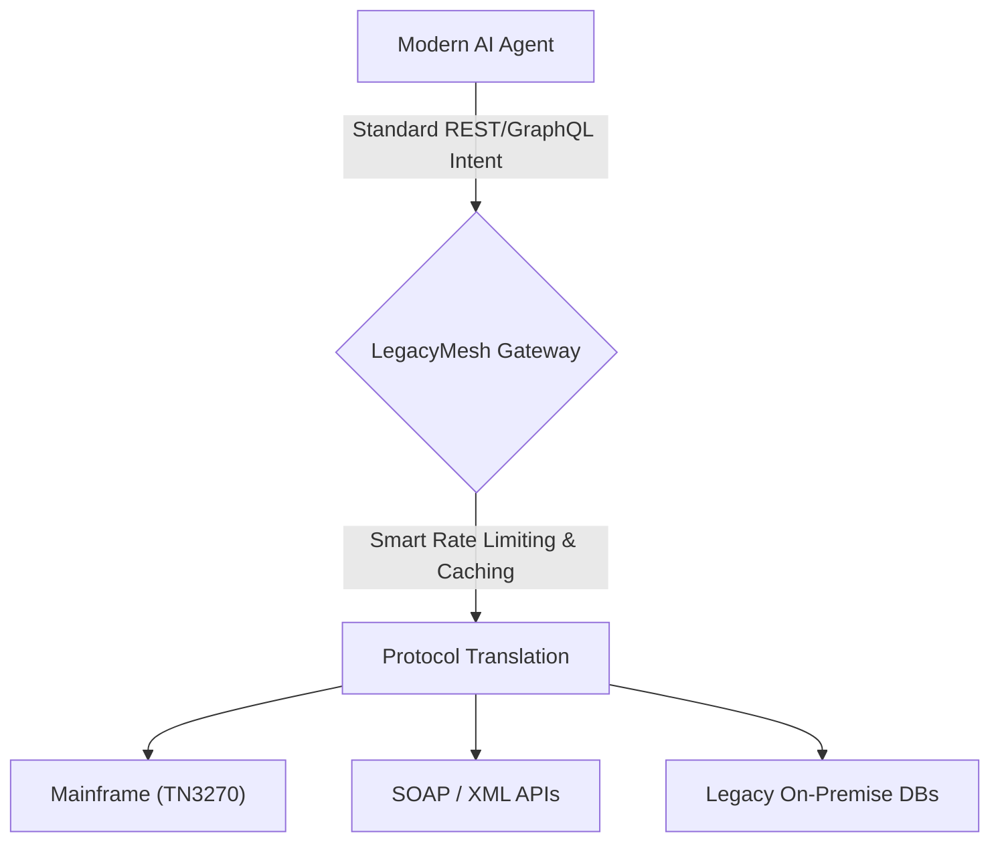
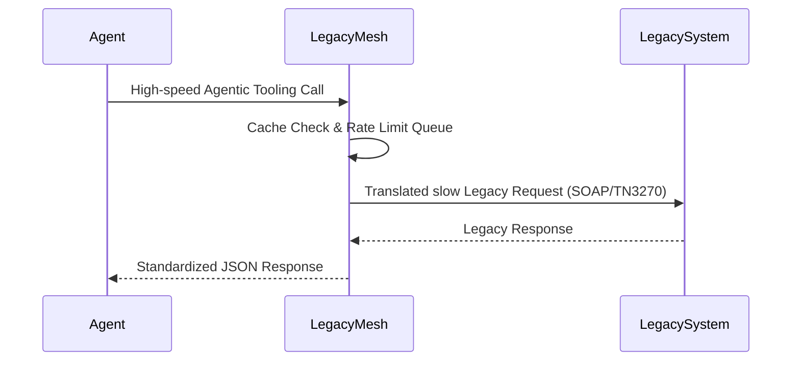

<!-- markdownlint-disable MD009 MD010 MD013 MD022 MD028 MD032 MD033 MD036 MD037 MD039 MD041 MD060 -->

[ 🇫🇷 Version Française ](./README.fr.md)

# LegacyMesh

> **Executive Summary:** An "Agent-to-Legacy" API gateway that dynamically translates modern AI agent intents into safe, rate-limited legacy protocols (SOAP, Mainframe terminals, SQL) to protect fragile enterprise infrastructure.

---

## 1. Visual Overview

## 2. Contrarian Thesis (Peter Thiel Style)

- **Popular Belief:** Enterprise modernization means completely rewriting legacy systems so they can natively interact with modern AI applications.
- **Hidden Truth:** Migrating legacy systems (COBOL, mainframes) takes decades and fails frequently. AI agents don't need modern systems to act; they just need a reliable translation and rate-limiting proxy. The immediate value is in safely connecting fast AI to slow, fragile legacy systems without crashing them.

## 3. Problem & Target Market

- **Business Model:** B2B
- **Target Audience:** Large enterprises (banks, insurance, manufacturing, public sector) with aging IT infrastructures (legacy) looking to deploy autonomous agents.
- **Urgent Pain Point:** Integrating fast AI agents directly with fragile legacy systems (Mainframes, SOAP) is extremely costly and risks crashing critical infrastructure due to unthrottled request bursts from the agents.

## 4. Technical Architecture & Infrastructure

## 5. Business Model & Financial Viability

| Metric                 | Value                                                   |
| ---------------------- | ------------------------------------------------------- |
| Pricing Structure      | Enterprise Subscription based on connected Legacy nodes |
| 12-Month Target        | 40 Enterprise Clients                                   |
| Revenue Formula        | 40 _ €2,500 / month _ 12 = 1.2M€                        |
| Estimated Gross Margin | 85%                                                     |

## 6. Distribution Engine & Moat

- **Acquisition Strategy:** Enterprise direct sales targeting CIOs and Cloud Architects struggling with "AI-readiness". Partnerships with massive SI (System Integrators) like Accenture or Capgemini.
- **Moat (Defensibility):** While an LLM can write code, it cannot maintain a stateful terminal emulation session (TN3270), manage reliable on-premise networking, or enforce strict traffic-shaping to protect critical systems. The heavy middleware infrastructure is the moat.

## 7. Detailed Evaluation Grid

| Criterion                   | VC Score (/100) | Market Score (/100) |
| --------------------------- | --------------- | ------------------- |
| Thesis & Monopoly / Urgency | 24 / 25         | -- / 25             |
| Moat / LLM Immunity         | 23 / 25         | -- / 25             |
| Scalability / UX Friction   | 21 / 25         | -- / 25             |
| Unit Economics / ROI        | 24 / 25         | -- / 25             |
| **TOTAL**                   | **92 / 100**    | **-- / 100**        |

> **VC Verdict:** Legacy Mesh capitalizes on the massive, unsexy gap between modern AI ambitions and fragile, archaic enterprise infrastructure. Its defensibility stems from the sheer complexity and danger of integrating with mainframes, a pain point most founders ignore. This guarantees high-ticket enterprise contracts with near-zero churn and exceptional unit economics.

> **Market Verdict:** Pending evaluation.
