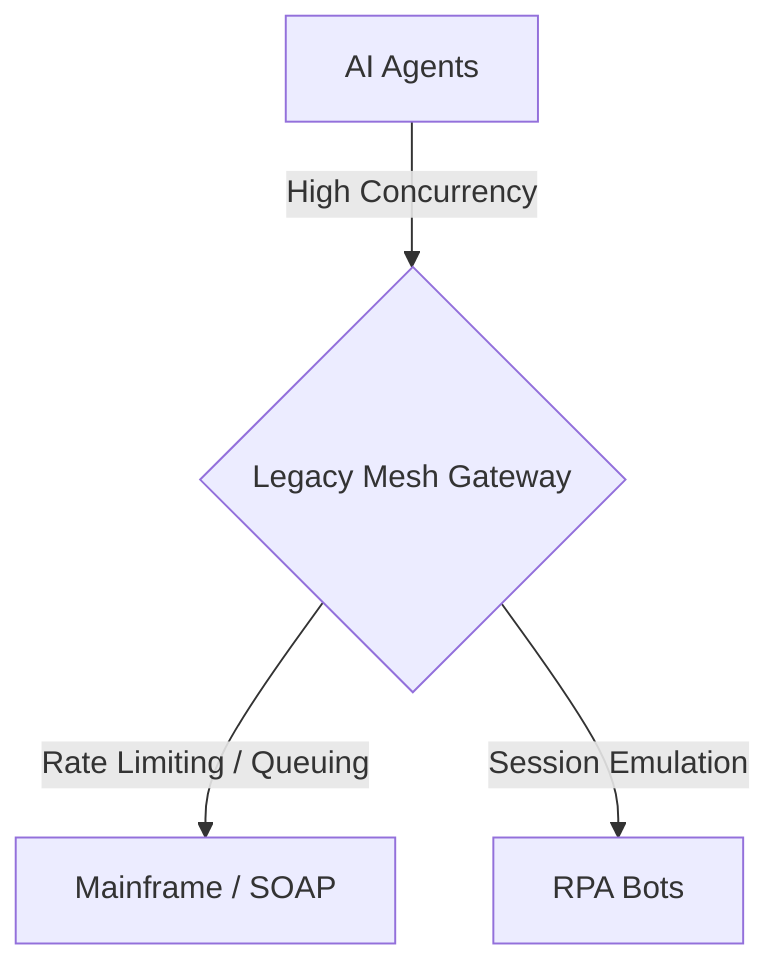
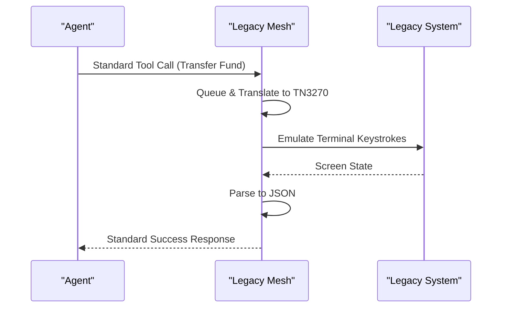

<!-- markdownlint-disable MD009 MD010 MD013 MD022 MD028 MD032 MD033 MD034 MD036 MD037 MD039 MD041 MD060 -->

[ 🇫🇷 Version Française ](./README.fr.md)

# Legacy Mesh (Agent-to-Legacy Gateway)

> **Executive Summary:** A hybrid middleware API gateway designed to securely translate autonomous AI agent intents into legacy system actions (SOAP, RPA, mainframes) with strict rate-limiting.

---

## 1. Visual Overview & Wow Effect

```mermaid
graph TD
    %% Architecture
    A["AI Agents"] -->|High Concurrency| B{"Legacy Mesh Gateway"}
    B -->|Rate Limiting / Queuing| C["Mainframe / SOAP"]
    B -->|Session Emulation| D["RPA Bots"]
```

## 2. Contrarian Thesis (Peter Thiel Style)

**Popular Belief:** LLMs can directly generate code and API calls to interface with any enterprise software.

**Hidden Truth:** Legacy systems are fragile and non-deterministic for LLMs; bridging the gap requires dedicated middleware with session emulation and rate-limiting to prevent critical failures.

## 3. Problem & Target Market

**Business Model:** B2B
**Target Audience:** Banks, insurance companies, and large enterprises attempting to connect modern AI agents to critical legacy infrastructure.
**Urgent Pain Point:** Agents generate bursts of concurrent requests that crash fragile legacy systems (e.g., AS400, SOAP APIs), causing catastrophic downtime in critical business operations.

## 4. Technical Architecture & Infrastructure

**Technical Approach:** A hybrid Agent-to-Legacy API Gateway. Exposes standard Agentic Tooling interfaces, dynamically translates requests into legacy actions (RPA, TN3270), and implements intelligent queuing/caching/rate-limiting.

```mermaid
sequenceDiagram
    participant Ag as "Agent"
    participant Mesh as "Legacy Mesh"
    participant Leg as "Legacy System"
    Ag->>Mesh: Standard Tool Call (Transfer Fund)
    Mesh->>Mesh: Queue & Translate to TN3270
    Mesh->>Leg: Emulate Terminal Keystrokes
    Leg-->>Mesh: Screen State
    Mesh->>Mesh: Parse to JSON
    Mesh-->>Ag: Standard Success Response
```

## 5. Business Model & Financial Viability

| Metric                     | Value                               |
| :------------------------- | :---------------------------------- |
| **Pricing Structure**      | Enterprise License / Per Connection |
| **12-Month Target**        | 20 Enterprise Implementations       |
| **Revenue Formula**        | 20 enterprises \* $5k/mo = $100k/mo |
| **Estimated Gross Margin** | 85%                                 |

## 6. Distribution Engine & Moat

**Acquisition Strategy:** Direct enterprise sales to IT modernization departments and system integrators.

**Moat (Defensibility):** An LLM cannot maintain terminal sessions or enforce strict network rate-limits on-premise. Dedicated, secure infrastructure plumbing is essential.

## 7. Detailed Evaluation Grid

| Criterion                       | VC Score (/100) | Market Score (/100) |
| :------------------------------ | :-------------- | :------------------ |
| **Thesis & Monopoly / Urgency** | 20 / 25         | 23 / 25             |
| **Moat / LLM Immunity**         | 23 / 25         | 16 / 25             |
| **Scalability / UX Friction**   | 21 / 25         | 23 / 25             |
| **Unit Economics / ROI**        | 22 / 25         | 18 / 25             |
| **TOTAL**                       | 86 / 100        | 80 / 100            |

> **VC Verdict:** Legacy Mesh bridges the crucial gap between modern AI agents and archaic enterprise mainframes that run the global economy. The deep integration required into legacy systems creates extreme stickiness and defends against lightweight competitors. While adoption cycles may be long, the high contract values ensure strong enterprise economics.
> **Market Verdict:** This solution addresses a critical pain point for the target market, justifying its strong urgency score (23/25). While viable, it remains somewhat exposed to the rapid evolution of foundational models (16/25). With low adoption friction (23/25) and a straightforward monetization strategy (18/25), the project demonstrates excellent overall market readiness.
