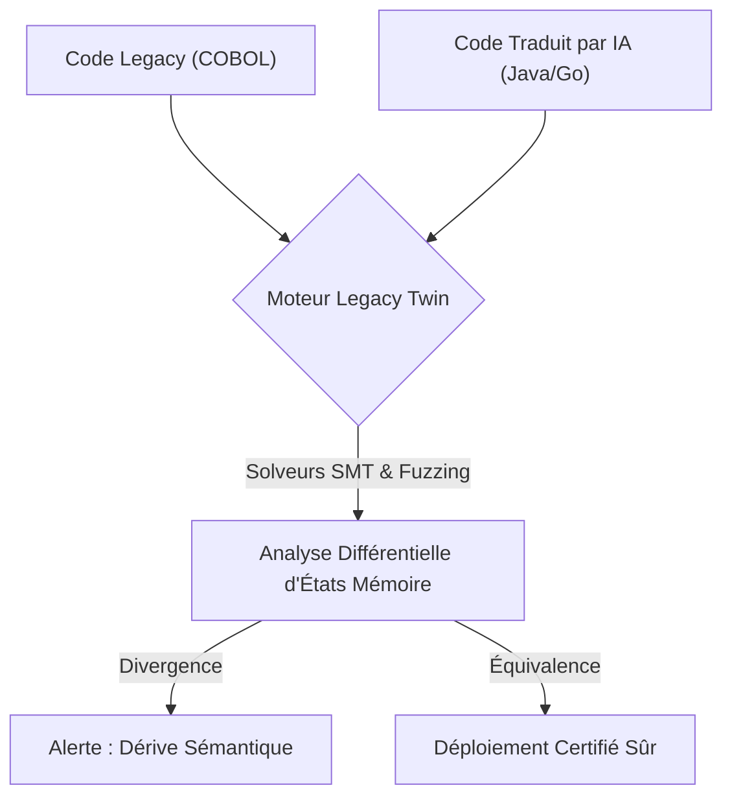
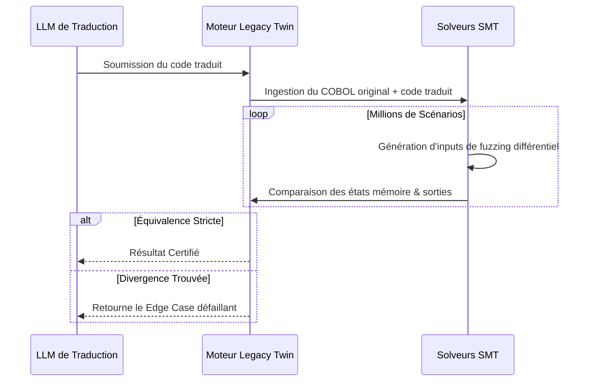

<!-- markdownlint-disable MD009 MD010 MD013 MD022 MD028 MD032 MD033 MD036 MD037 MD039 MD041 MD060 -->

[ 🇬🇧 English Version ](./README.md)

# Legacy Twin

> **Résumé exécutif :** Un moteur d'exécution symbolique et de "fuzzing" différentiel qui prouve mathématiquement l'équivalence sémantique stricte entre le code legacy (COBOL/Fortran) et sa traduction IA moderne.

---

## 1. Aperçu visuel

## 2. La thèse contrariante (Peter Thiel Style)

- **La croyance populaire :** Les LLMs traduisent très bien le code legacy (COBOL vers Java), ce qui résout le problème de migration informatique.
- **La vérité cachée :** Générer le code n'est que la partie facile. Le vrai goulot d'étranglement est de prouver que le nouveau code reproduit exactement 40 ans de cas particuliers non documentés. Les tests manuels prennent plus de temps que la traduction, et les entreprises ne déploieront pas sans preuve mathématique formelle.

## 3. Le problème & La cible

- **Modèle économique :** B2B
- **Cible précise :** DSI, architectes cloud et équipes de modernisation IT des grandes entreprises (banques, assurances, institutions) qui migrent leurs systèmes Legacy.
- **La douleur urgente :** L'IA traduit massivement, mais le code ne peut être mis en production car il est impossible de garantir qu'il reproduit la même logique métier complexe. Les tests de validation manuels sont hors de prix et interminables.

## 4. Architecture technique & Plomberie

## 5. Modèle économique & Viabilité financière

| Métrique                    | Valeur                                      |
| --------------------------- | ------------------------------------------- |
| Structure de prix           | Par Application / Lignes de Code Certifiées |
| Objectif 12 mois            | 20 Migrations Majeures d'Entreprise         |
| Calcul du CA (Target 100k€) | 20 \* 50 000€ par migration = 1.0M€         |
| Marge brute estimée         | 80%                                         |

## 6. Moteur de distribution & Fossé défensif (Moat)

- **Stratégie d'acquisition :** Ventes B2B "high-ticket" en partenariat avec les fournisseurs Cloud (AWS Mainframe Modernization) et les grands intégrateurs systèmes (ESN).
- **Moat (Barrière à l'entrée) :** Prouver l'équivalence d'état nécessite des solveurs mathématiques déterministes (SMT) et une infrastructure de fuzzing lourd, ce qu'un modèle probabiliste textuel ne peut pas accomplir seul.

## 7. Grille d'évaluation détaillée

| Critère                           | Score VC (/100) | Score Terrain (/100) |
| --------------------------------- | --------------- | -------------------- |
| Thèse & Monopole / Urgence        | -- / 25         | -- / 25              |
| Moat / Résistance aux LLM natifs  | -- / 25         | -- / 25              |
| Scalabilité / Friction d'adoption | -- / 25         | -- / 25              |
| Unit Economics / ROI direct       | -- / 25         | -- / 25              |
| **TOTAL**                         | **-- / 100**    | **-- / 100**         |

> **Verdict VC :** En attente d'évaluation.

> **Verdict Terrain :** En attente d'évaluation.
