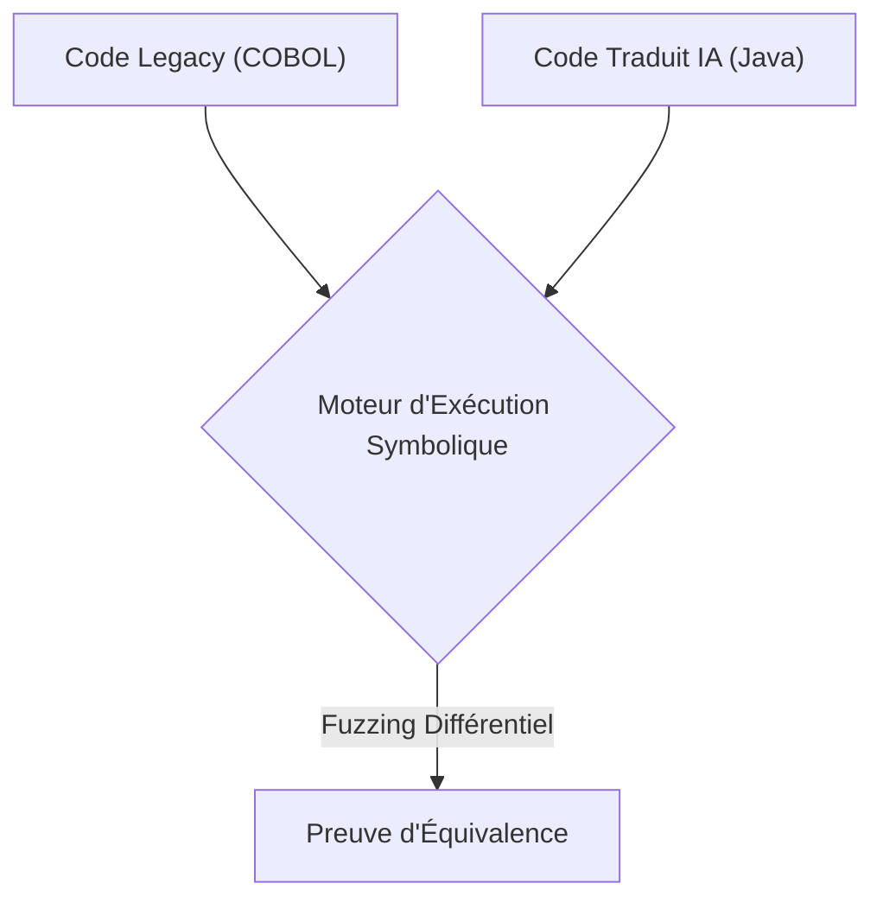
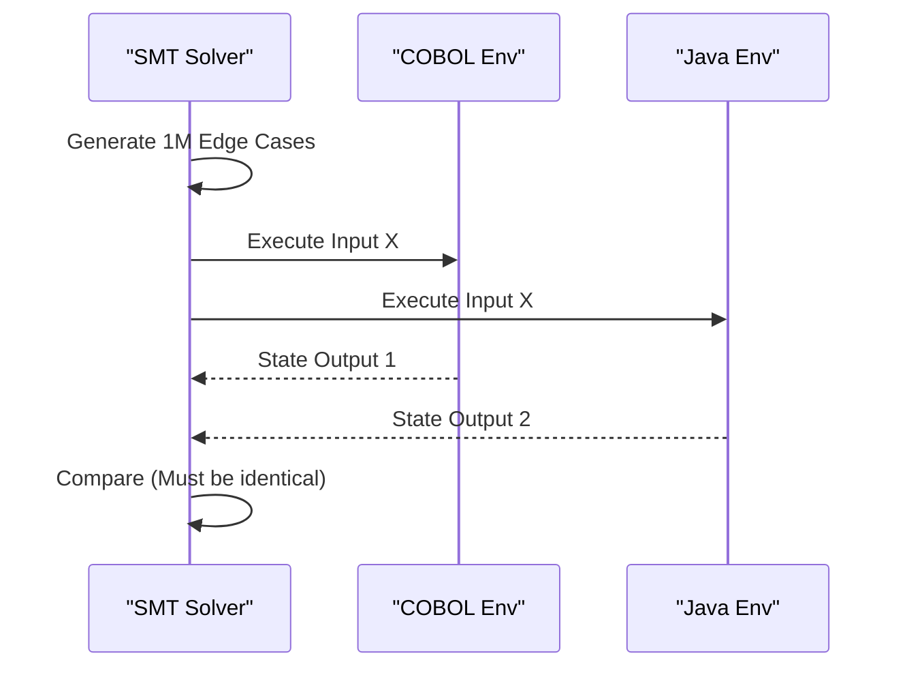

<!-- markdownlint-disable MD009 MD010 MD013 MD022 MD028 MD032 MD033 MD034 MD036 MD037 MD039 MD041 MD060 -->

[ 🇬🇧 English Version ](./README.md)

# Legacy Twin

> **Résumé exécutif :** Un moteur d'exécution symbolique qui garantit mathématiquement que le code moderne généré par IA se comporte exactement comme le système legacy d'origine.

---

## 1. Aperçu visuel

```mermaid
graph TD
    %% Architecture
    A["Code Legacy (COBOL)"] --> C{"Moteur d'Exécution Symbolique"}
    B["Code Traduit IA (Java)"] --> C
    C -->|Fuzzing Différentiel| D["Preuve d'Équivalence"]
```

## 2. La thèse contrariante (Peter Thiel Style)

**La croyance populaire :** L'IA peut traduire instantanément du COBOL en Java, résolvant la crise de modernisation.

**La vérité cachée :** La traduction est facile ; prouver l'équivalence sémantique est le vrai problème qui empêche les déploiements en production.

## 3. Le problème & La cible

**Modèle économique :** B2B
**Cible précise :** DSI, architectes cloud et équipes de modernisation IT des grandes entreprises migrant du legacy.
**La douleur urgente :** Les tests de validation manuels du code généré par IA coûtent plus cher et prennent plus de temps que la traduction elle-même.

## 4. Architecture technique & Plomberie

**L'approche technique :** Moteur d'exécution symbolique et fuzzing différentiel. Génère des millions de scénarios via solveurs SMT et compare les états pour garantir l'équivalence sémantique.

```mermaid
sequenceDiagram
    participant SMT as "SMT Solver"
    participant Legacy as "COBOL Env"
    participant Mod as "Java Env"
    SMT->>SMT: Generate 1M Edge Cases
    SMT->>Legacy: Execute Input X
    SMT->>Mod: Execute Input X
    Legacy-->>SMT: State Output 1
    Mod-->>SMT: State Output 2
    SMT->>SMT: Compare (Must be identical)
```

## 5. Modèle économique & Viabilité financière

| Métrique                        | Valeur                                            |
| :------------------------------ | :------------------------------------------------ |
| **Structure de prix**           | Per Line of Code Evaluated / Project Basis        |
| **Objectif 12 mois**            | 10 Major Migration Projects                       |
| **Calcul du CA (Target 100k€)** | 10 projects \* $120k/year = $1.2M/year ($100k/mo) |
| **Marge brute estimée**         | 90%                                               |

## 6. Moteur de distribution & Fossé défensif (Moat)

**Stratégie d'acquisition :** Partenariats avec les cloud providers et intégrateurs (Capgemini, Accenture).

**Moat (Barrière à l'entrée) :** Un LLM probabiliste ne peut ni exécuter le code ni prouver formellement une équivalence d'état. Cela nécessite des solveurs SMT déterministes.

## 7. Grille d'évaluation détaillée

| Critère                               | Score VC (/100) | Score Terrain (/100) |
| :------------------------------------ | :-------------- | :------------------- |
| **Thèse & Monopole / Urgence**        | 21 / 25         | 22 / 25              |
| **Moat / Résistance aux LLM natifs**  | 23 / 25         | 16 / 25              |
| **Scalabilité / Friction d'adoption** | 20 / 25         | 22 / 25              |
| **Unit Economics / ROI direct**       | 22 / 25         | 21 / 25              |
| **TOTAL**                             | 86 / 100        | 81 / 100             |

> **Verdict VC :** Legacy Twin crée un clone opérationnel moderne d'une infrastructure d'entreprise obsolète, permettant l'intégration d'agents IA sans risquer de casser des mainframes fragiles. L'approche par jumeau numérique est un coup de maître défensif qui contourne le risque de l'ancien, verrouillant les clients avec une dette IT massive. Les contrats B2B sont conséquents, bien que le cycle de vente puisse être long.
> **Verdict Terrain :** Cette solution répond à un besoin critique pour le marché cible, justifiant son excellent score d'urgence (22/25). Bien que viable, elle reste partiellement exposée à l'évolution rapide des modèles fondationnels (16/25). Avec une faible friction d'adoption (22/25) et une stratégie de monétisation directe (21/25), le projet démontre une excellente maturité marché globale.
